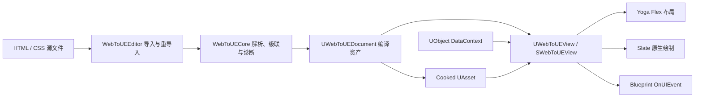

# WebToUE（WTUE）技术总结

## 1. 文档信息

- 插件版本：`0.1.0-preview`
- 文档对应引擎：Unreal Engine 5.8
- 当前目标平台：Win64
- 项目状态：Developer Preview / 技术可行性第一版
- 核心目标：使用 HTML/CSS 作为 UI 创作格式，在不嵌入浏览器内核的前提下，通过 Unreal Engine 自身的 Slate、UMG、UObject、资源系统和输入系统还原界面。

本文描述的是当前源码已经实现的能力，而不是完整 Web 标准兼容承诺。

## 2. 项目定位

WTUE 不是浏览器控件，也不是对 CEF、WebBrowser、JavaScriptCore 或其他 Web Runtime 的封装。HTML 和 CSS 在编辑器阶段被解析、校验并编译成 Unreal Asset；游戏运行时只读取编译后的节点和样式规则，再使用 Yoga 计算布局、Slate 绘制界面。

它的直接价值是：

- 允许前端开发者使用熟悉的 HTML/CSS 组织游戏 UI。
- 保留 Unreal 的资源管理、输入、蓝图、UObject、Cook 和平台构建流程。
- 避免浏览器内核带来的包体、内存、启动时间、安全面和跨平台维护成本。
- 将前端文件定位为一种“UI 源语言”，而不是在游戏中运行网页。

当前版本优先验证主菜单、HUD 等屏幕空间 UI。它不是完整 DOM，也暂不尝试像素级复刻现代浏览器。

## 3. 总体架构



插件由四个模块组成：

| 模块 | 类型 | 职责 |
| --- | --- | --- |
| `WebToUEYoga` | Runtime | 内置 Yoga 3.2.1 源码并提供 Flex 布局能力。 |
| `WebToUECore` | Runtime | HTML/CSS 解析、DOM-like 节点、选择器匹配、样式计算、诊断和 Yoga 适配。 |
| `WebToUERuntime` | Runtime | `UWebToUEDocument`、UMG 控件、Slate 渲染、输入、绑定、事件和字体配置。 |
| `WebToUEEditor` | Editor | `.html` 导入、CSS 依赖收集、UAsset 编译、重导入和文件监听。 |

模块之间保持单向依赖：Yoga → Core → Runtime → Editor。Editor 模块不会进入游戏目标。

## 4. 编辑器编译链路

### 4.1 导入入口

`UWebToUEFactory` 注册 `.html` 文件类型。用户把 HTML 拖入 Content Browser 后，工厂会：

1. 读取 HTML 文本。
2. 扫描 `<link rel="stylesheet" href="...">`。
3. 以 HTML 所在目录为基准解析相对 CSS 路径。
4. 将每个外部 CSS 作为带独立文件名和起始位置的样式表输入传给编译器，并单独收集 HTML 内的 `<style>`。
5. 调用 `FWebToUECompiler::Compile`，按样式表顺序参与级联。
6. 将节点树和样式规则序列化到 `UWebToUEDocument`。
7. 收集 `` 中的 Unreal Texture2D 软引用。
8. 保存源文件、依赖文件和诊断信息供编辑器使用。

### 4.2 编译资产格式

`UWebToUEDocument` 的运行时数据由扁平数组构成：

- `CompiledNodes`：节点类型、标签、文本、属性和 `ParentIndex`。
- `CompiledRules`：选择器片段、声明、优先级和源码顺序。
- `RootNodeIndex`：渲染根节点索引。
- `ReferencedTextures`：需要随 Cook 收集的 Texture2D 软引用。
- `Diagnostics`：可在编辑器和蓝图侧查看的编译信息。

HTML、CSS 原文、导入路径和依赖文件被放在 `WITH_EDITORONLY_DATA` 中，不进入游戏运行数据。

当前资产格式使用独立的自定义版本 GUID，首个版本为 `InitialCompiledDocument`。加载没有该版本的旧资产时，Runtime 只标记重编译请求；Editor 模块会在后续 Tick 对已加载资产执行一次重导入，成功后写入当前格式，失败则继续保留最后一次成功的运行数据。后续结构变更仍需为每个版本补充字段级迁移或重编译策略。

### 4.3 诊断与失败策略

当前诊断覆盖：

- 无法读取 HTML 或关联 CSS。
- HTML 标签名缺失。
- 未匹配的闭合标签。
- 未知标签降级为通用 Flex 容器。
- CSS 规则块未闭合。
- CSS 声明格式错误。
- 不支持的 CSS at-rule 或选择器。
- 不支持的 CSS 属性和非法属性值；对应声明会被忽略，不进入最终规则。

外链 CSS、HTML 内的 `<style>` 和元素 `style` 属性会保留各自的源文件与起始位置。CSS 诊断使用实际行列号，不再把拼接后的外链样式统一报告为 HTML 文件第一行。HTML 结构诊断已有行列号，未知 HTML 属性及更细粒度的属性值校验仍待补充。

第一次导入发生错误时不会产生有效运行数据。已有资产重导入失败时，工厂保留上一次成功编译的节点与规则，同时更新诊断信息，避免一次 CSS 书写错误立即破坏正在预览的界面。

### 4.4 热重载

Editor 模块监听项目目录内的 `.html` 和 `.css` 变化，并使用 200ms 防抖。到期后，它检查当前已加载 `UWebToUEDocument` 的 `DependencyFiles`，只重导入受影响的资产。

重导入成功后通过 `UWebToUEDocument::OnDocumentChanged` 通知现有 `UWebToUEView` 重建运行时文档和绑定。当前监听只覆盖已加载资产，没有独立的全局依赖数据库。

## 5. HTML/CSS 编译核心

### 5.1 HTML 子集

第一版识别以下标签：

- 文档标签：`html`、`head`、`body`
- 样式标签：`style`、`link`
- UI 标签：`div`、`span`、`p`、`img`、`button`
- 行内富文本标签：`strong` / `b`、`em` / `i`、`u`、`br`

`img`、`link` 和 `br` 默认按自闭合标签处理。未知元素会保留属性和子节点，并作为通用 Flex 容器参与布局，同时生成警告。

解析器支持：

- 双引号、单引号和无引号属性值。
- 布尔属性，缺省值记录为 `true`。
- HTML 注释与 doctype 跳过。
- `&lt;`、`&gt;`、`&quot;`、`&apos;`、`&amp;` 和数值实体解码。
- `<style>` 内联样式和元素 `style="..."` 声明。

文本节点目前会裁掉首尾空白，不保留浏览器式空白折叠语义；`white-space: normal` 会在宽度约束下自动换行，`nowrap` 保持单行。只包含文本和受支持行内标签的元素会编译为单个富文本叶节点，避免行内 run 被 Yoga 当作多个块布局。

### 5.2 CSS 选择器

当前支持：

- 类型选择器：`button`
- Class：`.primary`
- ID：`#start-button`
- 复合选择器：`button.primary:hover`
- 后代组合：`.panel button`
- 直接子代：`.panel > button`
- 逗号分隔的选择器组
- 伪类：`:hover`、`:active`、`:focus`、`:disabled`

规则按选择器优先级和源码顺序参与级联，元素 `style` 属性最后覆盖。当前声明存储使用 `TMap`，同一规则内重复声明的精确顺序语义与浏览器不完全一致。

### 5.3 CSS 属性

布局与可见性：

- `display`：`flex` / `none`
- `position`：`relative` / `absolute`
- `visibility`：支持 `hidden`
- `overflow`：`visible` / `hidden` / `auto` / `scroll`
- `width`、`height`
- `min-width`、`min-height`
- `max-width`、`max-height`
- `left`、`top`、`right`、`bottom`
- `margin`、`padding` 及四方向长属性
- `gap`、`row-gap`、`column-gap`
- 长度单位：`px`、百分比、零值和部分场景下的 `auto`

Flex：

- `flex` 简写
- `flex-direction`
- `flex-wrap`
- `flex-grow`
- `flex-shrink`
- `flex-basis`
- `justify-content`
- `align-items`
- `align-self`

绘制与文本：

- `color`
- `background`（当前仅解析纯色）
- `background-color`
- `border` 简写
- `border-color`
- `border-width`
- `border-style`（当前仅特别处理 `none`）
- `border-radius`
- `opacity`
- `font-family`
- `font-size`
- `font-weight`
- `text-align`
- `white-space`：`normal` / `nowrap`
- `object-fit`：`fill`、`contain`、`cover`
- `z-index`

颜色支持 `#RGB`、`#RGBA`、`#RRGGBB`、`#RRGGBBAA`，以及 `transparent`、`white`、`black`、`red`、`green`、`blue`。当前不支持 `rgb()`、CSS 变量、calc、渐变或完整颜色名称集合。

样式表和元素 `style` 属性会在编译阶段校验当前受支持的属性和值。未知属性、非法枚举、错误长度和错误颜色会产生 Warning，并按 CSS 的无效声明语义忽略；它们不会覆盖同一元素上其他有效声明。

### 5.4 样式继承

当前显式继承：

- `color`
- `font-family`
- `font-size`
- `font-weight`
- `text-align`
- `white-space`

`body` 默认占满视口；`button` 默认采用水平 Flex，并将内容居中。

### 5.4 本地化身份与基础富文本

每个导入后的文本叶节点都在 `CompiledNodes` 中保存真正的 `FText`：

- Document 首次导入时生成持久的文档命名空间，后续重导入继续复用。
- 没有显式 key 时生成一次自动 key，并通过文本作者路径在重导入时复用；带 `id` 的元素移动位置后仍使用 `#id/text[n]` 身份。
- 对需要长期稳定、可跨结构调整的文本，推荐显式填写 `data-ue-loc-key`；可用 `data-ue-loc-namespace` 覆盖文档命名空间。
- `data-ue-string-table` 与 `data-ue-string-key` 必须成对出现，编译结果使用 `FText::FromStringTable`，资产同时保存 String Table 软引用以参与 Cook。

```html
<p data-ue-loc-key="Menu.Start">Start Game</p>
<p data-ue-loc-namespace="Dialog" data-ue-loc-key="Guide.Welcome">Welcome</p>
<button
  data-ue-string-table="/Game/UI/ST_UI.ST_UI"
  data-ue-string-key="Common.Continue">
  Continue
</button>
```

String Table 模式下，元素内文本只是 HTML 作者提示，不是运行时缺失条目的 fallback；表和 key 应在 Unreal 中真实存在。自动 key 对常规内容编辑稳定，但没有 `id` 的节点在结构重排后作者路径可能变化，因此关键产品文案应使用显式 key。

基础富文本会把 `strong` / `b`、`em` / `i`、`u` 和 `br` 编译成同一个 Slate 富文本布局中的 bold、italic、underline run 和换行。来自 DataContext 或 String Table 的动态富文本需要在元素上设置 `data-ue-rich-text="true"`，值中使用 Slate 闭合形式，例如 `Choose <strong>Start</> now`。当前不支持图片、超链接、自定义 decorator 或任意 CSS span run。

## 6. 布局系统

`FWebToUELayoutEngine` 为运行时节点创建对应的 Yoga 节点树，将计算样式转换为 Yoga 属性，再把计算结果写回每个节点的 `Position`、`Size` 和 `PaintOrder`。

文本和图片叶节点通过 Yoga 原生 MeasureFunc 接收 `Exactly`、`AtMost` 或无约束的宽高条件。文本使用 Slate `FSlateTextBlockLayout` 在给定宽度下完成 shaping、断行和测量，测得的多行高度再返回 Yoga；`white-space: nowrap` 会禁用软换行。没有明确宽高的图片仍使用纹理固有尺寸。布局输入是控件当前视口尺寸，因此百分比尺寸会相对实际 UMG/Slate 分配空间计算。

当前每次需要重新布局时会重建 Yoga 树，不进行节点级增量布局缓存。对主菜单和中小型 HUD 足够直接，但大型列表、频繁数据变化和复杂伪类切换需要后续优化。

## 7. 原生 Slate 渲染

`UWebToUEView` 是可放入 Widget Blueprint 的 UMG 控件，其底层为单个 `SWebToUEView : SLeafWidget`。每个 HTML 节点不会生成一个 UObject 或 UWidget。

`SWebToUEView` 在 `OnPaint` 中手动递归绘制：

- 元素背景和边框使用 `FSlateRoundedBoxBrush`。
- 文本使用按节点缓存的 `FSlateTextBlockLayout`；普通文本使用 PlainText marshaller，富文本使用受控样式集的 RichText marshaller，测量和绘制共享同一套换行、shaping 与逐行对齐逻辑。
- 图片使用 Texture2D 对应的 Slate Brush。
- `overflow: hidden` 通过 Slate clipping zone 实现。
- `overflow: auto` 和 `overflow: scroll` 维护节点级滚动偏移，子树绘制位置会累计祖先滚动偏移，并沿用同一裁剪区域。
- 子节点按 `z-index` 和 `PaintOrder` 排序。
- 父子透明度相乘。
- 禁用状态使用 Slate DisabledEffect。
- 图片根据 `object-fit` 计算目标矩形。

纹理路径必须是 Unreal 软对象路径，例如：

```html

```

它不是磁盘图片路径，也不会从 HTTP 地址下载资源。

字体通过 Project Settings → WebToUE 配置，把 CSS `font-family` 映射到 Unreal Font Object 和 Typeface；无法解析时回退到 Slate 默认字体。

## 8. 输入、焦点与伪类

当前交互节点由 `FWebToUENode::IsInteractive()` 判断，主要用于带点击事件的元素和按钮。

鼠标流程：

- 移动：矩形 Hit Test，更新 `:hover`。
- 滚轮：选择光标下最深的可滚动祖先，按垂直方向更新偏移；内层到达边界后可由外层滚动容器继续处理。
- 左键按下：设置焦点和 `:active`，捕获鼠标。
- 左键抬起：仅当抬起节点与按下节点一致时触发点击。
- 离开控件：清理 hover。

键盘流程：

- `Tab`：按绘制顺序移动焦点并循环。
- `Shift + Tab`：反向移动焦点。
- `Enter` / `Space`：激活当前焦点节点。

Hit Test 会累计祖先滚动偏移并与祖先裁剪矩形求交，再按布局矩形、`z-index` 和绘制顺序选择最上层节点。当前尚未考虑变换、非矩形命中区域和可访问性导航。

## 9. UObject 数据绑定与事件桥

### 9.1 DataContext

`UWebToUEView::DataContext` 接受任意 UObject。第一版提供三个只读方向绑定：

| HTML 属性 | 目标属性要求 | 行为 |
| --- | --- | --- |
| `data-ue-bind-text="PlayerName"` | UPROPERTY；优先支持 FText、FString、FName，其他类型使用 ExportText | 更新元素的首个文本节点；FText 的 namespace/key 或 String Table 历史保持不变。 |
| `data-ue-bind-visible="bShowWarning"` | bool UPROPERTY | 控制运行时可见性。 |
| `data-ue-bind-enabled="bCanStart"` | bool UPROPERTY | 控制可用状态和 `:disabled`。 |

绑定名目前只能是 DataContext 根对象上的单个属性名，不支持 `Player.Profile.Name`、数组索引、表达式、转换器或双向写回。

如果 DataContext 实现 `INotifyFieldValueChanged`，控件会订阅实际使用到的 FieldNotify 字段，字段变化后自动刷新。普通 UObject 需要调用 `RefreshBindings()`。

找不到字段或类型不匹配时会写入一次性 Warning，避免每帧刷屏。

### 9.2 UI 事件

点击事件使用：

```html
<button id="start-button" data-ue-on-click="StartGame">Start</button>
```

`UWebToUEView::OnUIEvent` 广播两个参数：

- `EventName`：上例中的 `StartGame`
- `ElementId`：上例中的 `start-button`

蓝图或 C++ 负责把语义事件连接到游戏逻辑。第一版没有 JavaScript、DOM Event 对象、冒泡回调、事件参数对象或异步 Promise 模型。

## 10. Cook 与运行时边界

Cooked 游戏只需要：

- `CompiledNodes`
- `CompiledRules`
- `RootNodeIndex`
- `ReferencedTextures`
- `ReferencedStringTables`
- `Diagnostics`
- 运行时模块

原始 HTML/CSS、导入路径和依赖列表是 Editor-only 数据。当前 Development 和 Shipping 的 IoStore 检查均确认示例 `HUD.uasset`、`MainMenu.uasset` 存在，项目 WebUI 源文件、Chromium、CEF 和 WebBrowser 运行文件不存在。

这意味着运行时不会解析磁盘上的前端文件，也不会执行脚本或发起网页网络请求。当前攻击面更接近自定义资产解析器和 Slate 控件，而不是浏览器。

## 11. 使用示例

HTML：

```html
<body class="menu">
  <p data-ue-bind-text="PlayerName">Player</p>
  <button
    id="start-button"
    data-ue-bind-enabled="bCanStart"
    data-ue-on-click="StartGame">
    Start Game
  </button>
</body>
```

CSS：

```css
.menu {
  width: 100%;
  height: 100%;
  align-items: center;
  justify-content: center;
  gap: 16px;
}

#start-button {
  width: 240px;
  height: 56px;
  background: #2563eb;
  border-radius: 10px;
}

#start-button:hover { background: #3b82f6; }
#start-button:disabled { opacity: 0.45; }
```

使用流程：

1. 将 HTML/CSS 放在项目 `WebUI` 目录或其他稳定的源文件目录。
2. 把 HTML 导入 Content Browser，生成 `WebToUEDocument`。
3. 在 Widget Blueprint 中加入 **WebToUE View**。
4. 设置 Document 和可选 DataContext。
5. 监听 `On UI Event`。
6. 确保需要打包的 Document 被地图、资源或 AlwaysCook 目录引用。

项目内已有 `WebUI/Examples/MainMenu.*`、`WebUI/Examples/HUD.*`、`WebUI/Examples/ScrollableSettings.*` 和 `WebUI/Examples/LocalizedRichText.*` 源文件。

## 12. 测试与构建状态

现有自动化测试：

- `WebToUE.Core.HtmlCss`：HTML、实体、ID/伪类级联和样式重算。
- `WebToUE.Core.FlexLayout`：百分比宽度、水平 Flex 和 gap。
- `WebToUE.Core.ConstrainedMeasure`：Yoga 叶节点测量约束与多行高度回传。
- `WebToUE.Core.RichTextCompile`：行内标签合并、富文本 markup 和 String Table 属性诊断。
- `WebToUE.Core.ScrollLayout`：滚动 CSS、内容范围计算和偏移钳制。
- `WebToUE.Core.CssDiagnostics`：多来源样式表顺序、外链 CSS 文件/行/列、未知属性、非法值和内联样式诊断。
- `WebToUE.Runtime.AssetVersion`：自定义版本注册和旧资产重编译判定。
- `WebToUE.Runtime.TextWrapping`：Slate 文本在宽/窄约束及 `nowrap` 下的测量行为。
- `WebToUE.Runtime.LocalizedRichText`：FText namespace/key、String Table 历史和 RichText marshaller 测量。
- `WebToUE.Runtime.ScrollInteraction`：裁剪感知命中、滚轮滚动、可视位置和边界处理。
- `WebToUE.Editor.LocalizationImport`：自动 key/文档命名空间跨重导入稳定、显式身份和 String Table 编译。

第一版已经通过：

- UE 5.8 Win64 Editor Development 编译。
- Win64 Development 游戏目标编译。
- Win64 Shipping 游戏目标编译。
- Development 与 Shipping BuildCookRun。
- BuildPlugin 的 UnrealEditor、UnrealGame Development、UnrealGame Shipping 验证。

目前功能测试仍主要集中在 Core，尚缺少 Slate 输入、绑定、重导入、截图对比、性能和跨平台自动化测试。

## 13. 性能特征与已知风险

- 节点运行时使用轻量 C++ 结构，不为每个 DOM 节点创建 UObject，这是当前架构的主要性能优势。
- 样式匹配目前会遍历规则和节点；复杂度会随节点数与规则数共同增长。
- 伪类或绑定变化会重新计算样式、画刷，并把布局标记为脏；尚未区分“仅重绘”和“需要重排”。
- Yoga 树在布局时重建，尚无持久节点或增量更新。
- 图片画刷重建时会按软路径加载 Texture2D；未来应引入资源缓存和异步加载策略。
- 文本布局缓存目前按运行时节点维护；伪类或字体样式频繁变化时仍会参与全量样式和布局刷新，需要后续做失效粒度与性能基准。
- 文本节点同时保留 HTML 源字符串与编译后的 `FText`；自动 key 会按作者路径复用，但无 `id` 节点的结构重排仍可能改变路径，关键文案应显式指定 key。
- 基础富文本只覆盖 bold、italic、underline 和换行；尚无 CSS span run、自定义 decorator、图片或超链接。
- CSS 解析器是面向受控子集的自研实现，不应被当作完整、容错等价或安全隔离级别的浏览器解析器。
- 当前插件描述只允许 Win64，其他平台尚未形成支持矩阵。
- 编译资产已有初始自定义版本和已加载旧资产的自动重导入；它仍依赖源文件存在，成功后需要保存资产，且尚无全局未加载资产扫描或字段级迁移。

## 14. 当前明确不支持的能力

- JavaScript、TypeScript 和任意脚本执行。
- 浏览器 DOM API、网络加载、Cookie、Storage。
- 表单、输入框、文本编辑和 IME。
- 可见滚动条、拖拽/触摸滚动、惯性滚动和虚拟列表。
- 复杂富文本 decorator、行内图片/超链接和高级排版。
- CSS Grid、浮动、table layout。
- transition、keyframes、transform。
- 阴影、渐变、滤镜、mask。
- CSS 变量、calc、媒体查询。
- 组件模板、循环、条件渲染。
- 双向绑定、嵌套属性路径和事件载荷。
- 触摸、手柄导航、无障碍语义。
- 世界空间 UI。
- 独立 DOM/布局/样式调试器。

## 15. 接下来的几个阶段

后续不需要机械复制浏览器发展史，而应沿着“文档与样式 → 响应式数据 → 组件与动画 → 工具链 → 产品化”的顺序推进，并始终以游戏 UI 的实际需求约束子集。

### 阶段一：0.2，补齐可用的 UI 基础设施

- 多行文本、自动换行、本地化和基础富文本（约束测量、Slate 自动换行、稳定 FText/String Table 身份和基础语义 run 已完成；复杂 decorator 待补）。
- 滚动容器、裁剪修正、滚轮输入和简单列表（基础垂直滚轮滚动、嵌套边界传递和裁剪感知命中已完成；滚动条、拖拽、惯性与虚拟化待补）。
- 触摸与手柄焦点导航、安全区和 DPI 适配。
- 更完整的颜色、边框、背景图和常用 CSS 属性。
- 改进 CSS/HTML 行列号、未知属性和值诊断（多来源 CSS、内联样式、属性和值校验已完成；HTML 属性诊断待补）。
- 为 Document 引入自定义版本号和自动迁移/重编译策略（基础版本检测与已加载资产重编译已完成，后续补全批量扫描和字段级迁移）。
- 增加 Slate 输入、绑定、重导入和截图对比自动化测试。

阶段目标：可以稳定完成常规主菜单、设置页、暂停菜单和 HUD，而不依赖 UMG 内部拼接补洞。

### 阶段二：0.3，建立响应式数据与组件层

- 嵌套属性路径、转换器、格式化和可选双向绑定。
- 条件节点、数组循环、可复用模板和组件参数。
- 带类型的事件载荷，而不只传递 EventName/ElementId。
- 与 UE MVVM、CommonUI、输入映射和异步资源更深入集成。
- 增量更新节点、样式和布局，避免每次字段变化全量重算。
- 资源缓存、异步纹理加载和大列表虚拟化。

阶段目标：让 HTML/CSS 不只描述静态外观，还能承担大型游戏 UI 的结构复用和响应式状态组织。

### 阶段三：0.4，动画、响应式布局与视觉表现

- `transition`、关键帧时间线和常用 easing。
- 2D transform、锚点、透明度和颜色动画。
- 响应式断点、视口条件、平台/输入设备条件样式。
- 阴影、渐变、九宫格背景和更完整的图片适配。
- 动画与 Slate invalidation、布局重排之间的性能分层。

阶段目标：覆盖商业游戏菜单常见的动效和多分辨率适配，同时避免引入完整浏览器合成器。

### 阶段四：0.5，编辑器工具链与性能工程

- DOM、Computed Style、布局框、焦点和事件的可视化检查器。
- HTML/CSS 编辑错误定位、资源跳转和 UMG Designer 实时预览增强。
- 编译缓存、依赖图、增量编译和后台编译。
- 节点数、规则匹配、布局、绘制和绑定刷新的 Profiler 指标。
- 建立性能基准、内存预算和复杂 UI 压力测试。
- 扩展 Win64 之外的平台并建立自动构建矩阵。

阶段目标：把“技术可行”提升为团队可调试、可度量、可持续维护的生产工具。

### 阶段五：1.0，稳定化与产品化

- 冻结公开 API、资产格式和兼容策略。
- 完整文档、示例工程、升级指南和错误码体系。
- 插件独立安装、Marketplace/企业分发、许可证和第三方声明整理。
- Shipping 性能、崩溃恢复、Cook 校验和长期支持版本矩阵。
- 根据真实项目反馈确定最终 Web 子集，明确支持标准与非目标。

阶段目标：形成可以被外部项目依赖的稳定版本，而不再只是宿主工程中的开发预览。
