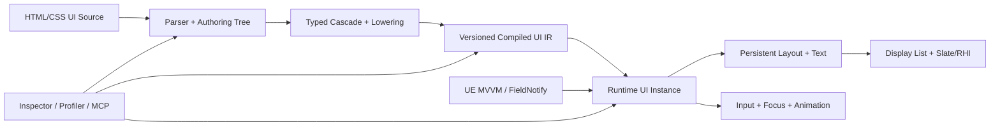

# WebToUE 工程技术总览与路线图

> 文档性质：长期维护的工程事实源（Living Engineering Document）
>
> 插件版本：`0.1.0-preview`
>
> 引擎基线：Unreal Engine 5.8
>
> 当前平台：Win64
>
> 当前里程碑：M2——增量原生运行时
>
> 最近核验：2026-08-12，基于 Git `3a9b800bcdc6` + working tree
>
> 统一术语：[CONTEXT.md](../../../CONTEXT.md)

本文同时回答四个问题：项目现在是什么、已经做到什么、为什么这样设计、下一步如何验收。它是工程状态和路线的入口，不是完整 Web 标准兼容承诺，也不替代源码、自动化测试或独立 ADR。

---

## 1. 文档使用与维护规则

### 1.1 信息分层

本文按变化速度组织，维护时不要把不同生命周期的信息重新混在一起：

1. **工程宪法**：项目定位、非目标、不可轻易改变的架构约束。
2. **当前快照**：版本、能力、测试、性能事实和风险，必须能由代码或构建结果核验。
3. **路线图**：宏观里程碑、活跃里程碑的微观工作包及退出条件。
4. **附录**：精确的 HTML/CSS/绑定支持矩阵和变更记录。

### 1.2 状态标记

| 标记 | 含义 |
| --- | --- |
| ✅ 已验证 | 已实现，并有自动化测试、构建结果或可重复证据。 |
| 🟡 已实现未度量 | 功能存在，但缺少性能、压力或跨平台证据。 |
| 🚧 进行中 | 已开始，尚未满足退出条件。 |
| ⬜ 已规划 | 已进入路线，但尚未开始。 |
| ⛔ 非目标 | 明确不进入当前产品边界。 |

路线进度使用“已通过验收项 / 总验收项”，不是工时百分比。每个验收项等权，只表示完成颗粒度，不表示剩余工作量。除非验收项明确另有约定，只有同时满足以下条件才可勾选：

- 功能代码合入。
- 对应自动化测试通过。
- 本文的当前能力、风险和路线状态已同步。
- 性能敏感功能有基准或确认没有破坏既定预算。

### 1.3 必须更新本文的事件

- 支持或移除 HTML 标签、CSS 属性、选择器、绑定或输入能力。
- 修改 Compiled UI IR、资产自定义版本或 Cook 边界。
- 改变样式、布局、绘制、命中或绑定的失效策略。
- 新增 Runtime 或 Editor 模块、第三方依赖、平台或引擎版本。
- 完成里程碑验收项、发现高风险问题或改变性能预算。
- 作出难以逆转且存在真实权衡的架构决定；此时还应新增 ADR，并从本文链接。

---

## 2. 一页工程仪表盘

### 2.1 当前判断

| 维度 | 当前结论 | 证据状态 |
| --- | --- | --- |
| 产品方向 | 使用前端式源语言构建 UE 原生 UI，方向正确。 | ✅ |
| 浏览器依赖 | 无 CEF、Chromium、WebBrowser 或通用页面运行时。 | ✅ |
| 原生程度 | 编译资产 + C++ 节点 + Yoga + 单 Slate 控件绘制。 | ✅ |
| 功能成熟度 | 已能覆盖受控的菜单/HUD 原型；尚非完整生产 UI 框架。 | 🟡 |
| 性能成熟度 | 固定体积轻、无默认 Tick；增量样式和布局尚未建立。 | 🟡 |
| Gameface 对标 | 架构形态接近专用原生 UI Runtime，工程成熟度与性能证据仍有明显差距。 | 🟡 |
| 当前最大风险 | 小范围状态变化会放大全树样式、文本缓存、资源和布局工作。 | ✅ |
| 当前策略 | 暂缓横向扩张 Web 特性，优先完成 M2 增量运行时。 | 🚧 |

### 2.2 版本与验证快照

| 项目 | 当前值 |
| --- | --- |
| 插件版本 | `0.1.0-preview` |
| Engine | UE 5.8 |
| SupportedTargetPlatforms | Win64 |
| 自动化测试 | 21 / 21 通过（2026-08-12，working tree） |
| 当前编译验证 | UE 5.8 Win64 Editor Development 通过（2026-08-12，working tree） |
| 历史发布验证 | Win64 Game Development/Shipping、BuildCookRun、BuildPlugin 均曾通过；发布前必须在当前提交重新执行 |
| Git 基线 | `3a9b800bcdc6` + working tree；未提交，不生成伪哈希 |
| 当前发布级别 | Developer Preview / 技术可行性与基础能力阶段 |

### 2.3 宏观里程碑

| 里程碑 | 对应前端演进经验 | 状态 | 验收进度 | 结果 |
| --- | --- | --- | --- | --- |
| M0 技术闭环 | 文档结构与样式可被独立渲染 | ✅ | 8 / 8 | 从 HTML/CSS 到 Cooked 原生 UI 的端到端闭环 |
| M1 UI 基础语义 | 排版、交互、本地化与诊断 | ✅ | 10 / 10 | 常规菜单/HUD 原型所需的受控基础子集 |
| M2 增量原生运行时 | 浏览器的 retained/incremental rendering | 🚧 | 2 / 7 退出门 | 可度量、局部失效、可扩展的 Runtime |
| M3 响应式与组件 | React/Vue/Svelte 的数据和组件抽象 | ⬜ | 0 / 8 | UE MVVM 驱动的组件、列表与结构复用 |
| M4 动画与响应式视觉 | 合成层、时间线与多视口适配 | ⬜ | 0 / 6 | 游戏级动效而不引入浏览器合成器 |
| M5 工具链与 MCP | DevTools、自动化与生态接口 | ⬜ | 0 / 7 | 可检查、可分析、可由工具安全驱动 |
| M6 1.0 产品化 | 标准化、兼容策略与平台工程 | ⬜ | 0 / 7 | 可被外部项目稳定依赖的插件 |

M2 的 `2 / 7` 表示“可重复性能基准、Trace/Stat 与硬预算门禁”和“原生、事件驱动的单控件运行时”两个退出门已经具备；其余退出门尚未完成。它不表示 M2 已完成约 29% 的工时。

---

## 3. 工程宪法

### 3.1 产品定位

WebToUE 将 HTML/CSS 视为 **UI Source**，而不是在游戏中运行的网页。编辑器负责解析、诊断并生成带版本的 **Compiled UI IR**；游戏运行时读取 WTUE Document，通过 UE 的对象、资源、输入和渲染能力生成 Runtime UI Instance。

直接价值：

- 前端开发者可以使用熟悉的结构与样式抽象。
- 游戏仍遵守 Unreal 的 UObject、资产、Cook、输入和平台构建流程。
- 避免通用浏览器内核的固定包体、内存、启动、安全和跨平台成本。
- UI 逻辑可继续存在于 C++、Blueprint、UE MVVM 和游戏系统中。

### 3.2 长期架构约束

1. Runtime 核心不依赖 CEF、Chromium、WebKit、Gecko 或通用 WebView。
2. Runtime 核心不以通用 JavaScript VM 作为状态和交互基础。
3. UI Source 必须先经过可诊断、可版本化的编译边界；Shipping 不读取磁盘前端源文件。
4. Compiled UI IR 与 Runtime State 必须分离；前者可共享，后者按视图实例存在。
5. 每个源节点不默认对应一个 UObject、UWidget 或独立 Slate Widget。
6. UE MVVM、FieldNotify、UObject 和类型化命令是响应式桥接方向。
7. 吸收前端历史中的结构、级联、组件、响应式和 DevTools 经验，但不追求浏览器标准完整度。
8. MCP 只作为可选 Editor Automation Surface，不得成为 Core、Runtime 或 Cooked 游戏依赖。

### 3.3 明确非目标

- 完整 DOM、浏览器导航、Cookie、Storage 和网页网络模型。
- 为兼容网页而复制浏览器历史遗留行为。
- 让任意 JavaScript 直接控制 UObject 或游戏世界。
- 仅为了 CSS 覆盖率而牺牲可预测性能、Cook 安全或跨平台能力。
- 在 1.0 前承诺任意网页可无修改运行。

---

## 4. 目标架构与当前差距



| 层 | 当前实现 | 目标状态 | 目标里程碑 |
| --- | --- | --- | --- |
| Authoring | 受控 HTML/CSS、自定义 `data-ue-*` | 明确版本的 WTUE Web Subset 与精确 Source Map | M2/M5 |
| Compiler | Parser、CSS 校验、级联、RichText lowering 集中于 Core | 分阶段编译管线、类型化属性、可缓存中间结果 | M2 |
| Asset/IR | 扁平 CompiledNodes/Rules、自定义版本 | 不可变、版本化、依赖完备、可迁移的 UI IR | M2/M6 |
| Runtime Instance | 运行节点混合源码、样式、布局和交互状态 | Compiled Node、Runtime State、Layout/Paint Cache 分离 | M2 |
| Reactivity | 根属性绑定、FieldNotify 刷新 | 依赖图、嵌套路径、转换器、命令、结构化更新 | M3 |
| Layout/Text | 每次脏布局重建 Yoga 树；节点级文本缓存 | 持久 Yoga、约束感知文本缓存、局部 Measure/Layout | M2 |
| Paint/Input | 递归 Slate Paint、全树 Hit Test | Display List、局部重绘、稳定排序、分层命中 | M2 |
| Tooling | 导入诊断、热重载、自动化测试 | Inspector、Profiler、Source Map、可选 MCP | M5 |

`UWebToUEDocument` 的 Compiled payload 已与每视图 Runtime Instance 分离；`FWebToUERuntimeInstance` 现在独占 Hydration Tree、连续 NodeState、Pseudo/Focus/Scroll 和绑定覆盖。`FWebToUENode` 仍承载结构、计算样式和布局结果，且 Text/Paint/Resource Cache 仍由 View 分散持有，因此 M2 还必须继续拆开这些生命周期，避免组件、动画和响应式能力放大全量重算成本。

---

## 5. 当前实现架构

### 5.1 模块边界

| 模块 | 类型 | 当前职责 |
| --- | --- | --- |
| `WebToUEYoga` | Runtime | 内置 Yoga 3.2.1，并提供 Flex 布局能力。 |
| `WebToUECore` | Runtime | HTML/CSS 解析、节点、选择器、样式计算、诊断、RichText lowering 和 Yoga 适配。 |
| `WebToUERuntime` | Runtime | WTUE Document、UMG 外壳、Slate 渲染、输入、绑定、事件和字体配置。 |
| `WebToUEEditor` | Editor | `.html` 导入/重导入、依赖收集、资产编译、文件监听和本地化导入。 |

当前依赖方向为 Yoga → Core → Runtime → Editor。Editor 不进入游戏目标。

`WebToUEEditor` 的 Runtime 专项基准私有依赖 UE 的 `ModelViewViewModel`，插件元数据显式声明该引擎插件依赖；产品 Runtime 的 FieldNotify 订阅仍通过 `FieldNotification` 和 `INotifyFieldValueChanged`，没有把 Editor 测试类型带入 Cooked 路径。

### 5.2 编译与运行链路

1. `UWebToUEFactory` 读取 HTML，并按源顺序收集 `<link>`、`<style>` 和元素内联样式。
2. `FWebToUECompiler` 解析结构、校验受支持 CSS、执行级联和富文本 lowering。
3. 工厂在局部 payload 中生成扁平节点、规则和资源引用，再原子提交给 `UWebToUEDocument`；Runtime 只能通过 const 边界读取 Compiled UI IR。
4. Editor 监听已加载文档依赖，文件变化后以 200ms 防抖重导入；失败时保留上次成功运行数据。
5. `UWebToUEView` 作为 UMG 控件宿主，底层创建单个 `SWebToUEView : SLeafWidget`。
6. Runtime hydration 后使用 Yoga 计算布局，通过 Slate 递归绘制、裁剪、文本、图片和交互状态。
7. Data Context 提供绑定值；语义化 UI Event 返回 Blueprint/C++ 游戏逻辑。

### 5.3 Cook 边界

Cooked 游戏保留 Compiled Nodes、Rules、Root、纹理/String Table 引用、诊断和 Runtime 模块。HTML/CSS 原文、源路径和依赖文件属于 Editor-only 数据。

现有 Development 和 Shipping IoStore 历史验证未发现 WebUI 源文件、Chromium、CEF 或 WebBrowser 运行文件。该结论在发布候选版本必须重新核验。

---

## 6. 当前能力矩阵

### 6.1 已实现并验证

- `.html` 导入、外链/内联 CSS、重导入、依赖监听与失败回退。
- 类型、Class、ID、复合、后代、直接子代、选择器组。
- `:hover`、`:active`、`:focus`、`:disabled`。
- Flex 主轴/交叉轴、Wrap、Gap、绝对定位、百分比尺寸和 Min/Max。
- Slate 约束文本测量、多行换行、`white-space: nowrap`。
- `FText` namespace/key、String Table、稳定自动 key 和基础富文本。
- `overflow: hidden/auto/scroll`、垂直滚轮、嵌套边界传递和裁剪感知 Hit Test。
- 鼠标点击、Tab/Shift+Tab、Enter/Space 焦点激活。
- 根 UObject 属性绑定、FieldNotify 自动刷新、可见性与启用状态。
- 语义化 `data-ue-on-click` → `OnUIEvent`。
- 自定义资产版本、旧资产重编译请求。
- Editor-only 的确定性 100/500/2,000 节点 Benchmark Corpus 与 50/200/500 规则集。
- Win64 Editor 编译以及 21 项自动化测试。

### 6.2 已实现但仍需工程化证据

- 中小型菜单与 HUD 的实际帧耗；固定 Compile/Style Corpus、单节点 Hover、单 FieldNotify、暖缓存完整布局和未变化重绘 Runtime 基线已建立，未变化 Paint 已满足零 WebToUE 标记分配/零已知 payload 字节硬门禁，但其他热路径和常驻内存字节仍缺专项证据。
- 高频伪状态与 FieldNotify 更新下的 Game Thread 峰值。
- 大型兄弟节点集合的 Paint 排序与全树 Hit Test 成本。
- 异常资源路径、超大文档和恶意输入的上限与恢复行为。
- 当前提交的 Game Development/Shipping、Cook 和独立插件打包矩阵。

### 6.3 尚未支持

- 输入框、文本编辑、IME、表单语义。
- 可见滚动条、拖拽/触摸滚动、惯性和虚拟列表。
- 手柄导航、CommonUI 深度集成、无障碍语义。
- 嵌套属性路径、Converter、双向绑定、类型化事件载荷。
- 组件、Props、Slots、条件节点、循环和 Keyed Diff。
- Transition、Keyframes、Transform、阴影、渐变、滤镜和 Mask。
- CSS Grid、Table、Float、CSS Variables、`calc()`、媒体查询。
- 独立样式/布局/事件检查器、性能时间线和跨平台矩阵。

精确的标签、属性和测试清单见附录 A～D。

---

## 7. 性能基线与预算

### 7.1 已知事实

2026-08-11 的 Win64 Editor DLL 文件体积：

| 模块 | 大小 |
| --- | ---: |
| `UnrealEditor-WebToUECore.dll` | 240,640 B |
| `UnrealEditor-WebToUEEditor.dll` | 211,968 B |
| `UnrealEditor-WebToUERuntime.dll` | 307,200 B |
| `UnrealEditor-WebToUEYoga.dll` | 340,480 B |
| 合计 | 1,100,288 B（约 1.05 MiB） |

这只能证明当前插件代码的固定文件成本很小，不代表 Shipping 包体、运行时内存、GPU 成本或 Gameface 性能对等。

M2 已建立三档确定性 Benchmark Corpus：100 节点/50 规则、500 节点/200 规则和 2,000 节点/500 规则。Automation Test 会验证源码生成确定性、编译无错误、运行节点/规则精确计数以及固定 Binding/Hover 目标。Runtime 现已在真实调用边界记录 Hydrate、Style、Measure、Layout、Paint Build、Hit Test、Binding 七阶段的 UE cycle stat、Insights trace scope 和线程局部 Automation capture；同一固定 Snapshot 还记录 Hydrate 节点/规则、Style 节点访问、Selector 求值/匹配、Yoga 节点、Text Layout 构建/计算、Brush 构建和标记分配事件，并验证真正的嵌套 capture 隔离。

固定 Corpus 的单次 Compile 可重复得到：100/50 场景 `100` 次 Style 节点访问、`5,000` 次 Selector 求值、`138` 次匹配；500/200 场景为 `500 / 100,000 / 694`；2,000/500 场景为 `2,000 / 1,000,000 / 2,794`。三节点 Runtime 集成场景验证 `3` 个 Hydrate 节点、`1` 条规则、`3` 个 Yoga 节点、`1/2` 次 Text Layout 构建/计算、`4` 个 Brush 和 `20` 个标记分配事件。`tracked_allocations` 只统计 WebToUE 源码中明确标注、可归因的分配点，不等同于进程级 malloc 或 Slate/Yoga 内部分配总数。

Snapshot Telemetry schema `2` 以稳定名称枚举七阶段的调用数/毫秒和十二个工作量计数；除全部显式分配事件外，额外记录调用点能够精确报告 payload 容量的事件数和字节数，使部分字节覆盖不会被误读成进程或 Runtime 总内存。Editor Benchmark 通过 UE 原生 `SetTelemetryStorage` / `AddTelemetryData` 输出 `Saved/Automation/Telemetry/WebToUEPerformance.csv`。Benchmark sampling policy schema `1` 固定为 Win64 `WindowsEditor` Development、1 次 warmup、20 个计量样本、常规 median P50 和 nearest-rank P95；budget policy schema `5` 明确 Hover、FieldNotify、暖缓存完整布局、未变化重绘的目标及 Observe/Enforce 状态，当前只有已稳定达标的暖缓存完整布局进入硬门禁。运行时通过不含主机名的 Engine/OS/CPU/GPU/核心数/内存指纹标识可比环境。当前固定 Compile/Style Corpus 的每个场景写入 20 个各含 `33` 字段的原始样本上下文和一个含 `20` 字段的汇总上下文；三个场景共 `2,040` 行、`63` 个上下文。Core/Runtime 不负责文件 I/O，捕获热路径也不执行 Telemetry 枚举或分位数计算。

同一 Editor Development 环境中，阶段计时插桩前固定 Corpus 10 样本为 median `0.600095 s`、P95 `0.605533 s`；插桩后 10 样本为 median `0.611922 s`、P95 `0.619202 s`，分别变化 `+1.97%` 与 `+2.26%`。工作量计数和原生 Telemetry 的历史 10 样本外壳也均低于临时 `+5% / +10%` 回归守门，但这些数据早于正式采样政策，只保留为插桩开销证据。

2026-08-11 的正式基线使用环境指纹 `79E20297`：UE `5.8.1-56057345`、Windows 11 25H2、i7-12700KF `12/20` 核心/线程、32 GB、RTX 5050，Win64 Editor Development。完整 14 项回归中的 Compile Style P50/P95 为：100/50 场景 `2.7250 / 2.9380 ms`，500/200 场景 `50.2063 / 51.0051 ms`，2,000/500 场景 `493.1027 / 494.4741 ms`。同一新 Editor 会话的两次 sampling policy schema `1` 运行中，三场景 P50 变化范围为 `-0.08%～+0.55%`，P95 为 `+0.40%～+2.64%`。这证明采样规则和输出可重复，不代表 Runtime 局部更新预算已达标；该 Compile Corpus 只执行 Compile/Style，其他 Runtime 阶段为零，内存字节和自动预算门禁仍未建立。

同日基于 `5179ec43ea52` + working tree 建立了首个 Runtime 专项：500 节点/200 规则的单节点 Hover，从稳定未 Hover 帧开始，端到端样本覆盖 Mouse Move、Hit Test、Style/Brush 重建、Measure/Layout 与 Paint，并把测试夹具的 Hit Test Grid/Draw Element List 构造排除在计时外。相同环境指纹 `79E20297`、1 次 warmup、20 个样本的两次连续聚焦运行得到 P50/P95 `55.6425 / 56.8578 ms` 与 `55.6616 / 56.8824 ms`，分别变化 `+0.03% / +0.04%`；完整 15 项回归中为 `55.7110 / 56.1389 ms`。该完整回归的阶段 P95 为 Style `51.4749 ms`、Measure `3.2947 ms`、Layout `4.0031 ms`、Paint Build `4.6945 ms`、Hit Test `0.0244 ms`，其中阶段为 inclusive 计时，不应相加为端到端时长。每个样本精确记录 `500` 次 Style 节点访问、`100,000` 次 Selector 求值和 `500` 个 Yoga 节点重建；每轮输出 `664` 行、`21` 个上下文。结果稳定但远高于 `< 0.5 ms` 目标，因此只建立基线和机器可读目标，不把未达标预算伪装成通过的硬门禁。

同日继续建立 500/200 单 FieldNotify 更新 Runtime 专项。测试使用 Editor-only 的 `UMVVMViewModelBase`，对固定 `BenchmarkLabel` 字段走真实 setter、FieldNotify 广播、`UWebToUEView` 订阅回调、Binding、Style/Brush、Measure/Layout 与 Paint；等长文本重置、稳定 Paint 及 Hit Test Grid/Draw Element List 构造均在计时外。相同环境的两次连续聚焦运行 P50/P95 为 `55.1823 / 56.1490 ms` 与 `55.6826 / 57.4543 ms`，分别变化 `+0.91% / +2.32%`；完整 16 项回归中为 `55.1790 / 56.8699 ms`。该完整回归的阶段 P95 为 Binding `52.3142 ms`、Style `51.4202 ms`、Measure `3.5181 ms`、Layout `4.3019 ms`、Paint Build `5.3780 ms`、Hit Test `0 ms`。每个样本精确断言一次 Binding 回调、`500` 次 Style 节点访问、`100,000` 次 Selector 求值和 `500` 个 Yoga 节点重建；每轮同样输出 `664` 行、`21` 个上下文。结果量化了单字段变化仍被放大为全树刷新，且远高于 `< 0.5 ms` 目标。

同日进一步建立 500 节点暖缓存完整布局专项，并把 budget policy 升为 schema `2`。测试在真实 `UWebToUEView` 上先以非计时 Paint 预热每视图文本缓存，再只计时一次完整 Layout；两次连续聚焦运行 P50/P95 为 `0.657301 / 0.716001 ms` 与 `0.662152 / 0.692900 ms`，分别变化 `+0.74% / -3.23%`，完整 17 项回归中为 `0.668652 / 0.802100 ms`，满足 `< 2.0 ms` 目标。完整回归的 Measure/Layout P95 为 `0.164300 / 0.801500 ms`，其余五阶段为 `0 ms`。每个样本精确断言 `1` 次 Layout、`249` 次 Measure、`500` 个 Yoga 节点重建、`0 / 249` 次 Text Layout 构建/计算和 `749` 个 WebToUE 标记分配事件；Style、Selector、Brush、Binding、Paint 与 Hit Test 工作量均为零。每轮输出 `685` 行、`21` 个上下文。该结果证明固定 Corpus 的暖缓存完整布局已在当前机器满足预算，但仍会重建完整 Yoga Tree；Hover/FieldNotify 的约 `4 ms` Layout 还包含全树样式刷新清空 Text Layout Cache 后的冷文本布局，不应与该暖路径混为一谈。

同日继续建立 500 节点暖缓存未变化重绘专项，并把 budget policy 升为 schema `3`。测试先以非计时 Paint 预热 Layout/Text/Brush，随后不改变状态、数据或 viewport，只计时真实 Slate Paint；两次连续聚焦运行 P50/P95 为 `0.252949 / 0.287399 ms` 与 `0.255549 / 0.273000 ms`，分别变化 `+1.03% / -5.01%`，完整 18 项回归中为 `0.259651 / 0.335000 ms`。完整回归仅 Paint Build 非零，P95 `0.332500 ms`；每个样本精确断言 `0` 次 Tick、`1` 次 Paint Build、`249` 次 Text Layout Compute、`0` 次 Text Layout Build 和 `250` 个 WebToUE 标记分配事件，其余阶段和工作量均为零。每轮输出 `728` 行、`21` 个上下文。Tick 目标满足，但根节点及 `249` 个按钮在 Paint 中复制子数组，导致零临时分配目标未满足。该场景明确测量“Slate 实际请求重绘时的未变化 Paint”，不等同于没有进入 Paint 的空闲引擎帧或 global invalidation cache 命中；`tracked_allocations` 也不代表 Slate/allocator 内存字节。

同日为该未变化 Paint 路径建立首个可归因字节基线，并将 Snapshot Telemetry / budget policy 分别升为 schema `2 / 4`。新指标把所有显式分配事件与“payload 字节已知”的事件分开；本场景的根节点和 `249` 个按钮子数组复制实现 `250 / 250` 覆盖，20 个样本均精确为 `7,984 B` 容器 payload 容量。两次聚焦 P50/P95 为 `0.251951 / 0.337999 ms` 与 `0.249101 / 0.289902 ms`，完整 18 项回归为 `0.259100 / 0.297900 ms`，Paint Build P95 `0.296100 ms`。完整 schema `2` 回归输出 `4,946` 行、`147` 个上下文，其中 Compile/Style、Hover、FieldNotify、未变化 Paint 和暖布局分别为 `2,040 / 704 / 704 / 773 / 725` 行。相对上一完整回归，Compile 三场景、Hover、FieldNotify、暖布局和未变化 Paint 的 P50/P95 变化均未超过既有临时 `+5% / +10%` 插桩守门；该字节数不含 allocator overhead、Slate/Yoga 内部分配或完整 Runtime 常驻内存。零事件和零 payload 字节目标仍未满足。

同日基于 `72533da10002` + working tree 将 budget policy 升为 schema `5`，四个 Runtime 汇总均输出机器可读的 `target_enforced`；暖缓存完整布局成为首个强制性能回归门禁，P95 达到或超过 `2.0 ms` 会直接使 Automation Test 失败。相同环境、相同 500/200 Corpus、1 次 warmup 和 20 样本的两次连续聚焦运行 P50/P95 为 `0.640400 / 0.803798 ms` 与 `0.647400 / 0.677601 ms`，均通过门禁；完整 18 项回归中为 `0.650749 / 0.776399 ms`。相对修改前完整回归 `0.662850 / 0.757299 ms`，P50/P95 变化约 `-1.83% / +2.52%`，没有改变 Runtime 热路径、缓存所有权、Dirty 传播或全树 Yoga 工作量。完整回归输出 `4,950` 行、`147` 个上下文，其中 Compile/Style、FieldNotify、Hover、未变化 Paint 和暖布局分别为 `2,040 / 705 / 705 / 774 / 726` 行；Hover、FieldNotify 和未变化 Paint 仍为 Observe，因为它们分别约 `54.53 ms`、`54.70 ms` 和 `250` 次/`7,984 B` 标记分配，尚未满足目标。

2026-08-12 基于 `068732527868` + working tree 将每个父节点 Paint 时的子数组复制/排序替换为 `SWebToUEView` 持有的扁平 Paint Order Cache，并将 budget policy 升为 schema `6`。缓存以 Runtime UI Instance 为所有者，结构或样式刷新时按 `z-index` 稳定排序并重建；未变化 Paint 只进行 `O(N)` 缓存遍历，不再产生原有 `O(N)` 临时子数组 payload。相同环境修改前聚焦基线 P50/P95 为 `0.253649 / 0.289399 ms`、`250` 个标记分配和 `7,984 B`；修改后两次聚焦为 `0.231652 / 0.248600 ms` 与 `0.233900 / 0.289701 ms`，最终 19 项完整回归为 `0.238301 / 0.266302 ms`，20 个样本全部为 `0` 个标记分配、`0` 个 payload 事件和 `0 B`，因此未变化 Paint 零分配目标进入强制门禁。最终完整回归输出 `4,950` 行、`147` 个上下文，暖缓存完整布局 P95 `0.796400 ms` 继续通过 `< 2.0 ms`；Hover/FieldNotify P95 `56.160700 / 56.295600 ms` 仍未达 `< 0.5 ms`，不能启用对应硬门禁。Paint Order 专项测试验证负/正 `z-index`、同层源顺序和 Hover 样式变化后的缓存重建。

同日基于 `3a9b800bcdc6` + working tree 建立显式每视图 Runtime Instance 和连续 NodeState 所有权：Pseudo/Disabled、绑定文本/可见/启用、Focus/Pressed/Hover 与 Scroll 状态不再存放于 `FWebToUENode` 或 `SWebToUEView` 的零散字段；Hydration 为每个节点分配稳定索引，并以一个可归因的连续 payload 保存状态，Paint/HitTest 热路径使用 `FORCEINLINE` 索引访问。相同环境修改前聚焦 P50/P95 为 Hover `53.927099 / 54.416399 ms`、FieldNotify `54.351000 / 54.858100 ms`、暖布局 `0.659700 / 0.720799 ms`、未变化 Paint `0.233199 / 0.293601 ms`；修改后两次连续聚焦为 Hover `55.152901 / 55.800501` 与 `55.964701 / 56.899898 ms`，FieldNotify `55.652900 / 57.248000` 与 `56.292050 / 56.945499 ms`，暖布局 `0.654649 / 0.693399` 与 `0.660051 / 0.773799 ms`，未变化 Paint `0.235550 / 0.262897` 与 `0.234852 / 0.268802 ms`。最终 21 项完整回归中四者为 `56.230349 / 56.711402`、`56.173099 / 56.511901`、`0.653800 / 0.762999` 和 `0.242550 / 0.262398 ms`；暖布局 `< 2.0 ms` 与未变化 Paint `0 / 0 B` 硬门继续通过。Hover/FieldNotify 仍为 Observe 且未达 `< 0.5 ms`，本次只建立生命周期边界，不宣称增量更新性能改善。

有利特征：

- 没有浏览器内核和通用脚本 VM。
- `SWebToUEView` 默认 `SetCanTick(false)`。
- 一个视图使用一个 Slate 叶控件，而不是每节点一个 UObject/UWidget。
- 滚动偏移变化目前只使 Paint 失效。

已知放大路径：

- Hover、Pressed、Focus 和绑定刷新调用全局 `RebuildStylesAndBrushes`。
- 样式解析对每个节点遍历规则并排序匹配项，近似 `O(N × R × selector-depth)`。
- 全局样式刷新会清空全部 Text Layout Cache。
- Layout Dirty 时重新创建并递归释放完整 Yoga Tree。
- Brush 重建可能同步 `LoadObject<UTexture2D>`。
- Paint 已缓存稳定兄弟顺序，但仍递归遍历节点树；Hit Test 同样全树递归遍历。

因此当前性能结论是：**固定成本轻、静态和低频界面有良好基础；动态扩展性尚未被证明。**

### 7.2 M2 初始性能预算

预算以项目指定的固定测试机和 Development 构建为准；首次基准建立后允许校准数值，但改变预算必须记录原因。

| 场景 | 初始目标 |
| --- | --- |
| 未变化帧 | UI Runtime Tick 为 0；WTUE 自身临时分配为 0 |
| 500 节点 / 200 规则，单节点 Hover | Game Thread P95 < 0.5 ms |
| 500 节点 / 200 规则，单 FieldNotify 更新 | Game Thread P95 < 0.5 ms |
| 500 节点暖缓存完整布局 | P95 < 2.0 ms |
| 2,000 节点压力场景 | 状态局部变化不得触发全树资源加载或不可控的 16.6 ms 尖峰 |
| 性能回归 | CI/本地标准脚本输出样式、布局、文本、绘制、命中和内存分项 |

这些是逐项验收的路线目标；当前暖缓存完整布局和未变化 Paint 零 WebToUE 标记分配/零已知 payload 字节已达到目标并进入强制回归门禁，Hover 与 FieldNotify 仍处于 Observe 且未达预算。其他目标必须以对应专项证据判断，不能由单项通过外推；现有计数也不等同于进程级 allocator 或 Slate 内部分配总量。

---

## 8. 风险登记册

| ID | 风险 | 等级 | 当前证据 | 缓解路线 | 状态 |
| --- | --- | --- | --- | --- | --- |
| R-01 | 伪状态/绑定导致全树样式、Brush、文本和布局刷新 | Critical | 500/200 Hover 与单 FieldNotify 基准均精确记录 `500` 次 Style 节点访问、`100,000` 次 Selector 求值和 `500` 个 Yoga 节点重建 | Dirty Graph、Selector Index、属性影响分类 | 🚧 M2 |
| R-02 | Yoga Tree 每次布局重建 | High | 500 节点暖缓存完整布局逐样本确认重建 `500` 个 Yoga 节点；完整回归 P95 `0.802100 ms`，虽满足当前预算但仍是 `O(N)` 全树工作 | Persistent Yoga Nodes、局部 Dirty | ⬜ M2 |
| R-03 | 编译数据与 Runtime State 混合在节点结构 | High | 资产 payload 已私有化；每视图 `FWebToUERuntimeInstance` 独占 Hydration Tree、连续 NodeState、Pseudo/Focus/Scroll 和绑定覆盖，双实例隔离专项已通过；`FWebToUENode` 仍混合结构、Computed Style 和 Layout，Cache 仍分散于 View | 继续拆分 Computed Style、Layout 和 Cache 生命周期 | 🚧 M2 |
| R-04 | 状态变化路径可能同步加载纹理 | High | Brush 重建使用 `LoadObject` | 编译依赖 + Resource Cache + 异步策略 | ⬜ M2 |
| R-05 | Compiler/View 职责集中，修改回归面扩大 | High | 两个核心实现文件体量和职责已确认 | 按编译阶段和 Runtime 服务拆分 | ⬜ M2 |
| R-06 | 没有完整可重复性能基准，无法证明“原生且高效” | Critical | 固定 Compile Corpus、七阶段计时/capture、可归因工作量计数、schema `2` 原生 Automation Telemetry/CSV、固定环境指纹和阶段 P50/P95 政策已建立；budget policy schema `6` 已强制暖缓存 Layout `< 2.0 ms` 和未变化 Paint 零 WebToUE 标记分配/零已知 payload 字节，本次完整回归分别为 P95 `0.762999 ms` 与 `0 / 0 B`；500/200 Hover 与单 FieldNotify 仍未达 `< 0.5 ms`，其他热路径/常驻内存字节和剩余预算门禁仍缺失 | Benchmark、Stat、Trace、预算门禁 | 🚧 M2 |
| R-07 | CSS 声明使用 Map，重复声明顺序不完全等价 | Medium | 当前声明模型已确认 | Ordered Declaration IR | ⬜ M2 |
| R-08 | 仅 Win64，平台假设尚未暴露 | Medium | `.uplugin` 平台限制 | 平台抽象审计与构建矩阵 | ⬜ M6 |
| R-09 | MCP 为 Experimental、本地服务无认证，通用 Python 执行面权限较高 | Medium | UE 5.8 原生 MCP 与 VibeUE 5.0 已在开发环境验证 | 仅回环、本地受信任、Editor-only；项目专用工具仍默认关闭并遵守最小权限 | ⬜ M5 |
| R-10 | workspace-only sandbox 可使 UBT/Turnkey 在关闭 Editor 后因用户目录不可写而失败，并诱发重复启动 | High | 复现 `UnauthorizedAccessException`；受限 Preflight 失败且未启动 Editor，精确非沙箱流程 build/readiness/MCP 通过 | 关 Editor 前写探针、项目互斥锁、持久 Operation State、单一 Skill 路由；见 [ADR-0001](ADRs/ADR-0001-Editor-Lifecycle-Execution-Boundary.md) | ✅ Mitigated |

风险关闭必须链接对应测试、基准或代码变更，不能只把状态改成“已解决”。

---

## 9. 宏观路线：按前端抽象演进，而非复制浏览器

### M0——技术闭环 ✅ 8 / 8

- [x] HTML/CSS 可导入。
- [x] 可生成 Unreal Asset。
- [x] Yoga 可计算布局。
- [x] Slate 可原生绘制。
- [x] UMG 可承载 WTUE View。
- [x] UObject 绑定和语义事件闭环。
- [x] 文件变化可重导入。
- [x] Cooked 运行不依赖 UI Source 或浏览器内核。

### M1——UI 基础语义 ✅ 10 / 10

- [x] 多来源 CSS 级联和精确诊断。
- [x] 约束文本测量和自动换行。
- [x] 稳定 FText/String Table 身份。
- [x] 基础富文本 run。
- [x] 垂直滚动、嵌套边界和裁剪命中。
- [x] 鼠标和基础键盘交互。
- [x] 资产自定义版本和旧资产识别。
- [x] Development/Shipping Cook 历史闭环。
- [x] Core/Runtime/Editor 自动化测试基础。
- [x] 工程技术总览和明确非目标。

### M2——增量原生运行时 🚧 2 / 7 退出门

- [x] 有可重复基准、Trace/Stat 和预算门禁。
- [ ] Compiled UI IR、Runtime State、Layout/Paint Cache 完全分离。
- [ ] Typed Property、Selector Index 和 Ordered Declaration 建立。
- [ ] Style/Measure/Layout/Paint/HitTest Dirty Graph 生效。
- [ ] Yoga、Text 和 Resource Cache 持久化且局部失效。
- [ ] Paint 顺序、Display List 和 Hit Test 可扩展。
- [x] 单 Slate 控件、无默认 Tick、无浏览器内核的事件驱动基础。

退出结果：500 节点常规菜单的局部状态变化满足性能预算；全量更新路径可被 Profiler 明确解释。

### M3——响应式数据与组件 ⬜ 0 / 8

- [ ] UE MVVM/FieldNotify 依赖图。
- [ ] 嵌套属性路径与类型化 Converter。
- [ ] Command 与类型化事件载荷。
- [ ] 编译期 Component 与 Props。
- [ ] Slots 与模板复用。
- [ ] 条件节点与列表循环。
- [ ] Stable Key、Keyed Diff 和实例复用。
- [ ] 大列表虚拟化。

退出结果：单字段变化只触达依赖节点；列表更新复用稳定实例，不进行全树重建。

### M4——动画与响应式视觉 ⬜ 0 / 6

- [ ] Typed Transition 和 easing。
- [ ] Keyframes 时间线。
- [ ] Transform、Opacity、Color 的 Paint/Composite 路径。
- [ ] Layout Animation 与 Paint Animation 分层。
- [ ] DPI、Safe Zone、视口和输入设备条件。
- [ ] 阴影、渐变、九宫格等受控商业 UI 能力。

退出结果：常用动画不触发无关 Cascade/Yoga；标准压力场景达到目标帧率。

### M5——工具链与 MCP ⬜ 0 / 7

- [ ] Authoring Tree、IR 和 Runtime Tree Inspector。
- [ ] Cascade、Computed Style、Box Model 和焦点可视化。
- [ ] Source Map 与源码跳转。
- [ ] Incremental Compile、DDC 和依赖图。
- [ ] Screenshot/Golden 测试。
- [ ] 性能时间线、Paint Rect 和内存统计。
- [ ] 可选 `WebToUEMCP` Editor-only 适配器。

退出结果：问题能够从画面定位到源文件、规则、布局和耗时；AI 工具只能通过受控接口操作 Editor。

### M6——1.0 产品化 ⬜ 0 / 7

- [ ] Public API 与扩展点稳定。
- [ ] UI IR/资产迁移和兼容策略稳定。
- [ ] Win64 以外的平台矩阵。
- [ ] Game/Shipping/Cook/BuildPlugin 自动发布门禁。
- [ ] 安全、异常恢复和资源上限。
- [ ] 文档、样例、升级指南、错误码和支持矩阵。
- [ ] 分发、许可证和第三方声明完备。

退出结果：外部项目可以依据公开版本、兼容策略和性能预算长期升级。

---

## 10. M2 微观执行路线

M2 是当前唯一活跃里程碑。工作包按依赖顺序推进；原则上不在 M2.0～M2.4 完成前扩张大型 CSS、组件或动画能力。

M2.0 只验收性能可观测性基础设施是否形成闭环：固定工作负载、分阶段计时、可归因计数、标准输出、采样政策，以及至少一个时间预算和一个分配预算能够真实阻止回归。第 7.2 节全部场景达标属于 M2.7 总退出门；依赖增量架构才能达到的 Hover、FieldNotify、局部 Layout 和缓存命中预算分别在 M2.3、M2.4 实现和启用，不能反向阻塞可观测性基础设施结束。

### M2.0——性能可观测性 ✅ 6 / 6

- [x] 固定 100/500/2,000 节点文档生成器与 50/200/500 规则集。
- [x] 分别统计 Hydrate、Style、Measure、Layout、Paint Build、Hit Test、Binding。
- [x] 记录 Hydrate 节点/规则、Style 节点、Selector 求值/匹配、Yoga、Text Layout、Brush、WebToUE 标记分配事件，以及已知 payload 覆盖事件/字节。
- [x] Unreal Insights/Stat 保留七阶段事件，schema `2` Automation Telemetry 生成标准 CSV。
- [x] 固定测试机、构建配置、采样次数和 P50/P95 规则。
- [x] budget policy schema `6` 以机器可读方式区分 Observe/Enforce，并让代表性的时间预算和分配预算真实阻止回归；暖缓存完整布局和未变化 Paint 零 WebToUE 标记分配/零已知 payload 字节均为强制门禁，本次完整回归分别以 P95 `0.762999 ms` 与 `0 / 0 B` 通过。

### M2.1——拆分生命周期 🚧 4 / 6

- [x] 定义只读 `CompiledDocument/CompiledNode` 边界。
- [x] 定义每视图 `RuntimeInstance/NodeState`。
- [ ] Layout、Text、Paint 和 Resource Cache 不再写回 Compiled IR。
- [x] Binding、Pseudo State、Focus、Scroll 只存在于 Runtime State。
- [x] Runtime 可共享同一 Document 创建两个互不污染的实例。
- [ ] Compiler 和 View 按职责拆分，当前 WebToUE 回归测试无回归。

### M2.2——类型化样式与选择器索引 ⬜ 0 / 5

- [ ] CSS Property ID + Typed Value，停止在热路径解析字符串。
- [ ] 声明保持源顺序，正确处理同规则重复属性。
- [ ] 规则按 ID/Class/Tag/Pseudo 候选索引。
- [ ] 属性元数据声明 Inherited 及影响 Style/Measure/Layout/Paint 的范围。
- [ ] Cascade 结果和浏览器式无效声明语义有专项测试。

### M2.3——Dirty Graph ⬜ 0 / 6

- [ ] 明确 Structure/Style/Measure/Layout/Paint/HitTest Dirty Flags。
- [ ] Hover/Active/Focus 只处理受影响选择器候选，并在 500/200 Corpus 达到 P95 `< 0.5 ms` 后启用硬门禁。
- [ ] Paint-only 属性不触发 Measure/Layout。
- [ ] 继承属性只向必要后代传播。
- [ ] FieldNotify 只刷新依赖节点，并在 500/200 Corpus 达到 P95 `< 0.5 ms` 后启用硬门禁。
- [ ] 每次更新可报告“为什么这些节点失效”。

### M2.4——持久缓存 ⬜ 0 / 6

- [ ] Yoga Node 与 Runtime Node 同生命周期。
- [ ] 仅脏子树进入 Measure/Layout；局部更新不再重建全树 Yoga，并建立对应工作量和时间硬门禁。
- [ ] Text Layout 以文本、字体、样式和约束作为 Cache Key，并对命中/重建次数建立可归因预算门禁。
- [ ] 伪状态变化不再无条件清空全部 Text Layout。
- [ ] 编译资产生成明确资源依赖，Runtime 使用 Resource Cache。
- [ ] 状态变化路径不执行同步纹理加载。

### M2.5——Paint 与命中扩展性 🚧 1 / 5

- [x] 稳定 Paint Order，避免每帧复制排序不变子节点。
- [ ] 引入可复用 Display List/Paint Commands。
- [ ] 局部 Paint Invalidations 和重绘区域可视化。
- [ ] Hit Test 使用裁剪感知的层次包围或空间索引。
- [ ] 500/2,000 节点场景满足预算并无异常分配。

### M2.6——生产 UI 基础补齐 ⬜ 0 / 7

- [ ] 可见垂直/水平滚动条。
- [ ] 鼠标拖拽、触摸和惯性滚动。
- [ ] 手柄导航与 CommonUI 协作。
- [ ] DPI 与 Safe Zone。
- [ ] 输入框、文本编辑和 IME 的最小可用方案。
- [ ] 无障碍语义的节点模型。
- [ ] 输入、重导入、绑定和截图自动化覆盖。

### M2.7——退出检查 ⬜ 0 / 6

- [ ] 当前 21 项测试及后续新增 M2 测试全部通过。
- [ ] Editor/Game Development/Shipping 编译通过。
- [ ] Cook、IoStore 和 BuildPlugin 通过。
- [ ] 第 7.2 节性能预算通过。
- [ ] R-01～R-06 关闭或降至可接受等级。
- [ ] 文档、示例和升级说明同步。

### 建议的前六个实现变更

1. Benchmark/Stats 基础与固定压力文档。
2. Compiler/View 拆分和 Compiled IR/Runtime State 类型设计。
3. Dirty Flags 与属性影响元数据。
4. Selector Index 与局部 Pseudo State 重算。
5. Persistent Yoga/Text/Resource Cache。
6. Display List、Paint/Hit Test 优化及 M2 性能门禁。

---

## 11. MCP 接入策略

UE 5.8 的 Unreal MCP 仍是 Experimental。WebToUE 可以利用它改善编辑器开发体验，但不得让实验协议污染 Runtime 架构。

当前开发环境已启用 UE 原生 `ModelContextProtocol`、`AllToolsets` 和 Editor-only 的 VibeUE 5.0。VibeUE 以固定提交 `24ac69d750c1c558a1b78ed5b60644ce000198d3` vendored 到 `Plugins/VibeUE`，版本与归档校验记录在项目根 `Plugins/VibeUE.version.json`；它与原生工具共用 `http://127.0.0.1:8000/mcp`。2026-08-11 已验证 VibeUE Win64 BuildPlugin、WebToUEEditor Development 构建、85 个 Agent Skills、83 个 Toolsets、Python API 发现/执行、PerformanceService，以及通过原生 AutomationTestToolset 运行的 13 / 13 WebToUE 测试和 17 / 17 VibeUE 测试。

Editor 生命周期统一路由到 `$operate-webtoue-editor` 及项目包装器。UBT、Turnkey 和 Editor 必须由同一精确批准的非沙箱边界启动；包装器在关闭健康 Editor 前验证 Engine/项目/LocalAppData 写权限，并用项目互斥锁与 `Saved/VibeUE/Lifecycle/operation.json` 阻止重复操作。长期决策和被否决方案见 [ADR-0001：Editor 生命周期执行边界](ADRs/ADR-0001-Editor-Lifecycle-Execution-Boundary.md)。

VibeUE 只作为受信任开发机上的通用 Editor Automation Surface，用于日志、截图、PIE、性能采样和通用资产操作。它暴露的任意 Python 执行能力不构成 WebToUE 产品接口，也不改变下述领域化 `WebToUEMCP` 规划；后者仍必须围绕 Compiled UI IR、Diagnostics、Computed Style、Source Map 和 Benchmark 提供收敛后的受控能力。

建议未来新增独立、可选、默认关闭的 `WebToUEMCP` Editor 模块：

```text
WebToUECore
WebToUERuntime
WebToUEEditor
WebToUEMCP       # EditorOnly, optional
```

M2 期间先建立与传输协议无关的 Compiler、Diagnostics、Inspection、Benchmark Editor Services。M5 再让 MCP 作为这些服务的适配器，而不是唯一入口。

首批候选能力：

- Resources：文档列表、Compiled UI IR、诊断、支持矩阵、性能快照。
- Read-only Tools：检查文档、Computed Style、布局、依赖和测试结果。
- Mutating Tools：编译、重导入和生成样例；必须支持参数校验、UE Transaction/Undo 和明确权限。

禁止暴露任意文件系统、Shell、任意 UObject/Blueprint 调用或远程无认证访问。MCP 不参与 Cook，不进入玩家设备，也不用于 Runtime 消息传递。

---

## 12. 测试与发布门禁

### 12.1 当前自动化测试（21 / 21）

| 层 | 测试 |
| --- | --- |
| Core | `HtmlCss`、`FlexLayout`、`ConstrainedMeasure`、`RichTextCompile`、`ScrollLayout`、`CssDiagnostics` |
| Runtime | `AssetVersion`、`CompiledDocumentBoundary`、`RuntimeInstanceIsolation`、`TextWrapping`、`LocalizedRichText`、`ScrollInteraction`、`PerformanceInstrumentation`、`PaintOrderCache` |
| Editor | `BenchmarkScenarios`、`BenchmarkStatistics`、`RuntimeHoverBenchmark`、`RuntimeFieldNotifyBenchmark`、`RuntimeWarmLayoutBenchmark`、`RuntimeUnchangedPaintBenchmark`、`LocalizationImport` |

Editor 生命周期基础设施另有 Pester 3 / 3：可写隔离环境 Preflight、探针失败不创建操作、持久存活 PID 识别与精确中断残留清理。它不计入 UE Automation 的 21 项。

### 12.2 仍需建立

- Runtime Pseudo State 局部失效测试。
- FieldNotify 依赖节点增量更新测试。
- Reimport 成功、失败回退和依赖变化测试。
- 鼠标、键盘、手柄、触摸与 IME 自动化。
- Screenshot/Golden 跨 DPI 测试。
- 100/500/2,000 节点性能和内存回归。
- Win64 Editor/Game Development/Shipping/Cook/BuildPlugin 一键门禁。

功能测试通过不等于性能达标；发布门禁必须分别报告 Correctness、Performance、Packaging 和 Compatibility。

---

## 13. 变更记录

只记录会改变工程判断、架构、里程碑或支持边界的变化；普通提交不在此重复 Git 历史。

| 日期 | 基线 | 变化 | 路线影响 |
| --- | --- | --- | --- |
| 2026-08-12 | `3a9b800` + working tree | 新增每视图 `FWebToUERuntimeInstance` 和连续 `FWebToUERuntimeNodeState`：Hydration 节点以稳定索引访问状态，Pseudo/Disabled、绑定文本/可见/启用、Focus/Pressed/Hover 与 Scroll 不再存放于 `FWebToUENode` 或 View 零散字段；新增 `RuntimeInstanceIsolation` 验证同一 Document 的双实例在 Pseudo/Focus、Scroll、Bound Text 上互不污染且不修改 Compiled payload。Win64 Editor Development build、readiness/MCP/Python/World、聚焦 8/8 和完整 21/21 通过；两次聚焦和完整回归继续通过暖 Layout `< 2.0 ms` 与未变化 Paint `0 / 0 B` 硬门，最终完整回归 P95 分别为暖 Layout `0.762999 ms`、未变化 Paint `0.262398 ms`、Hover `56.711402 ms`、FieldNotify `56.511901 ms`。 | M2.1 达到 4/6；R-03 继续缓解但保持 High，因为 Computed Style、Layout 和 Cache 尚未完全分离；资产 schema、自定义版本和旧资产行为不变。 |
| 2026-08-12 | `d1cdda3` + working tree | 将 `UWebToUEDocument` 的节点、规则、根索引和资源依赖 payload 私有化，Runtime 仅通过 const getter Hydrate；Editor 在局部完成节点/规则/本地化身份/资源依赖后通过单一入口提交。新增 `CompiledDocumentBoundary`，并扩展 LocalizationImport 验证失败重导入保留 last-good IR、依赖和 FText history；Win64 Editor Development build、readiness/MCP/Python/World、聚焦 4/4 和完整 20/20 通过，暖 Layout P95 `0.689797 ms` 与未变化 Paint `0 / 0 B` 继续通过硬门禁。 | M2.1 达到 1/6；R-03 进入缓解但保持 High，因为 Runtime Node 的 State/Style/Layout 和 Cache 生命周期尚未拆分；资产版本与旧资产行为不变。 |
| 2026-08-12 | `c89a728` + working tree | 校正 M2 宏观退出门口径：M2.0 已以固定 Corpus、七阶段观测、标准 Telemetry、固定采样政策，以及一个时间预算和一个分配预算的真实硬门禁达到 6/6，因此对应的宏观性能可观测性退出门应标记完成。 | M2 宏观进度由 1/7 修正为 2/7；这只修正验收事实映射，不代表 Hover/FieldNotify、局部 Layout、缓存命中或 M2.7 性能总门已经达标。 |
| 2026-08-12 | `0687325` + working tree | 修正 M2 性能验收归属：M2.0 以固定 Corpus、分阶段观测、标准输出、采样政策，以及至少一个时间预算和一个分配预算的真实硬门禁为退出条件；第 7.2 节全量预算保留在 M2.7，Hover/FieldNotify 和局部 Layout/Cache 门禁分别归入 M2.3/M2.4。 | M2.0 按现有证据达到 6/6；该调整不代表未达预算的路径通过，R-01/R-02/R-06 等级不变，M2.7 性能总门仍未完成。 |
| 2026-08-12 | `0687325` + working tree | 将递归 Paint 中每父节点的子数组复制/排序替换为 View-owned 扁平 Paint Order Cache，并将 budget policy 升为 schema `6`；相同环境修改前 P50/P95 `0.253649/0.289399 ms`、`250` 次/`7,984 B`，修改后两次聚焦为 `0.231652/0.248600` 与 `0.233900/0.289701 ms`，最终完整回归为 `0.238301/0.266302 ms`、`0 / 0 B`。新增顺序/失效专项，19/19 测试、Win64 Editor Development build、readiness/MCP/Python/World 通过。 | 未变化 Paint 零 WebToUE 标记分配/零已知 payload 字节成为第二项强制性能门禁；M2.5 达到 1/5，R-06 仍因 Hover/FieldNotify 与其他内存证据缺口保持 Critical；按当时定义，M2.0 保持 5/6。 |
| 2026-08-11 | `72533da` + working tree | 将 budget policy 升为 schema `5` 并显式记录 Observe/Enforce；500 节点暖缓存完整布局成为首个强制性能门禁。两次聚焦 P50/P95 为 `0.640400/0.803798` 与 `0.647400/0.677601 ms`，完整 18/18 回归为 `0.650749/0.776399 ms`，均满足 `< 2.0 ms`；完整 Telemetry 为 `4,950` 行、`147` 个上下文，Win64 Editor Development build、readiness/MCP/Python/World 通过。 | R-06 首次具备会阻止回归的硬预算门禁；Hover、FieldNotify 和未变化 Paint 仍为 Observe，M2.0 保持 5/6。 |
| 2026-08-11 | `5179ec4` + working tree | 将 Snapshot Telemetry / budget policy 升为 schema `2 / 4`，分离全部显式分配事件与 payload 字节已知子集；500 节点未变化 Paint 的 `250 / 250` 个子数组复制事件在全部样本中稳定为 `7,984 B`。两次聚焦 P50/P95 为 `0.251951/0.337999` 与 `0.249101/0.289902 ms`，完整 18/18 回归为 `0.259100/0.297900 ms`；schema `2` 完整输出 `4,946` 行、`147` 个上下文，Win64 Editor Development build、readiness/MCP/Python/World 通过。 | R-06 获得首个精确、100% 覆盖的瞬时 payload 字节基线，但未变化帧仍未达到零分配/零字节目标；其他热路径/常驻内存和永久门禁仍待完成，M2.0 保持 5/6。 |
| 2026-08-11 | `5179ec4` + working tree | 建立 500 节点暖缓存未变化重绘 Runtime 专项并将 budget policy 升为 schema `3`：非计时 Paint 预热后只计时无状态变化的 Slate Paint，逐样本断言无 Tick、`1 / 249 / 0 / 250` 的 Paint Build/Text Compute/Text Build/标记分配工作量，并输出 `728` 行、`21` 个上下文。两次聚焦 P50/P95 为 `0.252949/0.287399` 与 `0.255549/0.273000 ms`，完整 18/18 回归为 `0.259651/0.335000 ms`；Win64 Editor Development build、readiness/MCP/Python/World 通过。 | 未变化帧的 Tick 目标满足，但每次 Paint 仍复制根节点与 `249` 个按钮的子数组，零分配目标未满足；R-06 继续缺内存字节和永久门禁，M2.0 保持 5/6。 |
| 2026-08-11 | `5179ec4` + working tree | 建立 500 节点暖缓存完整布局 Runtime 专项并将 budget policy 升为 schema `2`：真实 View 先预热文本缓存，计时路径逐样本断言 `1 / 249 / 500 / 0 / 249 / 749` 的 Layout/Measure/Yoga/Text Build/Text Compute/标记分配工作量，并输出 `685` 行、`21` 个上下文。两次聚焦 P50/P95 为 `0.657301/0.716001` 与 `0.662152/0.692900 ms`，完整 17/17 回归为 `0.668652/0.802100 ms`；Win64 Editor Development build、readiness/MCP/Python/World 通过。 | 暖布局满足 `< 2.0 ms` 目标并直接量化 R-02，但仍每次重建全树 Yoga；R-06 继续缺未变化帧、内存字节和永久门禁，M2.0 保持 5/6。 |
| 2026-08-11 | `5179ec4` + working tree | 建立 500/200 单 FieldNotify 更新的真实 Runtime 专项：使用 UE `UMVVMViewModelBase` 和固定 `BenchmarkLabel` 走 setter/broadcast/订阅回调，逐样本断言一次 Binding、`500 / 100,000 / 500` 的 Style/Selector/Yoga 工作量，并输出 `664` 行、`21` 个上下文。两次连续聚焦 P50/P95 为 `55.1823/56.1490` 与 `55.6826/57.4543 ms`，完整 16/16 回归为 `55.1790/56.8699 ms`；Win64 Editor Development build、readiness/MCP/Python/World 通过。 | R-06 再补齐一个 Runtime 预算场景，R-01 的绑定全树放大获得直接量化；M2.0 保持 5/6，`< 0.5 ms` 目标未达标，下一步建立 500 节点暖缓存完整布局基线。 |
| 2026-08-11 | `5179ec4` + working tree | 建立 500 节点/200 规则单节点 Hover 的真实 Runtime 专项基线和 budget policy schema `1` 目标：样本覆盖 Mouse Move、Hit Test、全树 Style/Brush、Measure/Layout 与 Paint，测试夹具构造在计时外，精确断言 `500` 次 Style 节点访问、`100,000` 次 Selector 求值和 `500` 个 Yoga 节点重建。两次连续聚焦运行 P50/P95 为 `55.6425/56.8578` 与 `55.6616/56.8824 ms`，完整 15/15 回归为 `55.7110/56.1389 ms`；Win64 Editor Development build、readiness/MCP/Python/World 通过。 | R-06 获得首个 Runtime 专项证据，R-01 的 Style 放大被量化为主要瓶颈；M2.0 保持 5/6，`< 0.5 ms` 目标未达标，不启用虚假的通过门禁。 |
| 2026-08-11 | `fa4929a` + working tree | 建立 benchmark policy schema `1`：Win64 Editor Development、环境指纹、1 次 warmup、20 样本、median P50/nearest-rank P95；三个固定 Corpus 输出 `1,920` 行原始/汇总 Telemetry。环境 `79E20297` 的 Compile Style P50/P95 为 `2.7250/2.9380`、`50.2063/51.0051`、`493.1027/494.4741 ms`；Win64 Editor 构建、readiness/MCP/Python/World、聚焦 2/2 和完整 14/14 测试通过。 | M2.0 达到 5/6；R-06 保持 Critical，下一步把 Runtime 专项预算转为回归门禁。 |
| 2026-08-11 | `0d7dd9f` + working tree | 为性能 Snapshot 建立 schema `1` 的稳定 24 指标枚举，固定 Corpus 通过 UE 原生 Automation Telemetry 输出每场景 27 个标准 CSV 数据点；最终 Win64 Editor Development 构建、Python/World/MCP 和 13 / 13 WebToUE 测试通过。相对修改前固定 Corpus，median/P95 为 `0.614980/0.626666 s`，变化 `+0.31%/+0.13%`。 | M2.0 达到 4/6；R-06 保持 Critical，下一步固定采样政策与阶段分位数规则。 |
| 2026-08-11 | `57a334d` + working tree | 为固定性能 Snapshot 增加 Hydrate/Style/Selector/Yoga/Text Layout/Brush/标记分配工作量计数，固定 Corpus 断言 `N` 与 `N×R`，Runtime 集成测试验证精确计数和真正的嵌套 capture 隔离；13 / 13 WebToUE 测试和 Win64 Editor Development 构建通过，计数前后 median/P95 为 `0.613698/0.623550 s` 与 `0.613103/0.625830 s`。 | M2.0 达到 3/6；R-06 保持 Critical，继续建设标准输出、阶段分位数和永久预算门禁。 |
| 2026-08-11 | `342c04a` + working tree | 建立 Editor 生命周期精确非沙箱执行边界、关 Editor 前 Preflight、项目互斥锁、持久 Operation State、3 / 3 Pester 与 ADR-0001；真实 UE build/readiness/MCP/Python/World 通过。 | R-10 降为 Mitigated；长期开发不再因观察超时或 sandbox 权限失败重复启动 UBT。 |
| 2026-08-11 | `342c04a` + working tree | 为 Hydrate/Style/Measure/Layout/Paint Build/Hit Test/Binding 增加 Stats、Trace 与 Automation capture，新增 Runtime 集成测试；13 / 13 WebToUE 测试通过，固定 Corpus 前后 median/P95 为 `0.600095/0.605533 s` 与 `0.611922/0.619202 s`。 | M2.0 达到 2/6；R-06 保持 Critical，继续建设计数、阶段分位数和永久预算门禁。 |
| 2026-08-11 | `2674521` + working tree | 接入固定版本的 Editor-only VibeUE 5.0，验证原生 MCP 共享端点、Agent Skills、PerformanceService、Win64 BuildPlugin、项目级 Editor 构建、12 / 12 WebToUE 测试及 17 / 17 VibeUE 测试。 | 提前获得 M2 性能调查与通用 Editor 调试能力；不替代 M5 的领域化最小权限 `WebToUEMCP`。 |
| 2026-08-11 | `2674521` + working tree | 建立 Editor-only 的确定性 100/500/2,000 节点 Benchmark Corpus、50/200/500 规则集及专项 Automation Test。 | M2.0 达到 1/6；R-06 仍为 Critical，等待阶段计时与预算门禁。 |
| 2026-08-11 | `2674521` + working tree | 将一次性技术总结重构为长期工程事实、风险、宏观/微观路线和验收进度文档；建立统一术语。 | M0/M1 固化为完成，M2 成为唯一活跃里程碑。 |
| 2026-08-11 | `2674521` | 稳定 FText/String Table 身份与基础富文本。 | 完成 M1 本地化与文本语义。 |
| 2026-08-11 | `325d17b` | 垂直滚动、嵌套边界和裁剪命中。 | 完成 M1 基础滚动语义。 |
| 2026-08-10 | `e23638a` | 约束文本测量与自动换行。 | 完成 M1 排版基础。 |
| 2026-08-10 | `d81ec1c` | 多来源 CSS 诊断。 | 完成 M1 样式诊断基础。 |
| 2026-08-10 | `f5be9a5` | Compiled Document 自定义版本。 | 建立 M6 资产兼容前置能力。 |
| 2026-08-10 | `84f2eee` | 原生 HTML/CSS UI Preview 首版。 | 完成 M0 技术闭环主体。 |

---

## 附录 A：当前 HTML 与 Authoring 支持

标签：

- 文档：`html`、`head`、`body`
- 样式：`style`、`link`
- UI：`div`、`span`、`p`、`img`、`button`
- 行内语义：`strong` / `b`、`em` / `i`、`u`、`br`

解析能力：

- 双引号、单引号、无引号和布尔属性。
- HTML 注释、doctype 跳过和常见/数值实体解码。
- `<style>`、外链 CSS 和元素 `style`。
- 未知标签保留为通用 Flex 容器并产生警告。
- 文本首尾空白裁剪；尚非完整浏览器空白折叠语义。

本地化声明：

- `data-ue-loc-key`
- `data-ue-loc-namespace`
- `data-ue-string-table` + `data-ue-string-key`
- `data-ue-rich-text="true"`

关键产品文案应使用显式 key；无 `id` 节点结构重排可能改变自动作者路径。

## 附录 B：当前 CSS 支持

选择器：类型、Class、ID、复合、后代、直接子代、逗号组，以及 `:hover`、`:active`、`:focus`、`:disabled`。

布局与可见性：

- `display`、`position`、`visibility`、`overflow`
- `width/height`、`min-*`、`max-*`
- `left/top/right/bottom`
- `margin`、`padding` 及四方向属性
- `gap`、`row-gap`、`column-gap`

Flex：

- `flex`、`flex-direction`、`flex-wrap`
- `flex-grow`、`flex-shrink`、`flex-basis`
- `justify-content`、`align-items`、`align-self`

绘制与文本：

- `color`、纯色 `background/background-color`
- `border`、`border-color/width/style/radius`
- `opacity`、`z-index`
- `font-family/size/weight`、`text-align`、`white-space`
- `object-fit: fill/contain/cover`

值：`px`、百分比、零、部分 `auto`；Hex 颜色和少量命名色。尚无 `rgb()`、变量、`calc()`、渐变和完整颜色集合。

显式继承：`color`、`font-family`、`font-size`、`font-weight`、`text-align`、`white-space`。

## 附录 C：绑定、事件、输入与资源

绑定：

| 声明 | 当前行为 |
| --- | --- |
| `data-ue-bind-text="Property"` | 根 UObject 属性转文本 |
| `data-ue-bind-visible="BoolProperty"` | 控制可见性 |
| `data-ue-bind-enabled="BoolProperty"` | 控制可用状态和 `:disabled` |
| FieldNotify | 订阅实际使用字段并触发刷新；尚未局部更新节点 |

事件：`data-ue-on-click="EventName"` 广播 `EventName` 和 `ElementId`。

输入：鼠标移动/点击/滚轮、Tab/Shift+Tab、Enter/Space。尚无触摸、手柄、IME 和可访问性导航。

图片：`src` 使用 Unreal 软对象路径，例如 `/Game/UI/T_Logo.T_Logo`；不支持磁盘图片和 HTTP 下载。

## 附录 D：诊断与资产行为

当前诊断覆盖：

- HTML/CSS 文件读取失败。
- 标签名缺失、未匹配闭合标签、未知标签。
- CSS 规则未闭合、声明格式错误。
- 不支持的 at-rule、选择器、属性和值。
- 外链、内联样式的实际文件、行和列。

第一次导入错误不会产生有效运行数据；已有资产重导入失败保留上次成功运行数据并更新诊断。

WTUE Document 使用自定义版本 GUID，当前包含初始 Compiled Document 和本地化富文本演进。旧资产可请求重编译；全局未加载资产扫描和完整字段级迁移仍属于 M6。

## 附录 E：事实锚点与外部参考

主要源码事实锚点：

- 节点、样式和文档模型：`Source/WebToUECore/Public/WebToUECoreTypes.h`
- 编译、级联和 Yoga 适配：`Source/WebToUECore/Private/WebToUECompiler.cpp`
- WTUE Document 资产：`Source/WebToUERuntime/Public/WebToUEDocument.h`
- Slate Runtime、绑定、绘制和输入：`Source/WebToUERuntime/Private/SWebToUEView.cpp`
- HTML 导入和 Compiled Asset 生成：`Source/WebToUEEditor/Private/WebToUEFactory.cpp`
- 固定 Benchmark Corpus：`Source/WebToUEEditor/Private/Benchmarks/WebToUEBenchmarkScenario.cpp`
- 插件模块与平台声明：`WebToUE.uplugin`

外部参考只用于说明对标产品和引擎能力，不构成 WTUE 的兼容承诺：

- [Epic：Unreal MCP in Unreal Editor（UE 5.8）](https://dev.epicgames.com/documentation/unreal-engine/unreal-mcp-in-unreal-editor)
- [Epic：ModelContextProtocol API（UE 5.8）](https://dev.epicgames.com/documentation/unreal-engine/API/Plugins/ModelContextProtocol)
- [Coherent Labs：Gameface Unreal Overview](https://docs.coherent-labs.com/unreal-gameface/overview/)
- [Coherent Labs：Gameface Performance Profiling](https://docs.coherent-labs.com/unreal-gameface/performance-optimization/profilingoverview/)
