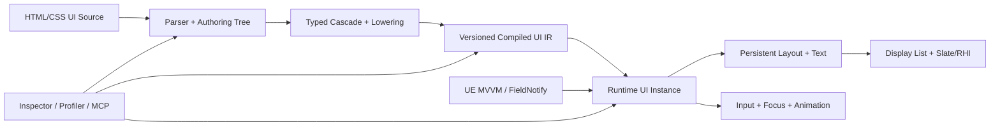

# WebToUE 工程技术总览与路线图

> 文档性质：当前工程事实、风险和路线的长期入口
>
> 插件版本：`0.1.0-preview`
>
> 引擎/平台：Unreal Engine 5.8 / Win64
>
> 当前里程碑：M2——增量原生运行时
>
> 最近核验：2026-08-12，基于 Git `a4e4e98` + working tree
>
> 统一术语：[CONTEXT.md](../../../CONTEXT.md) · 历史证据：[WTUE_EvidenceLedger.md](WTUE_EvidenceLedger.md) · 精确支持边界：[WTUE_SupportMatrix.md](WTUE_SupportMatrix.md)

本文回答项目现在是什么、已经做到什么、当前风险是什么、下一步如何验收。它不保存逐次实验历史，也不是完整 Web 标准兼容承诺；历史性能、构建与里程碑证据进入 Evidence Ledger，逐项功能边界进入 Support Matrix，难以逆转的决定进入 ADR。

---

## 1. 维护规则

### 1.1 信息职责

| 文档 | 唯一职责 |
| --- | --- |
| 本文 | 当前架构、能力判断、性能结论、风险、路线和门禁 |
| `CONTEXT.md` | 稳定的统一领域语言，不记录实现和版本状态 |
| `WTUE_EvidenceLedger.md` | 带时间语境的验证、性能和工程变更历史 |
| `WTUE_SupportMatrix.md` | HTML/CSS/绑定/输入/资源/诊断的精确当前边界 |
| `ADRs/` | 存在真实替代方案且难以逆转的架构决定 |

路线进度使用“已满足验收项 / 总验收项”，不是工时百分比。只有实现、自动化测试、必要性能/发布证据和文档同步全部满足后才能勾选完成。

### 1.2 状态标记

| 标记 | 含义 |
| --- | --- |
| ✅ | 已实现且有可重复证据 |
| 🟡 | 已实现但证据仍不足 |
| 🚧 | 已开始，尚未满足退出条件 |
| ⬜ | 已规划，尚未开始 |
| ⛔ | 明确不进入产品边界 |

以下变化必须同步本文：架构或所有权边界、Compiled UI IR/资产版本/Cook、失效策略、模块/依赖/平台、预算、风险等级、路线进度和发布门禁。支持项变化同步 Support Matrix；新的验证记录追加到 Evidence Ledger，不在本文复制完整过程。

---

## 2. 当前仪表盘

### 2.1 工程判断

| 维度 | 当前结论 | 状态 |
| --- | --- | --- |
| 产品方向 | 使用前端式 UI Source 编译 UE 原生 UI，方向成立 | ✅ |
| 浏览器依赖 | 无 CEF、Chromium、WebBrowser、通用页面运行时或 JavaScript 状态 VM | ✅ |
| 原生形态 | 编译资产 + C++ Runtime Instance + Yoga + 单 Slate 控件 | ✅ |
| 生命周期 | Compiled IR、Runtime State、Style/Layout Data、Presentation Cache 已按视图分离 | ✅ |
| 功能成熟度 | 可覆盖受控菜单/HUD 原型，尚非完整生产 UI 框架 | 🟡 |
| 性能成熟度 | 无默认 Tick；暖布局和未变化 Paint 有硬门，局部更新仍全树放大 | 🟡 |
| 当前最大风险 | Hover/FieldNotify 仍触发全树 Cascade、文本失效、资源和 Yoga 工作 | ✅ |
| 当前策略 | 不横向扩张大型 Web 特性，先完成 M2 增量运行时 | 🚧 |

### 2.2 验证快照

| 项目 | 当前值 |
| --- | --- |
| 自动化测试 | 27 / 27 通过（2026-08-12） |
| 当前编译 | UE 5.8 Win64 Game + Editor Development 通过（2026-08-12） |
| 当前发布 | Win64 Development BuildCookRun 通过：Cook 0 errors、Stage/Pak/IoStore 成功，569 包写入 2,226 个 IoStore chunks |
| 历史发布 | Win64 Game Development/Shipping、BuildCookRun、BuildPlugin 曾通过；发布前须在当前提交重跑 |
| Git 基线 | `a4e4e98` + working tree；未提交，不生成伪哈希 |
| 发布级别 | Developer Preview |

### 2.3 宏观里程碑

| 里程碑 | 状态 | 验收进度 | 结果 |
| --- | --- | --- | --- |
| M0 技术闭环 | ✅ | 8 / 8 | HTML/CSS 到 Cooked 原生 UI 的端到端闭环 |
| M1 UI 基础语义 | ✅ | 10 / 10 | 受控菜单/HUD 原型的排版、交互、本地化和诊断基础 |
| M2 增量原生运行时 | 🚧 | 3 / 7 退出门 | 可度量、局部失效、可扩展的 Runtime |
| M3 响应式与组件 | ⬜ | 0 / 8 | UE MVVM 驱动的组件、列表与结构复用 |
| M4 动画与响应式视觉 | ⬜ | 0 / 6 | 游戏级动效而不引入浏览器合成器 |
| M5 工具链与 MCP | ⬜ | 0 / 7 | 可检查、可分析、可由受控工具驱动 |
| M6 1.0 产品化 | ⬜ | 0 / 7 | 可被外部项目稳定依赖的插件 |

M2 已具备性能可观测性与代表性硬门、完整生命周期分离，以及无默认 Tick 的单控件事件驱动基础。`3 / 7` 不是工时比例。

---

## 3. 工程宪法

### 3.1 产品定位

WebToUE 将 HTML/CSS 视为 **UI Source**，而不是在游戏中运行的网页。Editor 负责解析、诊断并生成带版本的 **Compiled UI IR**；Cooked Runtime 读取 WTUE Document，以 UE 对象、资源、输入和渲染能力创建 Runtime UI Instance。

直接价值：前端开发者使用熟悉的声明式结构与样式；游戏继续遵守 UObject、资产、Cook、输入和平台流程；Runtime 避免通用浏览器内核的固定包体、内存、启动、安全和跨平台成本。

### 3.2 长期约束

1. Runtime 不依赖 CEF、Chromium、WebKit、Gecko、通用 WebView 或 JavaScript 状态 VM。
2. UI Source 必须经过可诊断、可版本化的编译边界；Shipping 不读取磁盘前端源文件。
3. Compiled UI IR 可共享且不可变；Runtime State、Render Data 和 Cache 按视图存在。
4. 每个源节点不默认对应 UObject、UWidget 或独立 Slate Widget。
5. UE MVVM、FieldNotify、UObject 和类型化命令是响应式桥接方向。
6. 吸收前端的结构、级联、组件、响应式和 DevTools 经验，但不追求浏览器标准完整度。
7. MCP 只是可选 Editor Automation Surface，不进入 Core、Runtime、Cook 或产品协议。

### 3.3 非目标

- 完整 DOM、网页导航、Cookie、Storage 和网页网络模型。
- 为网页兼容复制浏览器历史遗留行为。
- 让任意 JavaScript 直接控制 UObject 或游戏世界。
- 仅为 CSS 覆盖率牺牲可预测性能、Cook 安全或跨平台能力。
- 在 1.0 前承诺任意网页可无修改运行。

---

## 4. 架构与当前差距

| 层 | 当前实现 | M2 目标 |
| --- | --- | --- |
| Compiler | Parser/CSS 前端、RichText lowering、Property ID/Typed Value、Style Resolver、Property 应用和 Yoga Adapter 已拆分 | Property Metadata、Selector Index、Typed Cascade |
| Asset/IR | 私有扁平 CompiledNodes/Rules、类型化样式声明、自定义版本、原子提交 | 不可变、依赖完备、可迁移 |
| Runtime Instance | 每视图 Hydration、连续 NodeState、连续 Computed Style/Layout | Dirty Graph 和依赖图 |
| Presentation | 每视图 Layout Dirty、Text、Paint Order、Brush、Resource Cache | 持久缓存与局部失效 |
| Layout/Text | 脏布局重建 Yoga Tree；节点级 Text Layout Cache | Persistent Yoga、约束感知 Text Cache、局部 Measure/Layout |
| Paint/Input | 递归 Paint/Hit Test；Paint Order 已缓存 | Display List、局部重绘、分层命中 |
| Tooling | 导入诊断、热重载、Automation、Stat/Trace/Telemetry | Inspector、Profiler、Source Map、可选 MCP |

`UWebToUEDocument` 保存共享 Compiled payload；`FWebToUERuntimeInstance` 独占 Hydration、NodeState 和 Render Data；`FWebToUERuntimePresentation` 独占 Layout/Text/Paint/Resource Cache。双 View 专项已验证状态、Style/Layout 和 Presentation Cache 互不污染。下一阶段不再调整所有权，而是让 Typed Cascade、Selector Index 和 Dirty Graph 利用这些边界。

### 4.1 模块边界

| 模块 | 类型 | 职责 |
| --- | --- | --- |
| `WebToUEYoga` | Runtime | 固定 Yoga 3.2.1 与 Flex 布局能力 |
| `WebToUECore` | Runtime | HTML/CSS、节点、选择器、样式、诊断、RichText lowering、Yoga Adapter |
| `WebToUERuntime` | Runtime | WTUE Document、Runtime Instance、UMG/Slate、绑定、输入、事件、字体 |
| `WebToUEEditor` | Editor | 导入/重导入、依赖收集、资产编译、监听、本地化、Benchmark |

依赖方向为 Yoga → Core → Runtime → Editor。Editor 和 Editor-only Benchmark 类型不进入游戏目标。

`WebToUEEditor` 的 Runtime 专项基准私有依赖 UE `ModelViewViewModel`，并在插件元数据中显式声明；产品 Runtime 的 FieldNotify 订阅仍只通过 `FieldNotification` 和 `INotifyFieldValueChanged`，不把 Editor 测试类型带入 Cooked 路径。

### 4.2 编译与运行链路

1. Factory 读取 HTML，按源顺序收集外链、内联和元素样式。
2. Compiler 解析结构、校验 CSS，并把受支持属性和值一次性降低为稳定 Property ID 与 Typed Value；独立服务承担 Cascade、Property 应用和 Yoga。
3. Factory 在局部构建 Nodes、Rules、资源依赖并原子提交；Runtime 只读 Compiled IR。
4. 已加载文档依赖变化后以 200ms 防抖重导入；失败保留 last-good 数据。
5. `UWebToUEView` 宿主创建一个 `SWebToUEView : SLeafWidget`。
6. 每视图 Runtime/Presentation 协调状态、布局、缓存、Slate Paint 和输入。
7. Data Context 提供绑定值；语义 UI Event 返回 Blueprint/C++ 游戏逻辑。

Cooked 游戏保留 Compiled Nodes/Rules、Root、纹理/String Table 引用、诊断和 Runtime 模块；HTML/CSS 原文、源路径和依赖文件属于 Editor-only 数据。

---

## 5. 当前能力边界

已验证能力包括 HTML/CSS 导入与失败回退、受控 Selector/Pseudo State、Flex/Wrap/Gap/绝对定位、约束文本与 RichText、本地化身份、滚动裁剪与命中、鼠标/基础键盘、根属性绑定/FieldNotify、语义点击事件、自定义资产版本和固定 Benchmark Corpus。

当前仍缺生产级输入/IME、触摸与手柄、无障碍、组件/列表、动画、复杂 CSS、Inspector、跨平台和当前提交的完整发布矩阵。逐项支持、限制和诊断行为以 [WTUE_SupportMatrix.md](WTUE_SupportMatrix.md) 为唯一精确来源。

仍需工程化证据：真实菜单/HUD 帧耗、高频 Pseudo/FieldNotify 峰值、大型兄弟节点 Paint/Hit Test、异常资源与恶意输入、常驻内存，以及当前提交的 Game/Shipping/Cook/BuildPlugin。

---

## 6. 当前性能结论与预算

### 6.1 测量政策

正式可比较环境指纹 `79E20297`：UE 5.8.1、WindowsEditor Development、i7-12700KF、32 GB、RTX 5050。Sampling policy schema `1` 为 1 次 warmup、20 样本、median P50、nearest-rank P95；Snapshot Telemetry schema `2` 记录七阶段时间和可归因工作量；budget policy schema `6` 区分 Observe/Enforce。

| 场景 | 当前 P95 | 目标 | 状态 |
| --- | ---: | ---: | --- |
| Compile Style 100/50 | 2.647200 ms | 比较基线 | Observe |
| Compile Style 500/200 | 50.948400 ms | 比较基线 | Observe |
| Compile Style 2,000/500 | 517.156700 ms | 比较基线 | Observe |
| 500/200 单节点 Hover | 55.614501 ms | < 0.5 ms | Observe / 未达标 |
| 500/200 单 FieldNotify | 55.596102 ms | < 0.5 ms | Observe / 未达标 |
| 500 节点暖布局 | 0.731699 ms | < 2.0 ms | Enforced / 通过 |
| 未变化 Paint | 0.266701 ms；0 次/0 B | 0 Tick、0 WTUE 临时分配 | 分配 Enforced / 通过 |

500/200 的 Hover 与 FieldNotify 目前均访问 500 个 Style 节点、求值 100,000 次 Selector 并重建 500 个 Yoga 节点。暖布局虽重建完整 Yoga Tree，仍低于 2 ms；因此当前主瓶颈是全树 Cascade、缓存失效和后续刷新，而不是单独的暖 Yoga 计算。

已知放大路径：Pseudo/Binding 调用全局 Style/Brush 重建；Cascade 近似 `O(N × R × selector-depth)`；全局 Style 刷新清空全部 Text Layout；Layout 重建完整 Yoga Tree；Brush 重建可能同步加载纹理；Paint/Hit Test 仍全树递归。

Property ID/Typed Value 已消除版本 4 正常 Runtime 路径的属性名和值字符串解析，但当前 Style Resolve 仍为每节点构造临时 `TMap<Property, TypedValue>` 并复制类型化 payload；Selector 工作量、Dirty 粒度和 payload 紧凑度尚未由本工作包改变。

`tracked_allocations` 和已知 payload 字节只覆盖 WebToUE 标注点，不代表进程 allocator、完整常驻内存或 Slate/Yoga 内部分配。完整采样历史、阶段数据和 schema 演进见 [WTUE_EvidenceLedger.md](WTUE_EvidenceLedger.md)。

### 6.2 M2 性能预算

| 场景 | 目标 |
| --- | --- |
| 未变化帧 | UI Runtime Tick 为 0；WTUE 自身临时分配为 0 |
| 500/200 单节点 Hover | Game Thread P95 < 0.5 ms |
| 500/200 单 FieldNotify | Game Thread P95 < 0.5 ms |
| 500 节点暖缓存完整布局 | P95 < 2.0 ms |
| 2,000 节点压力 | 局部变化不得触发全树资源加载或不可控 16.6 ms 尖峰 |
| 性能回归 | 标准脚本输出 Style、Layout、Text、Paint、Hit Test 和内存分项 |

改变预算必须记录原因。单项通过不能外推其他场景；Hover/FieldNotify 只有稳定达到目标后才能启用硬门。

---

## 7. 风险登记册

| ID | 风险 | 等级 | 当前证据 | 缓解路线 | 状态 |
| --- | --- | --- | --- | --- | --- |
| R-01 | Pseudo/Binding 导致全树刷新 | Critical | 500 Style 节点、100,000 Selector、500 Yoga | Selector Index、Property Metadata、Dirty Graph | 🚧 M2 |
| R-02 | Yoga Tree 每次布局重建 | High | 暖布局重建 500 Yoga；P95 0.731699 ms | Persistent Yoga、局部 Dirty | ⬜ M2 |
| R-03 | Compiled 数据与 Runtime 生命周期混合 | Medium | 四项边界/双实例专项通过 | 后续 IR/Dirty/Cache 保持边界 | ✅ Mitigated |
| R-04 | 状态变化可能同步加载纹理 | High | Brush 重建使用 `LoadObject` | 资源影响分类、编译依赖、Resource Cache、异步策略 | ⬜ M2 |
| R-05 | Compiler/View 职责集中 | Low | Core 服务和 Presentation 已拆分，27/27 通过 | 后续能力进入对应服务 | ✅ Mitigated |
| R-06 | 性能证据和硬门仍不完整 | Critical | 两项硬门已建立；Hover/FieldNotify 未达标，常驻内存缺失 | Benchmark、Telemetry、预算门禁 | 🚧 M2 |
| R-07 | Map 声明丢失重复属性顺序 | Medium | Core、Compiled IR 与 Hydration 已使用有序声明；27/27 和 Win64 Development BuildCookRun 通过 | 保持 Ordered Declaration 专项与资产版本门 | ✅ Mitigated |
| R-08 | 仅 Win64 | Medium | `.uplugin` 平台限制 | 平台审计与构建矩阵 | ⬜ M6 |
| R-09 | MCP Experimental 且通用 Python 权限高 | Medium | 本地 Editor 环境已验证 | 回环/受信任/Editor-only/最小权限 | ⬜ M5 |
| R-10 | Sandbox 可使 UBT 关 Editor 后失败 | High | 曾复现；Preflight、互斥和持久状态已验证 | 生命周期 Skill 与 [ADR-0001](ADRs/ADR-0001-Editor-Lifecycle-Execution-Boundary.md) | ✅ Mitigated |

风险关闭必须有测试、Benchmark、构建或代码证据，不能只修改状态文字。

---

## 8. 宏观路线

M0/M1 已完成，详细验收项保存在 [Evidence Ledger](WTUE_EvidenceLedger.md#1-完成里程碑证据)。M2 是当前唯一活跃里程碑；原则上不在 M2.0～M2.4 完成前扩张大型 CSS、组件或动画能力。

### M2——增量原生运行时 🚧 3 / 7

- [x] 可重复 Benchmark、Trace/Stat 和预算门禁。
- [x] Compiled IR、Runtime State、Layout/Paint Cache 完全分离。
- [ ] Typed Property、Selector Index、Ordered Declaration。（M2.2 当前 2 / 5，尚未满足本退出门）
- [ ] Style/Measure/Layout/Paint/HitTest Dirty Graph。
- [ ] Yoga、Text、Resource Cache 持久化且局部失效。
- [ ] Paint 顺序、Display List、Hit Test 可扩展。
- [x] 单 Slate 控件、无默认 Tick、无浏览器内核的事件驱动基础。

退出结果：500 节点常规菜单的局部状态变化满足预算，全量路径可由 Profiler 解释。

### M3——响应式与组件 ⬜ 0 / 8

- [ ] UE MVVM/FieldNotify 依赖图。
- [ ] 嵌套属性路径与类型化 Converter。
- [ ] Command 与类型化事件载荷。
- [ ] 编译期 Component 与 Props。
- [ ] Slots 与模板复用。
- [ ] 条件节点与列表循环。
- [ ] Stable Key、Keyed Diff 和实例复用。
- [ ] 大列表虚拟化。

### M4——动画与响应式视觉 ⬜ 0 / 6

- [ ] Typed Transition 和 easing。
- [ ] Keyframes 时间线。
- [ ] Transform、Opacity、Color 的 Paint/Composite 路径。
- [ ] Layout Animation 与 Paint Animation 分层。
- [ ] DPI、Safe Zone、视口和输入设备条件。
- [ ] 阴影、渐变、九宫格等受控商业 UI 能力。

### M5——工具链与 MCP ⬜ 0 / 7

- [ ] Authoring/IR/Runtime Tree Inspector。
- [ ] Cascade、Computed Style、Box Model、焦点可视化。
- [ ] Source Map 与源码跳转。
- [ ] Incremental Compile、DDC、依赖图。
- [ ] Screenshot/Golden。
- [ ] 性能时间线、Paint Rect、内存统计。
- [ ] 可选 `WebToUEMCP` Editor-only 适配器。

### M6——1.0 产品化 ⬜ 0 / 7

- [ ] Public API 与扩展点稳定。
- [ ] IR/资产迁移与兼容策略稳定。
- [ ] Win64 以外平台矩阵。
- [ ] Game/Shipping/Cook/BuildPlugin 自动门禁。
- [ ] 安全、异常恢复和资源上限。
- [ ] 文档、样例、升级指南、错误码和支持矩阵。
- [ ] 分发、许可证和第三方声明。

---

## 9. M2 微观执行路线

M2.0 只验收可观测性闭环；全部预算属于 M2.7，Hover/FieldNotify、局部 Layout 和缓存门分别在 M2.3/M2.4 实现。

### M2.0——性能可观测性 ✅ 6 / 6

- [x] 固定 100/500/2,000 节点与 50/200/500 规则语料。
- [x] 七阶段时间统计。
- [x] 节点、Selector、Yoga、Text、Brush、分配工作量。
- [x] Insights/Stat 与 schema `2` Telemetry CSV。
- [x] 固定环境和 P50/P95 规则。
- [x] Schema `6` Observe/Enforce；暖布局和未变化 Paint 分配硬门。

### M2.1——拆分生命周期 ✅ 6 / 6

- [x] 只读 Compiled Document/Node 边界。
- [x] 每视图 Runtime Instance/NodeState。
- [x] Layout/Text/Paint/Resource Cache 不写回 IR。
- [x] Binding/Pseudo/Focus/Scroll 只在 Runtime State。
- [x] 同一 Document 双实例互不污染。
- [x] Compiler/View 按职责拆分并通过回归。

### M2.2——类型化样式与选择器索引 🚧 2 / 5

依赖顺序也是交付顺序；每项必须独立验收：

- [x] Ordered Declaration：保持源顺序，专项覆盖重复声明、有效/无效交错和最后有效声明获胜；资产版本 3、旧示例重编译、26/26 Automation 及 Win64 Development BuildCookRun 均通过。
- [x] CSS Property ID + Typed Value：52 个受支持属性在编译期解析为稳定 ID 与类型化联合值；规则和 inline style 的正常热路径不再解析属性名和值。资产版本 4、v3 一次性 Hydration 回退、两个示例重编译、27/27 Automation 及 Win64 Development BuildCookRun 均通过。
- [ ] Property Metadata：统一声明 Inherited 及 Style/Measure/Layout/Paint/HitTest/Resource 影响范围。
- [ ] Selector Index：按 ID/Class/Tag/Pseudo 建候选索引；立即在 500/200 记录候选数和 Selector 求值，必须低于当前 100,000 次。
- [ ] Typed Cascade：覆盖 specificity、source order、inline style、重复属性和无效声明。

中途门：先锁定正确性；资产 payload 改变时先完成迁移闭环；索引完成后立即验证工作量。`<0.5 ms` 仍属 M2.3，因为没有 Dirty Graph 时仍可能访问全树节点。Property Metadata 还必须证明 Paint-only Pseudo 变化不会同步加载纹理或重建无关图片；完整 Resource Cache 仍属 M2.4。

### M2.3——Dirty Graph ⬜ 0 / 6

- [ ] Structure/Style/Measure/Layout/Paint/HitTest Dirty Flags。
- [ ] Hover/Active/Focus 只处理候选；500/200 P95 `<0.5 ms` 后启用硬门。
- [ ] Paint-only 属性不触发 Measure/Layout。
- [ ] 继承属性只传播必要后代。
- [ ] FieldNotify 只刷新依赖节点；P95 `<0.5 ms` 后启用硬门。
- [ ] 更新可报告失效原因。

### M2.4——持久缓存 ⬜ 0 / 6

- [ ] Yoga Node 与 Runtime Node 同生命周期。
- [ ] 仅脏子树 Measure/Layout，并建立工作量和时间硬门。
- [ ] Text Cache Key 包含文本、字体、样式和约束，并统计命中/重建。
- [ ] Pseudo 变化不再无条件清空全部 Text Layout。
- [ ] 编译资产生成资源依赖，Runtime 使用 Resource Cache。
- [ ] 状态变化路径不执行同步纹理加载。

### M2.5——Paint 与命中扩展性 🚧 1 / 5

- [x] 稳定 Paint Order，未变化 Paint 不复制排序子节点。
- [ ] 可复用 Display List/Paint Commands。
- [ ] 局部 Paint Invalidations 与重绘区域可视化。
- [ ] 裁剪感知层次包围或空间 Hit Test。
- [ ] 500/2,000 节点满足预算且无异常分配。

### M2.6——生产 UI 基础补齐 ⬜ 0 / 7

- [ ] 垂直/水平滚动条。
- [ ] 拖拽、触摸、惯性滚动。
- [ ] 手柄导航与 CommonUI。
- [ ] DPI 与 Safe Zone。
- [ ] 输入框、文本编辑、IME。
- [ ] 无障碍语义节点。
- [ ] 输入、重导入、绑定、截图自动化。

### M2.7——退出检查 ⬜ 0 / 6

- [ ] 当前 23 项及后续 M2 测试全部通过。
- [ ] Editor/Game Development/Shipping 编译通过。
- [ ] Cook、IoStore、BuildPlugin 通过。
- [ ] 第 6.2 节预算通过。
- [ ] R-01～R-06 关闭或降至可接受等级。
- [ ] 文档、示例、升级说明同步。

---

## 10. MCP 与 Editor Automation 边界

UE 原生 MCP 和 VibeUE 仅用于受信任开发机上的日志、截图、PIE、测试、性能采样和资产操作。当前 Editor-only VibeUE 5.0 固定于 `24ac69d750c1c558a1b78ed5b60644ce000198d3`，与原生工具共用 `http://127.0.0.1:8000/mcp`；版本与归档校验见项目根 `Plugins/VibeUE.version.json`。Editor 生命周期统一使用 `$operate-webtoue-editor`；非沙箱执行边界、Preflight、互斥和持久状态见 [ADR-0001](ADRs/ADR-0001-Editor-Lifecycle-Execution-Boundary.md)。

M2 先建设与传输协议无关的 Compiler、Diagnostics、Inspection 和 Benchmark 服务；M5 才增加可选、默认关闭的 `WebToUEMCP` 适配器。首批候选面仅包含：文档/Compiled UI IR/诊断/支持矩阵/性能快照 Resources；文档、Computed Style、布局、依赖和测试结果的只读检查；以及具备参数校验、UE Transaction/Undo 和明确权限的编译/重导入/样例生成。它不得暴露任意文件系统、Shell、UObject/Blueprint 调用或远程无认证访问，不参与 Cook、Runtime 消息或产品协议。历史 VibeUE/MCP 验证见 [Evidence Ledger](WTUE_EvidenceLedger.md#5-工程变更记录)。

---

## 11. 测试与发布门禁

### 11.1 当前 Automation（27 / 27）

| 层 | 测试 |
| --- | --- |
| Core | `HtmlCss`、`OrderedDeclarations`、`TypedProperties`、`FlexLayout`、`ConstrainedMeasure`、`RichTextCompile`、`ScrollLayout`、`CssDiagnostics` |
| Runtime | `AssetVersion`、`CompiledDocumentBoundary`、`OrderedDeclarationHydration`、`RuntimeInstanceIsolation`、`RuntimeCacheSeparation`、`RuntimePresentationIsolation`、`TextWrapping`、`LocalizedRichText`、`ScrollInteraction`、`PerformanceInstrumentation`、`PaintOrderCache` |
| Editor | `BenchmarkScenarios`、`BenchmarkStatistics`、`RuntimeHoverBenchmark`、`RuntimeFieldNotifyBenchmark`、`RuntimeWarmLayoutBenchmark`、`RuntimeUnchangedPaintBenchmark`、`LocalizationImport`、`OrderedDeclarationImport` |

Editor 生命周期另有 Pester 3 / 3，不计入 UE Automation。

### 11.2 仍需建立

- Pseudo State 和 FieldNotify 局部失效专项。
- Reimport 成功、失败回退和依赖变化专项。
- 鼠标、键盘、手柄、触摸、IME 自动化。
- Screenshot/Golden 跨 DPI。
- 100/500/2,000 节点性能与内存回归。
- Win64 Editor/Game Development/Shipping/Cook/BuildPlugin 一键门禁。

交付必须分别报告 Correctness、Performance、Packaging 和 Compatibility；功能测试通过不能替代其余门禁。

---

## 12. 文档地图与事实锚点

- 历史性能、构建和工程变更：[WTUE_EvidenceLedger.md](WTUE_EvidenceLedger.md)
- HTML/CSS/绑定/输入/资源/诊断边界：[WTUE_SupportMatrix.md](WTUE_SupportMatrix.md)
- Editor 生命周期决定：[ADR-0001](ADRs/ADR-0001-Editor-Lifecycle-Execution-Boundary.md)
- 节点、样式和模型：`Source/WebToUECore/Public/WebToUECoreTypes.h`
- Compiler/Property/Cascade/Yoga：`Source/WebToUECore/Private/WebToUECompiler.cpp`、`WebToUEStyleProperties.cpp`、`WebToUEStyleResolver.cpp`、`WebToUELayoutEngine.cpp`
- WTUE Document：`Source/WebToUERuntime/Public/WebToUEDocument.h`
- Runtime/View/Presentation：`Source/WebToUERuntime/Private/WebToUERuntimeInstance.*`、`SWebToUEView.cpp`、`WebToUERuntimePresentation.cpp`
- Import/Compiled Asset：`Source/WebToUEEditor/Private/WebToUEFactory.cpp`
- Benchmark Corpus：`Source/WebToUEEditor/Private/Benchmarks/WebToUEBenchmarkScenario.cpp`
- 插件模块、引擎插件依赖与平台声明：`WebToUE.uplugin`

外部参考只用于对标，不构成兼容承诺：[Epic Unreal MCP](https://dev.epicgames.com/documentation/unreal-engine/unreal-mcp-in-unreal-editor)、[ModelContextProtocol API](https://dev.epicgames.com/documentation/unreal-engine/API/Plugins/ModelContextProtocol)、[Gameface Overview](https://docs.coherent-labs.com/unreal-gameface/overview/)、[Gameface Profiling](https://docs.coherent-labs.com/unreal-gameface/performance-optimization/profilingoverview/)。
