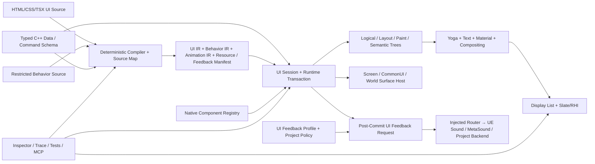

# WebToUE 工程技术总览与路线图

> 文档性质：当前工程事实、风险和路线的长期入口
>
> 插件版本：`0.1.0-preview`
>
> 引擎/平台：Unreal Engine 5.8 / Win64
>
> 当前里程碑：M3——Runtime Semantics、Host 与原生互操作进行中；M3.0 Native Component Registry、M3.1 UI Session/Screen Host、M3.2 更新事务、M3.3 事件/交互身份、M3.4 Clock/异步取消、M3.5 属性所有权、M3.6 多树/Portal 边界与 M3.7 Stable Semantic Identity 微观路线已完成
>
> 当前交付 Profile：PersonalGame-ready 0.5——Win64 项目内生产使用；通用商业 1.0 延后
>
> 最近核验：2026-08-20 `21f2933`、`f1c2e01` 完成 Component-scoped Stable Key、Route/keyed-path Component Instance Identity、diagnostic-only Source provenance、same-owner/cross-generation 状态匹配/重置规划与 `WTUE-ID-001..004`；82 / 82 Automation、UE 5.8 Win64 Editor Development Operation `f24cdf3107e946abaddc3600c563f827` 通过，Editor PID `30200` readiness/MCP/Python/World 健康
>
> 统一术语：[CONTEXT.md](../../../CONTEXT.md) · 历史证据：[WTUE_EvidenceLedger.md](WTUE_EvidenceLedger.md) · 精确支持边界：[WTUE_SupportMatrix.md](WTUE_SupportMatrix.md)

本文回答项目现在是什么、已经做到什么、当前风险是什么、下一步如何验收。它不保存逐次实验历史，也不是完整 Web 标准兼容承诺；历史性能、构建与里程碑证据进入 Evidence Ledger，逐项功能边界进入 Support Matrix，难以逆转的决定进入 ADR。

---

## 1. 维护规则

### 1.1 信息职责

| 文档 | 唯一职责 |
| --- | --- |
| 本文 | 当前架构、能力判断、性能结论、风险、路线和门禁 |
| `CONTEXT.md` | 稳定的统一领域语言，不记录实现和版本状态 |
| `WTUE_EvidenceLedger.md` | 带时间语境的验证、性能和工程变更历史 |
| `WTUE_SupportMatrix.md` | HTML/CSS/绑定/输入/资源/诊断的精确当前边界 |
| `ADRs/` | 存在真实替代方案且难以逆转的架构决定 |

路线进度使用“已满足验收项 / 总验收项”，不是工时百分比。只有实现、自动化测试、必要性能/发布证据和文档同步全部满足后才能勾选完成。

### 1.2 状态标记

| 标记 | 含义 |
| --- | --- |
| ✅ | 已实现且有可重复证据 |
| 🟡 | 已实现但证据仍不足 |
| 🚧 | 已开始，尚未满足退出条件 |
| ⬜ | 已规划，尚未开始 |
| ⛔ | 明确不进入产品边界 |

以下变化必须同步本文：架构或所有权边界、Compiled UI IR/资产版本/Cook、失效策略、模块/依赖/平台、预算、风险等级、路线进度和发布门禁。支持项变化同步 Support Matrix；新的验证记录追加到 Evidence Ledger，不在本文复制完整过程。

---

## 2. 当前仪表盘

### 2.1 工程判断

| 维度 | 当前结论 | 状态 |
| --- | --- | --- |
| 产品方向 | 使用前端式 UI Source 编译 UE 原生 UI，方向成立 | ✅ |
| 浏览器依赖 | 当前无 CEF、Chromium、WebBrowser、通用页面运行时或 JavaScript 状态 VM；正式路线允许受限 Behavior Source 提前编译为原生 Behavior IR，但不引入默认通用 JavaScript VM | ✅ |
| 原生形态 | 编译资产 + C++ Runtime Instance + Yoga + 单 Slate 控件 | ✅ |
| 生命周期 | Compiled IR、Runtime State、持久 Yoga/Layout、Text/Resource Handle 与 View-owned Display List/空间索引已分离 | ✅ |
| 功能成熟度 | 可覆盖固定 MainMenu/HUD/ScrollableSettings 原型，具备局部 Display patch、语义焦点/手柄导航、DPI/Safe Zone、重导入恢复和跨 DPI Golden；尚非完整生产 UI 框架 | 🟡 |
| 性能成熟度 | 无默认 Tick；局部更新、K=1 工作量、Packaged Development/Shipping GT/RT/GPU/input、Batch/Vertex、冷启动、Development LLM 与第二 View 硬门已建立并通过 | ✅ |
| 当前最大风险 | M2 风险已降至当前 Win64 项目内 0.5 可接受等级；Screen UI Session/Host、Feedback Router、更新事务、事件/交互身份、Clock/异步取消、属性所有权、多树/Portal 投影与 Stable Semantic Identity 基础合同已收口，后续最大架构风险转为 Behavior/FieldNotify 与 Stable Identity 产品接入、C++ Schema、Material/Transform 与真实 Portal 合成、真实双 LocalPlayer/CommonUI Modal、资源驻留、真实 Feedback Profile/音频后端和确定性工具链 | 🟡 |
| 当前策略 | 保持 M2 出口门；先完成 M3 Runtime Semantics/Host/Native Interop，再进入原生表现、Behavior 和现代作者工具链；UI Feedback 复用 UE/项目音频系统，完整 JS VM 与浏览器兼容继续延后 | ✅ |

### 2.2 验证快照

| 项目 | 当前值 |
| --- | --- |
| 自动化测试 | 82 / 82 通过、0 failed、0 skipped、0 warnings（8.757 秒；2026-08-20，M3.7；`StartsWith:WebToUE`） |
| 当前编译 | M3.7 Operation `f24cdf3107e946abaddc3600c563f827` 完成 UE 5.8 Win64 Editor Development 6 / 6 actions；Editor PID `30200` readiness/MCP HTTP 200、Python UE 5.8.1/Project WebToUE 与 `Lvl_TopDown` World 探针健康 |
| 当前发布 | tracked Win64 Development/Shipping BuildCookRun Operations `18966d65178245ed9cb7bb14eb949b6c` / `ba75b45f0803431b8b273dfc58798f14` 均通过，各 584 packages、2,250 chunks、250.22 MiB、AutomationTool 最终 ExitCode 0；相邻 schema 6 真实 Packaged gates `Development-ExitGate-20260820T0722Z` / `Shipping-ExitGate-20260820T0731Z` 均 `success=true`，12 / 12 WTUE↔UMG 时间/输入比较与 3 / 3 冷启动比较通过，三类 Shipping PNG 已目视核验 |
| 历史发布 | Win64 Game Development/Shipping、BuildCookRun、BuildPlugin 曾通过；发布前须在当前提交重跑 |
| Git 基线 | M2.9 检查点为 `8d26643`、`36fc522`、`e8ac686`、`e524997`、`64c2f7e`、`7df6832`；M3.0 为 `66ada22`、`ecb094c`；M3.1 为 `1fc2a20`、`5342bf6`、`3f1bf20`；M3.2 为 `7be0f8e`；M3.3 为 `692ffeb`、`048a676`、`a7c1db4`；M3.4 为 `9c33768`、`d3e1b80`、`2e0f1c3`；M3.5 为 `4001b08`、`4bdf63c`；M3.6 为 `f05ce52`、`0ae3ac4`；M3.7 为 `21f2933`、`f1c2e01`，路线/closure 文档随当前检查点收口 |
| 发布级别 | Developer Preview |

### 2.3 宏观里程碑

| 里程碑 | 状态 | 验收进度 | 结果 |
| --- | --- | --- | --- |
| M0 技术闭环 | ✅ | 8 / 8 | HTML/CSS 到 Cooked 原生 UI 的端到端闭环 |
| M1 UI 基础语义 | ✅ | 10 / 10 | 受控菜单/HUD 原型的排版、交互、本地化和诊断基础 |
| M2 增量原生运行时 | ✅ | 9 / 9 退出门 | 可度量、共享样式模板、稳定身份、持久 Layout/Resource、局部失效、真实渲染与 Win64 0.5 Go/No-Go 已完成 |
| M3 Runtime Semantics、Host 与原生互操作 | 🚧 | 9 / 11 | Native Component Registry、Screen UI Session/Host、Feedback Router、更新事务、事件/交互身份、Clock/异步取消、属性所有权、多树/Portal 投影与 Stable Semantic Identity 基础合同完成；C++ Schema 与资源合同待完成 |
| M4 UE 原生表现与合成 | ⬜ | 0 / 9 | Material/Brush、Transform、Animation IR、UI Feedback Profile/UE Audio 与分级 Compositing |
| M5 Dynamic UI 与 Compiled Behavior | ⬜ | 0 / 10 | Typed Mutation、动态结构、受限 Behavior TS、Feedback Cue 和原生事件驱动 Executor |
| M6 现代作者工具链与 Inspector | ⬜ | 0 / 8 | Component/TSX/Tailwind 子集、Source Map、原生预览、Inspector 与确定性构建 |
| M7 1.0 产品化 | ⬜ | 0 / 8 | 长期兼容、完整宿主/文本/无障碍、跨平台、外部分发与安全收口 |

M2 已完成性能可观测性与硬门、完整生命周期分离、类型化样式/选择器/Cascade、共享 Style Template 与稳定身份、Paint-only Pseudo、根字段 FieldNotify/Text 局部失效、持久 Yoga/异步 Resource Handle、可 patch Display List/空间命中、真实 Packaged 渲染、核心生产宿主和最终预算/发布 Go/No-Go。里程碑为 `9 / 9`。M3.0 建立 Native Component 显式注册与实例合同；M3.1 建立 Screen UI Session/Host 与 Feedback Router 基础合同，并把固定 Corpus 的 WebToUE Packaged Runner 迁到 per-LocalPlayer Host；M3.2 建立 Session-owned 更新事务、跨线程入队、遍历保护、预算与 Post-Commit Effect 收集基础；M3.3 建立 Generation-safe 事件路径、受控传播/默认动作和 per Slate User/Pointer 身份；M3.4 建立显式 Clock domain、无默认 Tick 的 Timer、异步 Command Result/Timeout/Cancel 和 Generation/View/World cleanup；M3.5 建立规范属性地址、唯一 durable owner、active-only Animation overlay、restrictive gate 与 typed Material Parameter 仲裁；M3.6 建立 Component/Logical durable ownership、Layout/Paint/Semantic projection、同 Session/Surface Overlay Anchor、Modal scope 与同代 Focus Restore；M3.7 建立 Component-scoped Stable Key、Route/keyed-path Component Instance Identity、diagnostic-only Source provenance 与 same-owner/cross-generation 状态匹配/重置规划。M3 当前为 `9 / 11`；现有 FieldNotify 与未来 Behavior 尚未全部迁入事务，Stable Identity 尚未接入作者/Compiler/View 产品路径，C++ Schema、资源 freshness 及其他 M3 语义仍未完成。

### 2.4 当前交付 Profile：PersonalGame-ready 0.5

当前优先目标不是立即成为可供未知外部项目稳定依赖的通用商业插件，而是在 PersonalGame 的真实菜单/HUD 中达到可生产使用、可测量、可打包和可恢复。Profile 分类不改变已经完成的事实，也不把 Deferred 项伪装为完成：

| 分类 | 含义 |
| --- | --- |
| `P0.5` | 阻塞 PersonalGame-ready 0.5，按依赖顺序实施和验收 |
| `P0.5-if-used` | 必须由目标游戏 Corpus 审计决定：实际使用则实现并验收，未使用则以明确 `N/A` 证据关闭 |
| `P1.0` | 延后到外部通用商业插件阶段，不阻塞 0.5 |

PersonalGame-ready 0.5 的固定边界：

- 平台与分发：Win64、项目内集成；Editor/Game Development、Shipping、Cook、IoStore 和真实 Packaged Smoke 必须通过。BuildPlugin、第二平台和独立插件分发属于 `P1.0`。
- 界面与输入：真实 Main Menu、HUD、Stress Corpus；鼠标、键盘、手柄/CommonUI、DPI 与 Safe Zone 属 `P0.5`。触摸/惯性、完整文本编辑/IME 和无障碍实现属于 `P1.0`，除非目标游戏明确使用。
- Runtime：M2.3～M2.7 的稳定身份、K=1 局部失效、持久 Layout/Text/Resource、Display List/Hit Test 和 Packaged GT/RT/GPU/内存证据不得裁掉。
- 宿主与协议：绑定 Local Player 的代码化 Screen Host、UI Session 生命周期、类型化 Data/Command Schema、UI Feedback Router 注入和直接 C++ 接入属 `P0.5`；世界空间 Host 为 `P0.5-if-used`，若目标游戏使用则必须单独通过 WidgetComponent/RT/输入、反馈空间策略与性能门。
- 响应式与行为：Typed Mutation、类型化 Command、Component/Props/Slots、条件节点、普通 Keyed List，以及覆盖真实 Corpus 的受限 Behavior Source/IR 与 `EmitFeedbackCue` 属 `P0.5`；通用 JavaScript VM、任意 npm/React Runtime 和大列表虚拟化不阻塞 0.5。
- 表现与资源：UE Texture/Material 的一等 Resource/Brush 合同、相对资源来源诊断、Transform/Opacity/Color Transition、easing、仅活动时 Tick，以及语义 UI Feedback Cue、版本化 Feedback Profile、关键 Cue 预取和默认 UE Audio Router 属 `P0.5`；Keyframes、Layout Animation、离屏高级 Filter/Backdrop、浏览器级合成器与通用多模态反馈按真实 Corpus 或延后。
- 工具与兼容：跨 DPI Screenshot/Golden、失败诊断、资源上限、最小 Source Map/Runtime 因果检查、确定性 Virtual UI Clock、Null/Recording Feedback Router 和内部使用文档属 `P0.5`。完整通用 Inspector、Incremental Compile/DDC、WebToUEMCP、稳定外部扩展 API、多代资产兼容、分发与许可证收口属于 `P1.0`。
- 资产升级：0.5 期间 UI Source 是可恢复事实源，允许在清晰诊断下重新编译资产；发布 1.0 前再冻结长期资产迁移兼容承诺。
- 对标：同画面 UMG A/B 属 `P0.5`；只有能获得合法、可比较的 Gameface Release 环境时才运行其 A/B，否则明确记录 `Unknown`，不阻塞 0.5。

0.5 退出时必须同时满足：M2 Go/No-Go；上述 `P0.5` 的 Session/Host、C++ 协议、Native Resource/Material、UI Feedback、响应式组件、Behavior、动画和输入切片；三类真实 Corpus 与新增敌意 Corpus 的 Win64 Packaged Development/Shipping 证据；当前项目的错误恢复、Golden、资源上限和维护文档。每个 `P0.5-if-used` 项必须由冻结后的真实 Corpus 清单裁决为“已实现并通过”或“有证据的 `N/A`”；一旦被使用就自动成为阻断门，不能以“按需”为由跳过。

---

## 3. 工程宪法

### 3.1 产品定位

WebToUE 将 HTML/CSS/受限 TS 视为 **UI Source/Behavior Source**，而不是在游戏中运行的网页程序。Editor 或确定性构建工具负责解析、诊断并生成带版本的 **Compiled UI IR/Behavior IR/Animation IR** 与资源/反馈配置；Cooked Runtime 通过 UI Session 把 WTUE Document、游戏数据、命令和反馈合同绑定到屏幕或世界空间 UI Surface。

直接价值：前端开发者使用熟悉的声明式结构与样式；游戏继续遵守 UObject、资产、Cook、输入和平台流程；Runtime 避免通用浏览器内核的固定包体、内存、启动、安全和跨平台成本。

### 3.2 长期约束

1. Runtime 不依赖 CEF、Chromium、WebKit、Gecko、通用 WebView 或默认通用 JavaScript VM；受限 Behavior Source 必须提前编译为原生可执行的 Behavior IR。
2. UI/Behavior Source 必须经过可诊断、可版本化且可复现的编译边界；Shipping 不读取或解释磁盘前端源文件。
3. Compiled UI/Behavior/Animation IR 可共享且不可变；Runtime State、Render Data、Clock 和 Cache 按 UI Session/Runtime UI Instance 存在。
4. 每个源节点不默认对应 UObject、UWidget 或独立 Slate Widget。
5. 类型化 Data/Command Schema、FieldNotify 和直接 C++ 是响应式桥接基础；UE MVVM 是可选 Adapter，不是编辑器配置前置条件。
6. 吸收前端的结构、级联、组件、响应式和 DevTools 经验，但不追求浏览器标准完整度。
7. MCP 只是可选 Editor Automation Surface，不进入 Core、Runtime、Cook 或产品协议。
8. “Gameface 级性能”不是单一营销数字或兼容承诺；性能结论只来自同硬件、同画面、同交互轨迹、同视觉结果和同构建配置的可复现 A/B。
9. 普通 WTUE 内容继续使用单 Slate Leaf；专用输入、媒体、模型预览、CommonUI 或项目控件通过显式 Native Component/Host 合同进入，不隐式退化为每节点 UWidget。
10. Behavior 只拥有界面局部状态与编排，游戏 C++ 继续拥有 Gameplay 权威、网络权限和实际副作用；UI Command 不是客户端权限证明。
11. UI Feedback Cue 只表达事务提交后的语义化瞬时反馈；UI Session 注入的 Router/Profile 负责 UE/项目音频资源、播放策略与用户设置。长期音乐和 Audio State 仍属于游戏 C++，不是节点或 Behavior 生命周期。

### 3.3 非目标

- 完整 DOM、网页导航、Cookie、Storage 和网页网络模型。
- 为网页兼容复制浏览器历史遗留行为。
- 让任意 JavaScript 直接控制 UObject 或游戏世界。
- 模拟 HTML `<audio>`、Web Audio API，或在 UI Source/Behavior IR 中直接绑定任意 Sound 路径和播放函数。
- 仅为 CSS 覆盖率牺牲可预测性能、Cook 安全或跨平台能力。
- 在 1.0 前承诺任意网页可无修改运行。

---

## 4. 架构与当前差距

下图是截至 2026-08-20 接受的目标边界，不代表当前已实现能力：

| 层 | 当前实现 | 已接受的后续边界 |
| --- | --- | --- |
| Compiler | Parser/CSS 前端、RichText lowering、Property ID/Typed Value、Property Metadata、固定槽位 Typed Cascade、Property 应用和 Yoga Adapter 已拆分 | 受限 Behavior/TSX 静态编译、C++ Schema、Source Map、Resource provenance 与确定性 freshness hash |
| Asset/IR | 私有扁平 CompiledNodes/Rules、类型化样式声明与 Texture/Font/String Table Resource Manifest、自定义版本 7、原子提交 | 独立版本的 UI/Behavior/Animation/Resource/Capability IR、稳定 Feedback Cue ID/Profile、多层迁移与 Cook freshness 合同 |
| Session/Runtime | Screen UI Session 绑定 LocalPlayer、World、Surface、Data/Command、Environment、显式 Game/Unscaled/Real/Test Clock 与 Session Generation；Session-owned 更新协调器在 Game Thread 原子提交，异步协调器提供无默认 Tick 的 Timer、Command Result/Timeout/Cancel、worker MPSC、Generation/View/World cleanup 与有界 Trace；Property Ownership Policy 区分 CSS baseline、唯一 Binding/Behavior durable owner、Animation overlay 和 restrictive gate；Stable Semantic Identity Policy 以 Component-scoped Key 生成 same-owner/cross-generation 状态匹配/重置计划 | 把 FieldNotify/类型化 Command/Behavior 接入事务与异步结果；让 M5/M6 作者/Compiler/View 消费 Stable Identity 与多树合同 |
| Data/Command | 根 UObject text/visible/enabled FieldNotify 与字符串点击事件 | 显式版本化 Data/Command Schema、异步 Result/Cancel；直接 C++ 基础，MVVM 可选 Adapter |
| Presentation | Handle-keyed Layout/Text/Paint/Brush、Manifest-indexed 强资源句柄、异步请求与可 patch Display List；Session-injected Feedback Request/Null/Recording Router 基础合同，无 Profile/真实播放 | UE Texture/Material/MID、Transform/Clip Chain、Portal/Overlay、分级 Compositing、Feedback Profile/UE Router 与资源驻留分组 |
| Layout/Text | 每 Runtime Instance 持久 Yoga Tree；节点级约束感知 Text Layout Cache；Property change 只写变化 Yoga 属性 | 动态结构增量、Typed Localized Text、Environment Context、RTL/复杂文本与明确 Accessibility Schema |
| Input/Host | 单 View 内鼠标/键盘/手柄焦点、SSafeZone；代码化 Screen Host 通过 `AddViewportWidgetForPlayer` 绑定 LocalPlayer，World cleanup/LocalPlayer removal 先失活 Session 再拆除；固定 Packaged Corpus 已迁移 | 多 LocalPlayer/Slate User/Pointer 敌意矩阵、CommonUI Modal 深度集成、实际 World Surface Host、Native Component Runtime 挂接 |
| Tooling | 导入诊断、热重载、Automation、Stat/Trace/Telemetry | 原生 Preview、Runtime Inspector、Behavior/Animation/Feedback Trace、Virtual UI Clock、Incremental Compile/DDC、可选 MCP |

`UWebToUEDocument` 保存共享 Compiled payload，并按当前文档修订缓存不可变的已水合 Style Rules 与 Selector Index；`FWebToUERuntimeInstance` 保留每 View 节点包装、Instance Handle 代次、NodeState 和 Render Data，因为 Binding 会插入动态子节点且 Parent/Children/Handle 属实例生命周期；`FWebToUERuntimePresentation` 独占 Handle-keyed Layout/Text/Paint/Resource Cache。双 View 专项已验证状态、Style/Layout 和 Presentation Cache 互不污染；`RuntimeIdentity` 证明同一模板节点跨 View 的 Template Node ID 一致、Style Template 共享，而 Instance Handle 不能跨 View、结构修订、重导入或 View 销毁解析。Runtime 数组以 Handle Slot 索引，Yoga Measure Context 通过 Handle 解析节点；未来 Dirty Graph、Display List 与 Stable Key 必须沿用同一合同，不另建 raw-pointer 身份。

### 4.1 模块边界

| 模块 | 类型 | 职责 |
| --- | --- | --- |
| `WebToUEYoga` | Runtime | 固定 Yoga 3.2.1 与 Flex 布局能力 |
| `WebToUECore` | Runtime | HTML/CSS、节点、选择器、样式、诊断、RichText lowering、Yoga Adapter |
| `WebToUERuntime` | Runtime | WTUE Document、Runtime Instance、UMG/Slate、绑定、输入、事件、字体、Session-owned 更新事务，以及实验性的 Native Component Registry/Factory/Instance 合同 |
| `WebToUEEditor` | Editor | 导入/重导入、依赖收集、资产编译、监听、本地化、Benchmark |

依赖方向为 Yoga → Core → Runtime → Editor。Editor 和 Editor-only Benchmark 类型不进入游戏目标。

`WebToUEEditor` 的 Runtime 专项基准私有依赖 UE `ModelViewViewModel`，并在插件元数据中显式声明；产品 Runtime 的 FieldNotify 订阅仍只通过 `FieldNotification` 和 `INotifyFieldValueChanged`，不把 Editor 测试类型带入 Cooked 路径。

### 4.2 编译与运行链路

1. Factory 读取 HTML，按源顺序收集外链、内联和元素样式。
2. Compiler 解析结构、校验 CSS，并把受支持属性和值一次性降低为稳定 Property ID 与 Typed Value；独立服务承担 Cascade、Property 应用和 Yoga。
3. Factory 在局部构建 Nodes、Rules 和去重的 Texture/Font/String Table Resource Manifest 并原子提交；Runtime 只读 Compiled IR。
4. 已加载文档依赖变化后以 200ms 防抖重导入；失败保留 last-good 数据。
5. `UWebToUEView` 以 UE 原生 `SSafeZone` 宿主唯一的 `SWebToUEView : SLeafWidget`；DPI/Safe Zone 由宿主缩放，内部 UI 节点不膨胀为独立 Slate Widget。
6. 每视图 Runtime/Presentation 协调状态、持久 Yoga、Text Cache、Manifest 稳定资源句柄、Slate Paint 和输入；未驻留资源在 View 创建边界异步请求，完成后以弱 Slate 引用触发失效。
7. Data Context 提供绑定值；语义 UI Event 返回 Blueprint/C++ 游戏逻辑。

Cooked 游戏保留 Compiled Nodes/Rules、Root、Texture/Font/String Table Resource Manifest、诊断和 Runtime 模块；HTML/CSS 原文、源路径和依赖文件属于 Editor-only 数据。

### 4.3 已接受的后续执行边界

- Behavior Source 是受限、静态可验证的 WTUE TypeScript DSL；它编译为原生 Behavior IR，不在 Shipping 中执行任意 JavaScript。
- M3.2 已实现通用 C++ 更新协调器的评估→收集 State/Structural Mutation→原子提交→Post-Commit Effect 顺序，以及非 Game Thread 入队、遍历来源结构拒绝和重入/循环预算；M3.4 已为 Timer 与异步 Command Result 建立 Session/Generation token、exact-once result/timeout、显式取消、worker MPSC、View/World cleanup 和 Virtual Clock 合同。现有 FieldNotify、类型化 Command payload 与未来 Behavior/Typed Mutation 尚未接入。
- UI Feedback Cue 与 Mutation/Command 一起在事件求值期收集，只在事务成功后作为 Post-Commit Effect 派发；UI Session 注入 Router，Profile/项目策略解析声音、限频、Scope、2D/3D 和资源，长期 Audio State 仍走类型化 UI Command。详细决定见 [ADR-0005](ADRs/ADR-0005-UI-Feedback-And-Audio-Routing-Boundary.md)。
- CSS/Pseudo、Binding、Behavior、Animation 与 Material 参数已按 [ADR-0006](ADRs/ADR-0006-UI-Property-Ownership-And-Arbitration.md) 冻结为 canonical address、CSS baseline、唯一 durable owner、active-only overlay 与 restrictive gate；后续 M4/M5 必须消费同一 Policy，不能另建最后写入者获胜路径。
- Component/Logical、Layout、Paint/Compositing 与 Semantic Tree 是不同投影；Portal/Overlay 可分离逻辑父级和绘制父级，但必须保持事件、焦点和 Source Map 对应。
- Stable Semantic Key 只在 Component Instance 内唯一；Source provenance 只用于诊断，跨重导入状态只按 [ADR-0008](ADRs/ADR-0008-Stable-Semantic-Identity-And-Reimport-State.md) 的显式白名单规划并重新绑定 current-generation Handle，不能用 DOM id/source span/结构位置复活旧 Handle。
- 普通 UI 继续走单 Slate Leaf；专用 UE 能力通过 Native Component Registry 或显式 Host Surface 接入。详细决定见 [ADR-0004](ADRs/ADR-0004-Compiled-Behavior-And-Native-Interop-Boundary.md)。

---

## 5. 当前能力边界

已验证能力包括 HTML/CSS 导入与失败回退、受控 Selector/Pseudo State、Flex/Wrap/Gap/绝对定位、约束文本与 RichText、本地化身份、滚动裁剪与命中、鼠标/键盘、内部语义焦点、手柄/CommonUI 最小导航、DPI/Safe Zone、根属性绑定/FieldNotify、语义点击事件、自定义资产版本和固定 Benchmark/Golden Corpus。

当前已有项目内实验性的 Native Component C++ 注册/工厂/实例合同，但仍缺 UI Source 声明、Compiler lowering、Runtime Tree/Host 挂接和真实组件实例证据。Screen UI Session、per-LocalPlayer 代码宿主、注入式 Feedback Request/Null/Recording Router、Session-owned 更新事务/Post-Commit Effect，以及 Game/Unscaled/Real/Test Clock、无默认 Tick 的一次性 Timer、异步 Command Result/Timeout/Cancel 和 Generation/View/World cleanup C++ 基础合同已支持。Core Property Ownership Policy 已支持规范 Node/CSS/Transform/typed Material Parameter 地址、CSS/Pseudo baseline、唯一 Binding/Behavior durable owner、Animation overlay、restrictive visibility/enabled gate 与 `WTUE-OWN-001..003` 诊断；Runtime Tree Projection Policy 已支持 Component/Logical durable ownership、Layout/Paint/Semantic projection、同 Session/Surface Anchor、Portal cycle/order/Modal scope、同代 Focus Restore 与 `WTUE-TREE-001..005` 诊断；Stable Semantic Identity Policy 已支持 Component-scoped Key、Route/keyed-path Component Instance、diagnostic-only provenance、same-owner/cross-generation 匹配/重置计划与 `WTUE-ID-001..004` 诊断。现有 Binding text/visible/enabled 的集成专项与 ownership 合同一致，但 UI Source/Compiler/现有 View 尚未创建真实 Portal 或生成/消费 Stable Identity，Behavior、Animation Track、Material/MID 仍未实现，FieldNotify/类型化 Command/未来 Behavior 也尚未全部迁入统一事务。类型化 Command Schema、状态保留式热重载、Profile/真实音效、触摸/惯性、完整文本编辑/IME、无障碍适配、组件/列表、Behavior、动画、UE Material、复杂 CSS、Inspector 和跨平台能力仍未支持。逐项支持、限制和诊断行为以 [WTUE_SupportMatrix.md](WTUE_SupportMatrix.md) 为唯一精确来源。

M2.9 已把三类固定 Corpus 的 Packaged GT/RT/GPU/Batch/Vertices/RSS/Development LLM/输入基线、UMG 对照、三次冷启动中位数与分阶段归因、同进程第二 View 内存和 K=1 工作量固化为 schema 6 与可复现出口门。M2.8 的生产宿主输入、失败重导入恢复与跨 DPI Golden 继续守住正确性；外部不受控输入的通用安全加固仍属 M7。这些证据只支持当前 Win64 PersonalGame Profile，不等于 Behavior、Material、世界空间、Gameface 对等或硬件扫描出像素延迟。UE 默认 Shipping 未编译 LLM，Development LLM 与 Shipping RSS 分开原样记录。BuildPlugin 是后续外部分发门，不阻塞 PersonalGame-ready 0.5。

---

## 6. 当前性能结论与预算

### 6.1 测量政策

正式可比较环境指纹 `79E20297`：UE 5.8.1、WindowsEditor Development、i7-12700KF、32 GB、RTX 5050。Sampling policy schema `1` 为 1 次 warmup、20 样本、median P50、nearest-rank P95；Snapshot Telemetry schema `8` 记录七阶段时间、Selector/Pseudo/Dirty/Cache/Binding、持久 Yoga 和 Resource Manifest/请求/命中/失败/取消/已知自有字节工作量；budget policy schema `9` 区分 Observe/Enforce，并强制 Hover、FieldNotify、暖布局、2,000 节点单点 Layout 和未变化 Paint 门。

| 场景 | 当前 P95 | 目标 | 状态 |
| --- | ---: | ---: | --- |
| Compile Style 100/50 | 0.097000 ms | 比较基线 | Observe |
| Compile Style 500/200 | 0.901200 ms | 比较基线 | Observe |
| Compile Style 2,000/500 | 6.689500 ms | 比较基线 | Observe |
| Hydrate 500/200 | 2.266999 ms | 比较基线 | Observe |
| Hydrate 2,000/500 | 15.088700 ms | 比较基线 | Observe |
| Hydrate 10,000/500 | 76.560199 ms | 比较基线 | Observe |
| 500/200 单节点 Hover | 0.294100 ms | < 0.5 ms | Enforced / 通过 |
| 500/200 单 FieldNotify | 0.238400 ms | < 0.5 ms | Enforced / 通过 |
| 500 节点暖布局 | 0.017401 ms | < 2.0 ms | Enforced / 通过 |
| 2,000 节点单点 Layout | 0.913102 ms | < 16.6 ms | Enforced / 通过 |
| 未变化 Paint | 0.301301 ms；0 次/0 B | 0 Tick、0 WTUE 临时分配 | 分配 Enforced / 通过 |

500/200 的单节点 Hover 每样本改变 2 个旧/新状态路径节点，检查 160 个编译失效目标候选，只访问 1 个 Style 节点、求值 43 个右端 Selector 候选、产生 1 个 Dirty Target 和 1 个 Property change；Measure/Layout/Yoga、Text Cache 失效和 Paint Order 重建均为 0，仅重建受影响目标的 1 个背景 Brush。500/200 单 FieldNotify 每样本读取 1 个根字段、执行 1 个 Binding Op、更新 1 个节点，Style visit、Selector candidate/evaluation、Layout、Yoga、Text Cache eviction、Brush、Paint Order 与资源加载均为 0，只重算 1 个目标文本 Desired Size；等长值保持 Layout clean。完整 Paint 仍递归遍历节点并生成 Draw Elements，故两项结果都不代表 Display List 或真实渲染成本已局部化。

Paint-only Pseudo 已由编译的 Reason→Target 依赖、实例 Target Index 和 old/new Typed Cascade change set 驱动，只更新旧/新状态路径及实际 Dirty Target；根字段 FieldNotify 由版本 5 Binding Ops 直接定位 Instance Handle，文本键命中复用 Desired Size，visible/enabled 只更新其精确 Style/Pseudo 目标。M2.6 后 Yoga Node 与 Runtime Instance 同生命周期，change set 只写变化属性，Layout Result 只记录实际变化节点；500 节点暖布局不重建 Yoga、不重算 249 个文本。2,000/500 的 K=1 Layout 样本固定为 1 Style visit、104 Selector evaluation、1 Yoga style write、0 Yoga build、3 Layout Result changes、0 Text compute、0 sync resource load。M2.6 时资源热路径只查 Manifest 稳定槽位，但 Paint/Hit Test 仍全树递归；该放大路径由下述 M2.7 结果收口。

M2.7 后 View-owned Display List 以 Instance Handle 持有 Command Range、Bounds/Clip、Batch Key 与 Text Layout 引用；局部 Pseudo/Binding/Scroll 变化 patch 命令并记录 Dirty Rect，不相交命令复用。128px 空间网格先缩小 Paint/Hit/Scroll 候选，再做精确 Visible Bounds/Clip/Depth 判断；超大命令进入独立列表，为未来虚拟列表保留查询边界而不实施 M5 能力。固定 Corpus 的 600 帧窗口中，MainMenu/HUD/ScrollableSettings 均为 K=1 hydrate（`15/13/21` 节点），测量期资源加载均为 0；M2.9 最终 Development/Shipping 三者局部 command patch 均为 `12/20/170`，不重建 Yoga Tree。10 次测量轨迹的 Style visit/Selector evaluation/Binding node update 分别为 `15/75/0`、`10/10/20`、`20/80/0`，即每轨迹不超过 `2/8/2`，低于产品门 `4/16/2`，没有随总节点 N 放大的 Style/Binding/Resource 工作。

M2.9 schema 6 的 Packaged Development WebToUE GT/RT/GPU P95 范围为 `4.7092～5.0603 / 10.1633～10.6842 / 9.0072～9.1845 ms`，Shipping 为 `2.4223～2.8172 / 4.2872～5.3615 / 8.8435～9.2832 ms`；input-to-backbuffer-ready P95 分别为 `34.1510～35.1382` 与 `39.1234～50.7093 ms`。同画面/轨迹 UMG 的全部 24 个稳态关键维度比较均通过 `≤2×` 出口门，Development/Shipping 最大比值分别为 `1.064/1.366`。WebToUE 最终 Slate Batch/Vertex 为 Development `12/492、6/136、14/384`，Shipping `11/492、5/136、13/384`，均不超过冻结上限。

冷启动采用每模式/Corpus 三次独立进程中位数而不是单个样本：Development 三类 WTUE/UMG 最大比值 `1.132`，Shipping 最大 `1.347`，均通过 `≤2×`；每个完整样本另记录 Asset Load、UI Object Construction、TakeWidget、Prepass、Attach、Other Setup 和首个匹配 Renderer Wait，并与总时间对账。Development 的第二 View RSS 增量最大 `0.0117 MiB`、LLM 增量均为负、known-owned Runtime+Presentation 比值均为 `1.0`；跨独立进程的 WTUE/UMG LLM 差值最大 `1.935 MiB`，低于 `64 MiB`。Shipping 明确记录 `not_compiled_for_configuration`，不把 LLM 0 当成内存证明。独立进程原始 RSS 因 allocator/driver 基线漂移只报告、不作硬门；同进程第二 View 的正向 RSS/LLM `≤32 MiB` 和 Development known-owned `≤1.10×` 仍是硬门。这些结果不能外推为 Gameface 对等或硬件扫描延迟。

Property ID/Typed Value 已消除版本 4 正常 Runtime 路径的属性名和值字符串解析；52 项 Property Metadata 现在统一提供稳定名称、继承性和 Style/Measure/Layout/Paint/HitTest/Resource 影响分类，Style Resolver 的显式继承也从该表驱动。Selector ID/Class identity 与候选桶在每个文档修订的共享 Runtime Style Template 中一次性派生，热路径不组装或去重候选数组。Typed Cascade 将匹配声明直接竞争到固定 Property winner slots，并将受支持 shorthand 展开到规范 longhand slots，移除了每节点 `Matches.Sort + TMap`；三节点集成语料三轮 Style Resolve 的标记分配从 20 降为 17。固定 Corpus 的单轮时间有上下波动，因此本工作包不宣称耗时改善；Dirty 粒度和 payload 紧凑度也未改变。

单次显式 `SetDocument` 的 Hydration Corpus 覆盖 500/200、2,000/500、10,000/500。稳定身份→共享 Style Template 完整回归的 P50/P95 为 `2.187399/2.256501→2.157299/2.266999`、`15.556302/16.173001→14.695600/15.088700`、`76.497801/78.366399→75.147599/76.560199 ms`。每文档共享 Style Rules + Selector Index 为 `84,496/205,456/205,456 B`；每 View known-owned 从 `916,030/3,308,234/14,373,224 B` 降至 `691,958/2,761,322/13,826,312 B`，第二 View 不再重复该共享容量。节点包装仍按 View 线性增长，这是为动态子节点、Parent/Children 和实例 Handle 保留的可逆选择；Editor RSS 继续只作原始观测，不替代 Packaged RSS/LLM。本轮证明共享边界和容量下降，不把小样本耗时变化宣称为产品级性能改善。

`tracked_allocations` 和已知 payload 字节只覆盖 WebToUE 标注点，不代表进程 allocator、完整常驻内存或 Slate/Yoga 内部分配。完整采样历史、阶段数据和 schema 演进见 [WTUE_EvidenceLedger.md](WTUE_EvidenceLedger.md)。

### 6.2 M2 性能预算

| 场景 | 目标 |
| --- | --- |
| 未变化帧 | UI Runtime Tick 为 0；WTUE 自身临时分配为 0 |
| 500/200 单节点 Hover | Game Thread P95 < 0.5 ms |
| 500/200 单 FieldNotify | Game Thread P95 < 0.5 ms |
| 500 节点暖缓存完整布局 | P95 < 2.0 ms |
| 2,000 节点压力 | 局部变化不得触发全树资源加载或不可控 16.6 ms 尖峰 |
| 性能回归 | 标准脚本输出 Style、Layout、Text、Paint、Hit Test 和内存分项；真实 Packaged Corpus 另输出 GT/RT/GPU、Batch/Vertex、首帧与进程/显存趋势 |

改变预算必须记录原因。单项通过不能外推其他场景；Hover/FieldNotify 只有稳定达到目标后才能启用硬门。

### 6.3 产品性能合同与对标边界

M2 不以模糊的“达到 Gameface”作为验收。性能合同分为三类，并要求在 WTUE、UMG 以及可获得的 Gameface 环境中复刻相同视觉结果和输入轨迹：

| 合同 | 代表场景 | M2 核心证明 |
| --- | --- | --- |
| A 静态 HUD | 常驻状态、低频文本/数值更新 | 无活动时 0 Tick；缓存命中；GT/RT/GPU、常驻内存和第二 View 增量可解释 |
| B 响应式菜单 | Hover/Focus、FieldNotify、图片、滚动 | 单点变化成本与实际影响节点数成正比；500/200 两项 P95 `<0.5 ms` |
| C 扩展压力 | 2,000 节点、深层 Flex、长文本/CJK、裁剪与大兄弟集合 | 无同步资源加载、无不可控尖峰；Paint/Hit Test、批次和内存具备扩展证据 |

动画密集和虚拟大列表分别在 M4/M5 完成产品能力，但 M2 必须先建立对应语料、指标字段和可运行基线，防止后续能力建立在不可观测路径上。正式 A/B 使用 Packaged Development/Shipping 或对方等价 Release 配置；Editor Development 微基准只用于定位和回归，不能单独支撑产品对等结论。

---

## 7. 风险登记册

| ID | 风险 | 等级 | 当前证据 | 缓解路线 | 状态 |
| --- | --- | --- | --- | --- | --- |
| R-01 | Pseudo/Binding 导致全树刷新 | Medium | Hover 为 1 Style 节点、43 Selector 求值、0 Yoga；FieldNotify 为 1 字段/1 Op/1 节点、0 Style/Selector/Yoga；schema 6 三类 Corpus 每轨迹 Style/Selector/Binding 不超过 `2/8/2` 且只 patch 受影响命令 | M2.4～M2.9 的局部与 Packaged K=1 门持续 Enforce | ✅ Mitigated |
| R-02 | Yoga Tree 每次布局重建 | Medium | 500 节点暖布局 0 Yoga build/write/result change、P95 `0.017401 ms`；2,000 节点单点 Layout 0 build、P95 `0.913102 ms`；M2.9 Packaged K=1 不重建 Yoga Tree | M2.6 Persistent Yoga、局部 Dirty 与 M2.9 出口门持续守门 | ✅ Mitigated |
| R-03 | Compiled 数据与 Runtime 生命周期混合 | Medium | 四项边界/双实例专项通过 | 后续 IR/Dirty/Cache 保持边界 | ✅ Mitigated |
| R-04 | 状态变化可能同步加载纹理 | Medium | 版本 7 Resource Manifest；View 创建边界 resolve/async request，Presentation 只查稳定槽位；schema 6 六个 WTUE 完整样本的测量期资源加载与失败均为 0 | `ResourceLifecycle`、`PaintOnlyPseudoResourceSafety` 与 PackagedExitPolicy 持续守门 | ✅ Mitigated |
| R-05 | Compiler/View 职责集中 | Low | Core 服务、Runtime Presentation、Semantic/Focus 接口、Game-owned Packaged Runner 与独立出口门脚本已拆分；当前精确发现 82 项 Automation | 后续能力进入对应服务 | ✅ Mitigated |
| R-06 | 性能证据和硬门仍不完整 | Medium | 第 6.2 节全部 Enforce 门通过；schema 6 + gate schema 1 覆盖两配置三 Corpus 的 GT/RT/GPU/input、Batch/Vertex、冷启动归因、Development LLM、第二 View 与 K=1 工作量，关键比较最大 `1.366×` | 0.5 维持现有硬门；Shipping LLM、硬件扫描延迟和 Gameface 保持明确不可用/Unknown，不伪装为已测 | ✅ Mitigated |
| R-07 | Map 声明丢失重复属性顺序 | Medium | Core、Compiled IR 与 Hydration 已使用有序声明；当前 82/82 Automation 与 M2.9 Win64 Development/Shipping BuildCookRun 通过 | 保持 Ordered Declaration 专项与资产版本门 | ✅ Mitigated |
| R-08 | 仅 Win64 | Medium | `.uplugin` 平台限制；PersonalGame-ready 0.5 明确采用 Win64-first | `P1.0` 第二平台可行性 Spike 与完整构建矩阵 | ⬜ M7 |
| R-09 | MCP Experimental 且通用 Python 权限高 | Medium | 本地 Editor 环境已验证 | 回环/受信任/Editor-only/最小权限 | ⬜ M6 |
| R-10 | Sandbox 或宿主超时可使 UE 子进程脱离观察 | High | Preflight、互斥、进程树/日志/持久状态和 Pester 6/6；包装器解析最终 AutomationTool ExitCode，已覆盖宿主假 0 | 生命周期 Skill 与 [ADR-0001](ADRs/ADR-0001-Editor-Lifecycle-Execution-Boundary.md) | ✅ Mitigated |
| R-11 | 每 View 深拷贝静态节点/规则 | Medium | Compiled payload、Style Rules 与 Selector Index 按修订共享；Development Packaged 第二 View known-owned 比值均为 `1.0`、RSS 增量最大 `0.0117 MiB`，LLM 无正向增量 | ADR-0002 保留可逆节点包装；第二 View `≤32 MiB`/known-owned `≤1.10×` 门持续 Enforce | ✅ Mitigated |
| R-12 | Game Thread Paint 微基准无法代表 Slate Renderer/RT/GPU | Medium | schema 6 真实窗口记录最终 Slate Batch/Vertices、RT/GPU/input；同轨迹 UMG 的 Development/Shipping 稳态最大比值 `1.064/1.366`，冷启动三次中位数最大 `1.347` | gate schema 1 固化 `≤2×`、批次/顶点与冷启动中位数；单次样本不替代门 | ✅ Mitigated |
| R-13 | 同步 Presentation Resource 不只包含纹理 | Medium | Texture/Font/String Table 类型化 Manifest；生产 Runtime 无同步加载，schema 6 六个 WTUE 完整样本均为 0 compiled resources、0 测量期加载/失败，冷启动分阶段对账 | PackagedExitPolicy 维持资源上限与热路径零同步加载 | ✅ Mitigated |
| R-14 | 单 Slate Leaf 内部语义节点对焦点/IME/无障碍不可见 | Medium | Generation-safe Semantic/Focus Node 公开 Handle/ID/Label/Role/Bounds/状态并支持 request/activate；Tab/空间手柄导航、Accept、scroll-into-view 与 CommonUI 边界逃逸均有专项 | M2.8 的 `P0.5` 接口和手柄焦点已完成；M3 冻结 Semantic Tree/Native Component 合同，完整 IME/无障碍适配属于 M7 | ✅ Mitigated |
| R-15 | Behavior、FieldNotify、Command 与异步回调产生重入、循环或过期节点访问 | High | `7be0f8e` 建立 Session-owned 更新事务/预算；`692ffeb` 将 Click 路径纳入事务；`9c33768`、`d3e1b80`、`2e0f1c3` 建立显式 Clock、Timer/Command exact-once result/timeout/cancel、worker MPSC、Generation/View/World cleanup 与有界 Trace；`4001b08` 冻结唯一 durable owner 与 active-only overlay，消除跨 writer 的隐式 last-writer。现有 FieldNotify、类型化 Command payload 与未来 Behavior 尚未接入 | M3 后续迁移其余真实更新入口并保持 Generation Cancellation；见 ADR-0004/0006 | 🚧 M3 |
| R-16 | Transform、Opacity、Material、Clip 与 Filter 需要 Stacking/Compositing，而扁平 Display List 语义不足 | High | `f05ce52` + ADR-0007 已冻结 Layout/Paint/Semantic projection、显式 Anchor、Overlay order 与 cycle 拒绝；当前真实命令仍为轴对齐 Box/Text，空间索引与命中使用 `FSlateRect`，无 Transform/Material/离屏层证据 | M4 在同一 Paint/Compositing projection 上按 Brush/Layer/RT 分层实现并测量 | 🚧 M4 |
| R-17 | 全局 View/Focus 无法正确表达 LocalPlayer、Slate User、多指针、关卡生命周期和世界空间 Surface | Medium | `1fc2a20` + `5342bf6` 已建立 Screen UI Session/per-LocalPlayer Host；`048a676` 证明 per-user/pointer 身份隔离；`f05ce52` 冻结同 Session/Surface Anchor、最高 Modal scope、背景 inert 与同代 Focus Restore。真实双 LocalPlayer、CommonUI Modal 与 Packaged 多指针仍未验证；冻结 Corpus 不使用 World Surface | M3 后续敌意原型补真实多用户/Modal；World Host 仅在冻结 Corpus 使用时升级为阻断门 | 🚧 M3 |
| R-18 | 大型组件文档在 View 创建时预载完整 Manifest，形成 I/O、首帧与常驻内存悬崖 | High | 当前每 View 批量请求全部未驻留 Manifest，固定三 Corpus compiled resources 为 0；没有大型资源页面证据 | M3 冻结文档粒度、Critical/Visible/Lazy 资源组、释放与 Chunk 合同；M4 加入 Texture/Material/PSO/Glyph 首开门 | ⬜ M3/M4 |
| R-19 | TS/资源依赖和 last-good 可能造成不可复现构建或陈旧 IR 进入 Cook | High | 当前 HTML/CSS 重导入失败保留 last-good；ADR-0008 已冻结 diagnostic-only Source provenance 且禁止 source span 参与身份，但尚无完整 Dependency Hash、Compiler/Lockfile/DDC Key 或 Cook freshness 门 | M3 继续冻结资源 provenance/freshness；M6 建立密封工具链、Incremental/DDC 和 CI 失败门 | 🚧 M3/M6 |
| R-20 | 缺少 Native Component 逃生口会迫使 Core 重写输入框、视频、模型预览、CommonUI 和项目控件 | High | `66ada22` 已建立命名空间+版本注册、类型化 Props/Event、Resource Slot、Measure/Input/Focus/Semantics/Lifecycle、显式 Slate Widget 与 RAII 注销合同；尚未接入 Compiler、Runtime Tree 或 Host | M3 后续只通过显式 Host/Surface 接入敌意原型；普通节点保持无 per-node Widget | 🚧 M3 |
| R-21 | 节点直接播放 UI Sound 会产生重复、错误作用域、首次交互加载尖峰，并把主题/用户设置/项目音频后端耦合进 Behavior | High | M3.1 提供 Request/Scope/Correlation/Generation 与注入式 Router；M3.2 证明 Feedback 可作为 Post-Commit Effect；M3.3 将真实 Click 默认动作纳入 Post-Commit，但尚无作者 Cue、Profile、资源预取、限频/去重或 UE 音频后端 | M4 实现 Profile、资源与 UE 后端；M5 实现语义默认和 `EmitFeedbackCue`；见 ADR-0005 | 🚧 M4/M5 |

风险关闭必须有测试、Benchmark、构建或代码证据，不能只修改状态文字。

---

## 8. 宏观路线

M0/M1/M2 已完成，详细验收项保存在 [Evidence Ledger](WTUE_EvidenceLedger.md#1-完成里程碑证据)。2026-08-17 已接受 M3～M7 新路线和 [ADR-0004](ADRs/ADR-0004-Compiled-Behavior-And-Native-Interop-Boundary.md)；M3.0 随后完成 Native Component Registry 合同。2026-08-20 的 [ADR-0005](ADRs/ADR-0005-UI-Feedback-And-Audio-Routing-Boundary.md) 将 UI Feedback 跨切面验收加入 M3～M6；M3.1 完成 Screen UI Session/Host 与基础 Feedback Router，M3.2 完成更新事务基础，M3.3 完成事件/交互身份，M3.4 完成 Clock/Timer/异步取消，M3.5 按 [ADR-0006](ADRs/ADR-0006-UI-Property-Ownership-And-Arbitration.md) 完成属性所有权与仲裁，M3.6 按 [ADR-0007](ADRs/ADR-0007-Multi-Tree-Portal-And-Focus-Restore-Boundary.md) 完成多树/Portal/Focus Restore 边界，M3.7 按 [ADR-0008](ADRs/ADR-0008-Stable-Semantic-Identity-And-Reimport-State.md) 完成 Stable Semantic Identity 与跨重导入状态规划边界，当前 M3 为 `9 / 11`。真实 Feedback Profile/音频后端仍归 M4，作者 Cue/Behavior 仍归 M5。

### M2——增量原生运行时 ✅ 9 / 9

- [x] 可重复 Benchmark、Trace/Stat 和预算门禁。
- [x] Compiled IR、Runtime State、Layout/Paint Cache 完全分离。
- [x] Typed Property、Selector Index、Ordered Declaration、Typed Cascade。（M2.2 已完成 5 / 5）
- [x] 共享 Compiled/Style Template、稳定 Node/Instance 身份和已量化的 Hydrate/每 View 内存；Packaged RSS/Development LLM 与第二 View 增量已由 M2.9 验证。
- [x] Paint-only 与 FieldNotify 纵向切片满足局部 Dirty/Cache/Paint 预算。
- [x] Yoga、Text、Resource Cache 持久化；布局变化只传播必要依赖路径。
- [x] Display List、局部重绘、裁剪/空间 Hit Test 和 Slate Batch 可扩展。
- [x] 三类真实 Corpus 在 Packaged 构建中具备 GT/RT/GPU、首帧和内存证据。
- [x] 单 Slate 控件、无默认 Tick、无浏览器内核的事件驱动基础。
- [x] PersonalGame-ready 0.5 的 Win64 Correctness/Performance、Development/Shipping Packaged、内存、视觉和发布出口门。

退出结果：500 节点常规菜单的局部状态变化满足预算，全量路径可由 Profiler 解释。

### M3——Runtime Semantics、Host 与原生互操作 🚧 9 / 11

- [x] `P0.5` 冻结“替代 Widget Blueprint 作者方式、复用 UE UI 基础设施”的产品边界，并定义 Native Component Registry 的 Measure/Input/Focus/Semantics/Resource/Lifecycle 合同。
- [x] `P0.5` 定义绑定 LocalPlayer、World、Surface、Data/Command、Environment、Clock 与 Generation 的 UI Session；代码化 Screen Host 完成最小闭环，World Host 由真实 Corpus 裁决。
- [x] `P0.5` 冻结 Game Thread 更新事务、非 Game Thread 入队、遍历期禁止结构 Mutation、重入与循环预算。
- [x] `P0.5` 定义事件路径快照、受控 capture/bubble/default/stop、Pointer Capture Lost，以及每 Slate User/Pointer 的焦点与交互身份。
- [x] `P0.5` 定义 Game/Unscaled/Real/Test Clock、Timer/异步 Command Result/Timeout/Cancellation 和 View 销毁/关卡切换清理。
- [x] `P0.5` 冻结 CSS/Pseudo、Binding、Behavior、Animation 与 Material Parameter 的属性所有权和冲突诊断。
- [x] `P0.5` 定义 Component/Logical、Layout、Paint/Compositing、Semantic Tree 映射，以及 Portal/Overlay/Anchor/Focus Restore 边界。
- [x] `P0.5` 定义 Stable Semantic Key、Component Instance Identity、Source provenance 和跨重导入状态保留/重置合同；不改变 ADR-0002 的短期 Handle 安全边界。
- [ ] `P0.5` 选定 C++ Data/Command Schema 单一事实源、版本与 `.d.ts` 生成方向，避免 UHT/UBT/UI Compiler 循环依赖；MVVM 只保留 Adapter 身份。
- [x] `P0.5` 冻结 UI Feedback Cue/Request、Post-Commit 派发、Router 注入、Session/LocalPlayer/Viewport/Surface Scope、Input Modality/Correlation/Generation、Null/Recording Router 与长期 Audio State 分界；具体播放不进入 UI Command、Native Component 或 Core。
- [ ] `P0.5` 冻结 Resource provenance、Document/Route 粒度、Critical/Visible/Lazy 驻留、依赖 Hash、Cook freshness 和多层 IR/Schema 版本合同。

退出结果：敌意原型覆盖双 LocalPlayer、CommonUI Modal、异步结果晚到、Hover→Focus/重入 Feedback 去重、Session 销毁、关卡切换/GC、Portal、Transform 命中、Material/WidgetComponent 和 stale-source Cook；所有未实现语义都有明确拒绝或后续归属。

### M4——UE 原生表现与合成 ⬜ 0 / 9

- [ ] `P0.5` 将 Texture、Material/Material Instance 和必要 Brush Metadata 纳入版本化 Resource Manifest；静态对象共享、View/Node MID 所有权和 GC 明确。
- [ ] `P0.5` 建立 `ue-asset`/relative/generated 等作者资源解析、稳定生成资产身份、intrinsic size、重导入和 Cook 依赖；HTTP Runtime 继续拒绝。
- [ ] `P0.5` 实现版本化 UI Feedback Profile 和默认注入式 UE Router：Cue 映射到 Sound/SoundCue/MetaSound 或项目 Adapter，覆盖 Critical 预取/Cook、用户设置、Concurrency/Cooldown/Throttle、缺项降级、Screen 2D 与 World Surface 策略；Core 不依赖音频中间件。
- [ ] `P0.5` 实现 Translate/Scale/Rotate/Origin 的 Visual Transform、Clip Chain、transformed bounds、逆变换 Hit Test、Semantic Bounds 和空间索引更新。
- [ ] `P0.5` 实现 Opacity/Color/Transform Typed Transition 与受控 easing、Retarget/Reverse/Cancel/Fill 语义。
- [ ] `P0.5` 建立原生 Animation IR/Track 与 Active-only Clock；无 Track 时零 Tick，Virtual UI Clock 可在精确时间点验证。
- [ ] `P0.5` 建立 Paint Effect、UI Material Brush、子树 Compositing Layer、Render Target Effect 四档合同；不把任意 Material 等同于浏览器合成器。
- [ ] `P0.5-if-used` 以冻结 Corpus 实现 Gradient、Shadow、Nine-slice、Mask/Keyframes 中的必要切片；任意 Material `Time` 明确为不受 WTUE 时钟保证的 escape hatch。
- [ ] `P0.5` 屏幕 Corpus 保持 M2 的 GT/RT/GPU/Batch/Vertex/内存门；使用世界空间时另建 WidgetComponent RT、Redraw、Gamma、VRAM、输入和可见性门。

### M5——Dynamic UI 与 Compiled Behavior ⬜ 0 / 10

- [ ] `P0.5` 实现由 M3 事务驱动的 Typed Mutation Protocol，禁止脚本逐节点字符串写入或每次状态变化重新 Hydrate 全树。
- [ ] `P0.5` 基于 Stable Key 实现 insert/remove/reorder、实例复用和增量 Yoga/Selector/Resource/Display List 维护。
- [ ] `P0.5` 实现条件节点与覆盖真实普通列表 Corpus 的 keyed list；大列表虚拟化按 Corpus 裁决。
- [ ] `P0.5` 定义并实现受限 WTUE Behavior TS 的静态 AST 编译、诊断和版本化 Behavior IR；不执行任意 JavaScript 或 npm 构建代码。
- [ ] `P0.5` 支持 UI 局部状态、受控纯表达式、有限 Variant/State 和直接依赖索引。
- [ ] `P0.5` 支持类型化 Event/Command/Payload、异步 Request/Result/Cancel，并保持 Gameplay/网络权威在 C++。
- [ ] `P0.5` 编译语义角色/事件默认、组件/主题覆盖和 Behavior `EmitFeedbackCue` 为类型化 Post-Commit Effect；Cue 不携带 Sound 路径，Press/Accepted/Rejected 保持不同语义。
- [ ] `P0.5` Behavior 可启动、取消、串联、并行动画并响应完成事件，但不逐帧计算插值。
- [ ] `P0.5` 指令、递归、Timer、节点、Mutation 和事件循环预算可观测并可失败关闭；静态资产不承担通用 VM/GC 成本。
- [ ] `P0.5` 敌意 Corpus 覆盖快速输入、卸载后异步返回、列表重排保留焦点/状态/动画、主题/资源/动画/Feedback 并发、滑块/滚动限频和确定性重放。

### M6——现代作者工具链与 Inspector ⬜ 0 / 8

- [ ] `P0.5` 编译期 Component、Props、Slots 与模板复用，并定义 Scoped Style、Variant 和 Design Token/Theme 合同。
- [ ] `P0.5` TS/TSX 静态作者入口降低到同一 UI/Behavior IR；不得宣传 ReactDOM、Hooks 或任意 npm Drop-in。
- [ ] `P0.5-if-used` 建立 `tailwind-wtue` 受支持集合、静态 class/Variant 枚举和 Unsupported Capability 报告。
- [ ] `P0.5` Source Map 覆盖 Source Span→Component Instance/Key→IR Node/Behavior Op/Animation Track/Feedback Cue→Runtime Handle/Paint Command。
- [ ] `P0.5` 最小原生 Preview/Inspector 查看 Authoring/Runtime Tree、Cascade、Layout、Binding、Resource、Dirty、Animation、Feedback 与 Command Trace，并解释 Cue 的提交、去重、限频、路由、缺失和丢弃。
- [ ] `P0.5` Incremental Compile、DDC、依赖图、状态保留式热重载和 clean/offline CI 复现；Source/Lockfile/Compiler/Schema 进入确定性 Key。
- [ ] `P1.0` 机器可读 Capability Manifest、专用类型库/Lint、错误码与 AI 编译→截图→交互回放→预算验证闭环。
- [ ] `P1.0` 可选 `WebToUEMCP` Editor-only 适配器；不得进入 Cook、Runtime 协议或默认远程访问。

### M7——1.0 产品化 ⬜ 0 / 8

- [ ] `P1.0` Public API、Native Component/Host/Feedback Router 扩展点和兼容等级稳定。
- [ ] `P1.0` UI/Behavior/Animation/Resource/Schema/Component 多层版本、资产迁移、DLC/补丁和旧源码不可用策略稳定。
- [ ] `P1.0` 完整 Screen/CommonUI/LocalPlayer/世界空间宿主矩阵，以及目标平台所需的触摸、IME、无障碍、Reduced Motion、UI Feedback 用户/设备策略与复杂文本适配。
- [ ] `P1.0` Win64 以外平台、Dedicated Server 排除、Console/JIT 限制和多 UE 小版本矩阵。
- [ ] `P1.0` 在当前项目门禁之上增加 BuildPlugin、外部安装、离线构建和分发自动化。
- [ ] `P1.0` 受信任项目源与外部模板/Mod 两种安全 Profile；后者若不支持则明确拒绝，不形成隐式攻击面。
- [ ] `P1.0` 外部文档、升级指南、错误码、支持政策、遥测隐私和故障诊断收口。
- [ ] `P1.0` TypeScript/Yoga/可选脚本模块、字体、资源、组件模板和生成内容的许可证/第三方声明收口。

---

## 9. 微观执行路线

### M3.0——Native Component Registry 合同 ✅ 6 / 6

`P0.5-if-used` 裁决：`N/A`。本路线是无条件 `P0.5` 的架构/Runtime 前置，不包含由 Corpus 选择性启用的产品能力；世界空间 Host、具体专用组件和对应视觉/性能门仍由后续路线按冻结 Corpus 裁决。

- [x] [ADR-0004](ADRs/ADR-0004-Compiled-Behavior-And-Native-Interop-Boundary.md) 冻结普通 WTUE 节点继续使用单 Slate Leaf、专用 UE 能力只通过显式 Native Component/Host 进入，且不形成每节点 UWidget 回退。
- [x] `FWebToUENativeComponentDescriptor` 以命名空间 `TypeName`、非零 `ContractVersion`、能力位、`UScriptStruct` Props/Event 类型和命名 Resource Slot 定义注册 schema。
- [x] Factory/Instance 合同覆盖显式 Slate Widget、Props、Measure、Pointer/Key Input、Focus、Semantic projection、Resource binding 与 Attach/Suspend/Resume/Detach；调用限定 Game Thread，Owner Handle 仍服从现有 Generation 边界。
- [x] Registry 拒绝无命名空间、零版本、无类型 Event、重复/无类 Resource Slot、未声明 Resource 能力和重复 Type；move-only RAII token 只注销自己拥有的注册项。
- [x] `NativeComponentRegistry` 专项在聚焦与完整 Automation 中通过；完整 `StartsWith:WebToUE` 为 61 / 61、0 failed、0 skipped、7.988 秒。
- [x] UE 5.8 Win64 Editor Development 编译通过；Operation `db53dab67bed4801bcdc28eed0030fb4` 安全关闭旧 PID `23732` 并启动 Editor PID `37040`，readiness 有效，Windows PowerShell 5.1 Status Healthy、MCP HTTP 200、Python UE/Project 与 World 探针通过。没有可见变化、资产/Cook/schema/依赖变化或组件挂接，因此视觉、性能、PIE、Packaged Runtime 和 BuildCookRun 均不适用。

本路线完成后停止。M3.1 已在后续微观路线完成；M3.0 的历史边界仍不包含 UI Source/Compiler/Runtime Tree 的 Native Component 挂接。

### M3.1——UI Session + 代码化 Screen Host 最小闭环 ✅ 8 / 8

`P0.5-if-used` 裁决：World Surface Host 为有证据的 `N/A`。`CorpusSurfaceContract` 自动审计冻结的 MainMenu/HUD/ScrollableSettings HTML/CSS，不存在 `data-ue-surface=world`、`world-space` 或 WidgetComponent 声明；本裁决只关闭当前 Corpus 的世界空间门，一旦后续冻结 Corpus 使用 World Surface，WidgetComponent/RT/输入/Feedback 3D Scope/性能立即升级为阻断验收。

- [x] `FWebToUESession` 绑定 LocalPlayer、World、Screen Surface、Data/Command Context、Environment、可注入 Clock 与单调 Session Generation；失活 Session 和 Generation 不匹配请求明确拒绝。
- [x] Feedback Request 携带 Cue、Source、Correlation、Input Modality、Session/LocalPlayer/Viewport/Surface Scope 与 Generation；Null/Recording Router 可注入，真实 Profile/Sound/MetaSound/作者 Cue 不进入本路线。
- [x] `FWebToUEScreenHost` 为一个 LocalPlayer 创建一个 `UWebToUEView`，通过 `AddViewportWidgetForPlayer` 附着，保留 `SSafeZone`，World cleanup/LocalPlayer removal 与显式 Shutdown 均先失活 Session 再拆除 Slate/UObject 所有权。
- [x] `UWebToUEView` 持有弱 Session，文档设置/换代推进 Session Generation，避免旧代次 Feedback 进入新文档。
- [x] 固定 Corpus 的 WebToUE Packaged Runner 已迁到生产 Screen Host；UMG 对照路径不变，第二 View 仍只做独立 K=1 内存普查。Runner 在 `RequestExit` 前显式释放 Host/Slate/Strong UObject，修复过晚模块析构导致的非零进程退出。
- [x] 聚焦 Session/ScreenHost/CorpusSurface/PackagedExitPolicy 4 / 4 与完整 `StartsWith:WebToUE` 64 / 64、0 failed、0 skipped、0 warnings（8.276 秒）通过；`git diff --check` 通过。
- [x] UE 5.8 Win64 Editor Development：Operation `b4489c5c7ae744d4811c94c669c84448` Strict 68 / 68 actions 通过；退出修复后 Operation `7613acbfea8c427e937a08b21f5af0a3` 当前源码 6 / 6 actions 通过，Editor readiness/MCP 健康。
- [x] tracked Development/Shipping BuildCookRun Operations `18966d65178245ed9cb7bb14eb949b6c` / `ba75b45f0803431b8b273dfc58798f14` 与 schema 6 Packaged gates `Development-ExitGate-20260820T0722Z` / `Shipping-ExitGate-20260820T0731Z` 全部通过；12 / 12 时间/输入比较、3 / 3 冷启动比较、Batch/Vertex、Development LLM、Shipping LLM 配置边界、资源/第二 View 门和三类 1920×1080 Shipping PNG 均取得证据。

本路线完成后停止。M3.2 已在后续微观路线完成；M3.1 的历史边界仍不包含更新事务、事件身份、Clock/异步或 Behavior。

### M3.2——Game Thread 更新事务基础 ✅ 7 / 7

`P0.5-if-used` 裁决：`N/A`。本路线是无条件 `P0.5` Runtime 前置，不包含由冻结 Corpus 选择性启用的产品能力；Clock/异步 Command Result、事件身份、属性所有权、Typed Mutation 和 Behavior 语法仍由后续路线验收。

- [x] `FWebToUEUpdateCoordinator` 由 UI Session 拥有；evaluation 只收集 State/Structural Mutation 和 Post-Commit Effect，整笔成功后在 Game Thread 以 State→Structure→Effect 顺序提交，evaluation 拒绝或预算失败不产生部分提交。
- [x] 非 Game Thread 生产者只把 evaluation 入 MPSC 队列并调度 Game Thread drain；生产者线程不访问 Runtime 状态，Session 失活拒绝新工作并可观测地丢弃晚到队列。
- [x] `FWebToUEUpdateTraversalScope` 标记 Paint/Layout/Input 等树遍历来源；该来源若收集 Structural Mutation，整笔事务以明确结果拒绝，已收集 State/Effect 也不提交。
- [x] evaluation 重入并入当前原子事务，Commit/Post-Commit 重入进入后续事务；每事务 evaluation/mutation/effect、每次 drain 的事务数与保留 Trace 数均有正整数硬预算，敌意自重入在预算处终止且零部分提交。
- [x] Session-owned Post-Commit Effect 专项证明 Feedback 只能观察已提交状态，失败事务不路由 Feedback；Session Invalidate 同步关闭协调器。真实作者 Cue、Profile/音频资源、去重/限频与 UE 后端仍不在本路线。
- [x] 聚焦 `UpdateTransaction`/`UpdateQueue`/`SessionFeedback` 3 / 3 与完整 `StartsWith:WebToUE` 66 / 66、0 failed、0 skipped、0 warnings（8.896 秒）通过；`git diff --check` 通过。
- [x] UE 5.8 Win64 Editor Development Operation `f379d269a129493fa9ae04ad215e45de` 完成 11 / 11 actions；旧 PID `34848` 正常关闭，新 PID `17480` readiness、MCP HTTP 200、Python UE/Project 与 `Lvl_TopDown` World 探针健康。本路线不改资产/Cook/schema/模块依赖或可见输出，因此视觉、PIE、性能、Packaged Runtime 与 BuildCookRun 不适用；不据此升级产品性能或 Packaged 正确性结论。

本路线完成后停止。M3.3 已在后续微观路线完成；M3.2 的历史边界仍不包含事件身份、Clock/异步或 Behavior 语法。

### M3.3——事件路径与交互身份 ✅ 7 / 7

`P0.5-if-used` 裁决：`N/A`。本路线是无条件 `P0.5` Runtime/Input 前置，不包含由冻结 Corpus 选择性启用的产品能力；真实双 LocalPlayer/CommonUI Modal、世界空间 Surface、触摸/惯性与 P1.0 输入能力未由本路线外推。

- [x] `FWebToUEEventPathSnapshot` 固化 root→target 的 Instance Handle、文档 Generation、可选 Session Handle/Generation、事件类型、输入模态和 Correlation；提交前逐段复核父子关系与代次，重导入、重挂或 Session 失活时整笔拒绝。
- [x] Runtime Event 以 capture→target→bubble 顺序执行，分别支持 `StopPropagation`、`StopImmediatePropagation` 与 cancelable `PreventDefault`；`PointerCaptureLost` 明确不可取消。
- [x] `data-ue-on-click` 广播从直接回调迁为 Session-owned 更新事务的 Post-Commit 默认动作；监听器 State Mutation 先提交，拒绝或失败事务不执行默认动作，Post-Commit 重入继续服从协调器预算。
- [x] hover/pressed/captured 使用稀疏 `(SlateUserIndex, PointerIndex)` 身份表，focus 使用 per-Slate-user 身份；聚合引用计数保持 `:hover`/`:active`/`:focus`，最后一个拥有者离开时才清除，不创建 per-node UObject/UWidget/Slate Widget。
- [x] Slate `OnMouseCaptureLost` 只清除匹配身份并沿快照派发 `PointerCaptureLost`；错误 Pointer release 与其他 Slate User/Pointer 隔离。C++ per-user focus/activate API 使用 `SetUserFocus`，键盘/导航保留 Slate User 与 Input Modality。
- [x] 聚焦 `EventRouting`/`EventPathSafety`/`InteractionIdentity`/`PseudoInvalidationPath` 4 / 4 与完整 `StartsWith:WebToUE` 69 / 69、0 failed、0 skipped、0 warnings（8.465 秒）通过；首次完整套件暴露聚合 hover 对祖先逐节点失效导致 `3→4` Style visits，`a7c1db4` 改为批量去重后专项与全量均通过，`git diff --check` 通过。
- [x] UE 5.8 Win64 Editor Development 最终 Operation `52d93aaf0d65462a8ea8c9d0be4dce4c` 完成 9 / 9 actions；旧 PID `4456` 正常关闭，新 PID `13408` readiness、MCP HTTP 200、Python UE/Project 与 `Lvl_TopDown` World 探针健康。K=1 三节点 hover 回归保持 3 个状态节点、2 个 Style dirty targets、3 次 Style node visits；无默认 Tick、资源加载或新增 per-node 对象。本路线不改资产/Cook/schema/模块依赖或可见输出，因此视觉、PIE、产品性能、Packaged Runtime 与 BuildCookRun 不适用；不据此宣称真实双 LocalPlayer/CommonUI 或 Packaged 输入已验证。

本路线完成后停止。M3.4 已在后续微观路线完成；M3.3 的历史边界仍不包含 Clock/异步或 Behavior 语法。

### M3.4——Clock、Timer 与异步取消 ✅ 7 / 7

`P0.5-if-used` 裁决：`N/A`。本路线是无条件 `P0.5` Runtime/Behavior 前置，不包含由冻结 Corpus 选择性启用的产品能力；类型化 Command Schema/payload、FieldNotify/Behavior 接入、Animation Track 与真实 Feedback Profile 仍由后续路线验收。

- [x] `EWebToUEClockDomain` 冻结 Game（随 pause 停止、受 dilation）、Unscaled（随 pause 停止、不受 dilation）、Real（不随 pause 停止、不受 dilation）与 Test；生产 `FWebToUEWorldClock` 不冒充 Test，`FWebToUEVirtualClock` 可独立、单调推进每个域并拒绝倒退/非有限时间。
- [x] Session-owned `FWebToUEAsyncCoordinator` 提供一次性 Timer；Deadline 只在显式安全边界 `Pump()` 观察，不注册默认 Tick。零延迟 Timer 在当前终态回调中创建时延后到下一 Pump，同一 Pump 的终态数、总 Pending 与 Trace 均有正整数硬预算。
- [x] 异步 Command Result 使用 Session/Generation/Work token；非 Game Thread completion 只进入 MPSC 并调度 Game Thread Pump，result 与 timeout exactly-once，duplicate/late result 可区分 AlreadyTerminal、StaleGeneration、WrongSession 与 Inactive。
- [x] 显式 Cancel 不执行终态 Mutation；所有成功 Timer、Command Result 与 Timeout evaluation 都进入现有更新事务，worker 线程不直接访问 Runtime 状态。当前只冻结生命周期/事务边界，不预先定义后续类型化 Command payload schema。
- [x] `AdvanceGeneration` 同步取消旧 View 的 Timer/Command；`UWebToUEView::SetDocument`、Host `Shutdown`、匹配 `OnWorldCleanup` 与既有 LocalPlayer removal 路径最终都先失活 Session/Async，再释放 View。敌意专项证明旧 result、旧 Timer、timeout 和 World cleanup 后 result 产生零 late Mutation，并分别记录 Generation/Session cancellation。
- [x] 聚焦 `ClockDomains`/`AsyncTimer`/`AsyncCommand`/`AsyncLifecycle`/`SessionFeedback`/`ScreenHost` 通过；完整 `StartsWith:WebToUE` 为 73 / 73、0 failed、0 skipped、0 warnings（8.322 秒），`git diff --check` 通过。
- [x] UE 5.8 Win64 Editor Development 最终 Operation `6a3c308a1ff34ab0870dc2ebdbeda166` 完成 6 / 6 actions；旧 PID `19868` 正常关闭，新 PID `34776` readiness、MCP HTTP 200、Python UE/Project 与 `Lvl_TopDown` World 探针健康。本路线无默认 Tick、无 per-node 对象、无资源加载，不改资产/Cook/schema/模块依赖或可见输出，因此视觉、PIE、产品性能、Packaged Runtime 与 BuildCookRun 不适用。

本路线完成后停止。下一建议为 M3.5：围绕宏观 M3 中首个未完成项，冻结 CSS/Pseudo、Binding、Behavior、Animation 与 Material Parameter 的属性所有权、优先级和冲突诊断；不顺带进入 Portal/多树或 Behavior 语法。

### M3.5——属性所有权、仲裁与冲突诊断 ✅ 7 / 7

`P0.5-if-used` 裁决：`N/A`。本路线是无条件 `P0.5` Runtime/Compiler 前置，不包含由冻结 Corpus 选择性启用的产品能力；Gradient/Shadow/Nine-slice/Mask/Keyframes、World Surface 与具体 Material 使用仍由各自后续路线按 Corpus 裁决。

- [x] [ADR-0006](ADRs/ADR-0006-UI-Property-Ownership-And-Arbitration.md) 冻结 Node text/visibility/enabled、canonical CSS longhand/computed slot、Visual Transform 与 typed Material Parameter 地址；shorthand 必须先降低，CSS 字符串不能别名 Material 参数。
- [x] CSS 与 Pseudo 共同属于既有 Cascade baseline，仍按 inline/specificity/source/declaration order 竞争；Pseudo 不获得独立跨 writer 优先级。
- [x] Binding/Behavior 只能有一个 durable owner；双重 claim 以顺序无关、携带 canonical address 与排序 source location 的 `WTUE-OWN-003` 拒绝，invalid target/writer 使用 `WTUE-OWN-001/002`。
- [x] Layered 属性采用 `Animation(active) > durable > CSS/Source`；Animation release 显露最新 underlying value，不写回启动快照。同地址多 Track 必须由 M4 显式 Retarget/Reverse/Replace/Cancel/Reject，不允许 last-writer。
- [x] visibility/enabled 采用 restrictive gate；Color/BackgroundColor/BorderColor/Opacity/VisualTransform 和 Scalar/Vector Material Parameter 才允许 Animation overlay，Layout/Text/Texture Parameter 明确拒绝。
- [x] `PropertyOwnershipLayers/Conflicts/MaterialParameters/Determinism` 与 `Editor.PropertyOwnershipIntegration` 5 / 5 证明 claim 顺序无关、canonical slot、Binding/Behavior 冲突、typed Material 参数，以及现有 Source text/Binding、Pseudo visibility/Binding visibility/Enabled 恢复路径一致。
- [x] 完整 `StartsWith:WebToUE` 78 / 78、0 failed/skipped/warnings（8.303 秒）与 `git diff --check` 通过；UE 5.8 Win64 Editor Development Operation `efca7e18c8234699b63cbe89974ab755` 完成 4 / 4 actions，Editor PID `15276` readiness/MCP/Python/World 健康。两次测试 include-hygiene 失败 `831770998166414c9f29ac757721fbf6` / `35cf66e5ac7044779abf7da0621dc013` 保留且不计通过。本路线不改资产/Cook/schema/模块依赖、可见输出或热路径；视觉、PIE、产品性能、Packaged Runtime 与 BuildCookRun 不适用。

本路线完成后停止。下一建议为 M3.6：围绕宏观 M3 中首个未完成项，定义 Component/Logical、Layout、Paint/Compositing、Semantic Tree 映射及 Portal/Overlay/Anchor/Focus Restore 边界；不顺带进入 Stable Semantic Key、Behavior 语法或 M4 表现实现。

### M3.6——多树、Portal 与 Focus Restore 边界 ✅ 7 / 7

`P0.5-if-used` 裁决：`N/A`。本路线是无条件 `P0.5` Runtime/Compiler 前置，不包含由冻结 Corpus 选择性启用的产品能力；真实 Portal/Overlay 作者能力、World Surface、Transform/Clip/Material 和具体 Modal 视觉/输入仍由后续路线及 Corpus 验收。

- [x] [ADR-0007](ADRs/ADR-0007-Multi-Tree-Portal-And-Focus-Restore-Boundary.md) 冻结 Component/Logical durable ownership 与 Layout/Paint/Compositing/Semantic projection；事件、Cascade/继承、状态和属性所有权只沿 Logical Tree，不能复用 Paint parent。
- [x] `FWebToUETreeProjectionPolicy` 以同一 Instance Owner/Generation 注册节点，普通节点把非参与 wrapper flatten 到最近投影祖先；Component parent 可与 Logical parent 分离，但父链必须先注册且无环。
- [x] Portal root 保留 Component/Logical owner、成为独立 Layout root，并只将 Paint 投影到 `(Session generation, SurfaceId, AnchorId)` 显式 Overlay Anchor；跨 Surface/Generation、未知 Anchor、重复挂载和 Paint/Semantic cycle 以 `WTUE-TREE-001..004` 失败关闭。
- [x] Overlay 以显式 order + Instance slot 确定排序；Modal 只在 Anchor 提供 Semantic parent/capability 时挂载，最高 Modal 形成 focus scope，背景与较低 Modal inert，非 Modal Semantic parent 继续沿 Logical projection。
- [x] Focus Restore token 捕获 Session/Surface/Portal 与 origin→Logical Semantic ancestors；关闭后只选择同代仍存活、可聚焦且符合当前 Modal scope 的候选，错误上下文/旧 Handle/Portal 内 origin 使用 `WTUE-TREE-005` 拒绝，不提前引入 Stable Semantic Key。
- [x] `TreeProjection`/`PortalFocusRestore` 聚焦 2 / 2；完整 `StartsWith:WebToUE` 80 / 80、0 failed/skipped/warnings（8.203 秒）与 `git diff --check` 通过。
- [x] UE 5.8 Win64 Editor Development Operation `34290d79e5bd40aaa75b4a572d2a3370` 完成 8 / 8 actions；旧 PID `15276` 正常关闭，新 PID `14772` readiness、MCP HTTP 200、Python UE/Project 与 `Lvl_TopDown` World 健康。本路线不改资产/Cook/schema/模块依赖、现有 Runtime 热路径或可见输出，因此视觉、PIE、产品性能、Packaged Runtime 与 BuildCookRun 不适用；真实 Portal 仍明确未支持。

本路线完成后停止。下一建议为 M3.7：围绕宏观 M3 中首个未完成项，定义 Stable Semantic Key、Component Instance Identity、Source provenance 与跨重导入状态保留/重置合同；不顺带进入 C++ Schema、Behavior 语法或真实 Portal/M4 表现实现。

### M3.7——Stable Semantic Identity 与跨重导入状态合同 ✅ 7 / 7

`P0.5-if-used` 裁决：`N/A`。本路线是无条件 `P0.5` Runtime/Compiler 前置，不包含由冻结 Corpus 选择性启用的产品能力；Component/Keyed List、状态保留式热重载、跨重导入 Focus/Scroll 与其 Corpus 门仍由 M5/M6 在真实作者/Compiler/View 接入时验收。

- [x] [ADR-0008](ADRs/ADR-0008-Stable-Semantic-Identity-And-Reimport-State.md) 冻结大小写敏感、Component-scoped Stable Semantic Key；未键控节点跨修订重置，DOM id、Selector、Template Node ID、source span、结构位置和旧 Handle 均不能作为 fallback。
- [x] Component Instance Identity 使用 Route scope、显式 keyed component/list path 与非零 contract version；兄弟重排保持身份，同 Key 可在不同 Component Instance 中复用，同 Component 重复 Key 以 `WTUE-ID-002` 失败关闭。
- [x] Source provenance 只保存逻辑 source unit/span 并参与确定性诊断；格式化或节点移动不改变 Stable Semantic Identity，绝对机器路径/line/column 不进入隐式 Key 或匹配。
- [x] `FWebToUESemanticIdentityPolicy` 要求同一 Runtime UI Instance Owner、不同 Generation，并按 Kind/State Contract 兼容性生成 Matched、ResetUnkeyed、ResetAdded、ResetIncompatible、Removed Action；Stable Key 不替代 ADR-0002 的 current Handle 校验。
- [x] 只允许双方显式 `LocalState`/`ScrollIntent`/`FocusIntent` 白名单交集进入 pre-commit 规划；Pointer/Pseudo/Capture、Binding output、Animation/async 与 Style/Layout/Text/Paint/Resource cache 始终重置/取消，Focus 必须在 current Semantic/Modal/Session/Surface 上重新验证。
- [x] `SemanticIdentityPlan`/`SemanticIdentityFailures` 聚焦 2 / 2（0.019 秒）；完整 `StartsWith:WebToUE` 82 / 82、0 failed/skipped/warnings（8.757 秒）与 `git diff --check` 通过。
- [x] 受保护 UE 5.8 Win64 Editor Development Operation `f24cdf3107e946abaddc3600c563f827` 完成 6 / 6 actions，正常关闭 PID `14772` 并启动 PID `30200`；readiness signal、MCP HTTP 200、Python UE 5.8.1/Project WebToUE 与 `Lvl_TopDown` World 健康。路线不改资产/Cook/schema/模块依赖、现有 Runtime 热路径或可见输出，因此视觉、PIE、产品性能、Packaged Runtime 与 BuildCookRun 不适用；UI Source/Compiler/Compiled UI IR/现有 View 尚未生成或消费 Stable Identity。

本路线完成后停止。下一建议为 M3.8：围绕宏观 M3 中首个未完成项，选定 C++ Data/Command Schema 单一事实源、版本和 `.d.ts` 生成方向；不顺带进入 Resource freshness、Behavior 语法或 M4/M5 产品实现。

M2.0～M2.9 已完成可观测性、生命周期、类型化样式、共享 Style Template、统一身份、Paint-only Pseudo 与根字段 FieldNotify/Text 局部失效、持久 Yoga/异步 Resource Handle、Display/Hit/Packaged 真实渲染、核心生产宿主与 M2 0.5 Go/No-Go。宏观 `9 / 9` 的全部性能预算和 Win64 Packaged 证据已经收口；BuildPlugin 与第二平台仍属 P1.0。

### M2.0——性能可观测性 ✅ 6 / 6

- [x] 固定 100/500/2,000 节点与 50/200/500 规则语料。
- [x] 七阶段时间统计。
- [x] 节点、Selector、Yoga、Text、Brush、分配工作量。
- [x] Insights/Stat 与 schema `4` Telemetry CSV。
- [x] 固定环境和 P50/P95 规则。
- [x] Schema `7` Observe/Enforce；Hover、暖布局和未变化 Paint 分配硬门。

### M2.1——拆分生命周期 ✅ 6 / 6

- [x] 只读 Compiled Document/Node 边界。
- [x] 每视图 Runtime Instance/NodeState。
- [x] Layout/Text/Paint/Resource Cache 不写回 IR。
- [x] Binding/Pseudo/Focus/Scroll 只在 Runtime State。
- [x] 同一 Document 双实例互不污染。
- [x] Compiler/View 按职责拆分并通过回归。

### M2.2——类型化样式与选择器索引 ✅ 5 / 5

依赖顺序也是交付顺序；每项必须独立验收：

- [x] Ordered Declaration：保持源顺序，专项覆盖重复声明、有效/无效交错和最后有效声明获胜；资产版本 3、旧示例重编译、26/26 Automation 及 Win64 Development BuildCookRun 均通过。
- [x] CSS Property ID + Typed Value：52 个受支持属性在编译期解析为稳定 ID 与类型化联合值；规则和 inline style 的正常热路径不再解析属性名和值。资产版本 4、v3 一次性 Hydration 回退、两个示例重编译、27/27 Automation 及 Win64 Development BuildCookRun 均通过。
- [x] Property Metadata：52 项受支持属性统一声明稳定名称、Inherited 及 Style/Measure/Layout/Paint/HitTest/Resource 影响范围；显式继承由元数据驱动。`PaintOnlyPseudoResourceSafety` 以真实 Slate Paint 证明 opacity hover 生效，同时不增加纹理加载次数且保留无关图片 Brush；29/29 Automation、Game + Editor Development 及 Win64 Development BuildCookRun 通过。
- [x] Selector Index：最初在每 View Runtime Document 初始化时建立，M2.3 后改为每个文档修订的共享 Runtime Style Template 持有；按右端 ID/Class/Tag/Pseudo/Universal 将每条规则归入一个主桶，节点缓存规范化 ID/Class 并在初始化阶段去重 class token，热路径直接遍历匹配桶后执行完整组合选择器校验。100/50、500/200、2,000/500 的候选/求值分别为 `638/638`、`10,694/10,694`、`102,794/102,794`，均低于原全扫描 `5,000`、`100,000`、`1,000,000`；专项覆盖 ID/Class/Tag/Pseudo/child combinator/universal/miss/重复 class，聚焦 6/6、完整 30/30、Game + Editor Development 及 Win64 Development BuildCookRun 通过。资产 payload/schema 不变。
- [x] Typed Cascade：匹配声明直接竞争固定 Property winner slots，按 inline origin、specificity、source order 和 declaration order 决定胜者；`margin`、`padding`、`gap`、`flex`、`background`、`border` 的受支持分量与 longhand 竞争同一规范槽位。Core 专项覆盖重复/无效声明及 shorthand/longhand 优先级，Runtime 专项以最终 Yoga gap 和 Slate background draw elements 验证输出；聚焦 8/8、固定性能 Corpus 5/5、完整 32/32 及 Win64 Editor Development 通过。三轮 Style Resolve 的标记分配 `20→17`，资产 payload/schema 不变，未触发发布门。

中途门：先锁定正确性；资产 payload 改变时先完成迁移闭环；索引完成后立即验证工作量。Hover `<0.5 ms` 属 M2.4，因为没有失效依赖时仍可能访问全树节点。Property Metadata 已证明 Paint-only Pseudo 变化不会同步加载纹理或重建无关图片；完整 Resource Manifest/Cache 属 M2.6。

### M2.3——共享模板与稳定身份裁决 ✅ 6 / 6

`P0.5-if-used` 裁决：`N/A`。M2.3 只收口 Runtime 架构、身份和共享边界，不包含由目标游戏 Corpus 触发的可选产品能力；冻结 Corpus 的能力级裁决仍在 M2.8，本文不提前实施或关闭其中任何条目。

- [x] 测量 500/2,000/10,000 节点 Hydrate P50/P95、单 View 常驻内存和第二 View 增量内存：P95 `2.423998/14.574900/75.649202 ms`；首/第二 View known-owned 均为 `895,678/3,227,058/13,966,944 B`。Editor RSS 另行原样记录，不外推 Packaged 内存。
- [x] 为 Compiled Template 定义修订内稳定 `TemplateNodeId`，为静态/动态实例定义 Owner + Generation + Slot Handle；交互状态及 Text/Brush/Paint Order Cache 不再以无法校验生命周期的 raw pointer 作为长期身份合同。身份范围与替代方案见 [ADR-0002](ADRs/ADR-0002-Template-And-Instance-Identity.md)。
- [x] 裁决共享边界：Compiled payload、已水合 Style Rules 与 Selector Index 按文档修订共享；每 View 保留节点包装、NodeState、Render Data 和 Presentation Cache。Hydration Corpus 证明第二 View 不再重复 `84,496/205,456/205,456 B` 的样式模板容量。
- [x] Runtime State/Render Data 使用 Handle Slot，Yoga Measure Context、Text、Brush、Paint Order 使用 Instance Handle；未来 Dirty、Display List 和 Stable Key 的身份合同冻结为 Template Node ID + Instance Handle，不创建占位接口。
- [x] `RuntimeIdentity` 覆盖结构修订、`NotifyDocumentChanged` 重导入刷新、跨 View、旧 Generation、动态节点和 View 销毁；旧 Handle 均不能命中新实例。
- [x] [ADR-0002](ADRs/ADR-0002-Template-And-Instance-Identity.md) 记录最终共享边界、替代方案、迁移成本和多 View 数据；34/34 Automation 与 UE 5.8 Win64 Editor Development 通过，资产 payload/schema、模块依赖和发布边界不变。

### M2.4——Paint-only Pseudo 纵向切片 ✅ 7 / 7

`P0.5-if-used` 裁决：`N/A`。M2.4 的验收集合不含任何 `P0.5-if-used` 产品能力，因而没有可由目标游戏 Corpus 提升为阻断门的路线内条目；冻结 Corpus 的能力级裁决仍在 M2.8，本路线不提前实施或关闭其中任何能力。

- [x] 共享 Runtime Style Template 编译 Selector Reason→Target 依赖，覆盖目标自身、祖先 Pseudo 后代、child/descendant 组合和继承传播；实例 Target Index 以 Handle 定位目标，右端 Selector Index 继续只承担候选匹配。
- [x] Typed Cascade 产生 old/new Property change set 与 Impact 并省略未变化属性；`TypedCascadeChangeSet` 覆盖值变化、无变化和继承元数据。
- [x] Hover/Active/Focus 只更新旧/新状态路径和编译依赖候选；`PseudoInvalidationPath` 的 500/200 样本只访问 1 个 Style 节点，不再全树清状态或访问全部 Style 节点。
- [x] Paint-only change set 定向更新 Presentation；opacity 变化保留 Text Cache、Paint Order、全部无关 Brush 和已加载图片，背景变化只重建受影响目标 Brush；Measure/Layout/Yoga 为 0。
- [x] 最小只读文本视图按 `Source State → Selector → Property → Impact → Dirty Target` 报告因果链；Runtime 专项校验 Hover、`background-color`、`Style|Paint` 和目标身份。
- [x] 500/200 单节点 Hover P50/P95 为 `0.271350/0.294100 ms`，低于 `<0.5 ms`；每样本 1 Style visit、43 Selector candidate/evaluation、1 Dirty Target、1 Property change、0 Yoga，budget schema `7` 已转 Enforce。
- [x] `PseudoInvalidationDependencies` 与 `PseudoInvalidationPath` 覆盖深层祖先 Pseudo、宽泛目标、child/descendant 组合和继承文本传播；Compiler 对无右端 ID/Class 的宽泛祖先 Pseudo 发出诊断。完整 37/37 Automation、UE 5.8 Win64 Editor Development、Editor readiness/MCP/Python/World 均通过。

### M2.5——FieldNotify 与文本纵向切片 ✅ 6 / 6

`P0.5-if-used` 裁决：`N/A`。M2.5 的六项均为无条件 `P0.5` Runtime 前置，不包含由目标游戏 Corpus 选择性启用的产品能力；MainMenu/HUD 冻结样例实际使用 enabled/text/visible 根字段绑定并已重编译为版本 5，但嵌套路径与 Converter 只在 M3 冻结 Schema、在 M5 实现，不因本路线扩张。

- [x] 编译根字段→Binding Op→Runtime Node 直接索引；`FieldId` 不再退化为全树 Binding 扫描，嵌套路径留给 M3 Schema/M5 实现。
- [x] 单字段变化只读取该字段并更新直接依赖节点；一个字段绑定多节点和多个字段绑定一节点均有专项。
- [x] Text Cache Key 覆盖文本、RichText、字体、样式、区域设置和约束；只重建实际变化的文本。
- [x] 文本 Desired Size 未变化时跳过 Yoga；变化时只传播必要 Measure/Layout 依赖路径。
- [x] visible/enabled 走准确影响分类；enabled↔disabled 在同一刷新中使用新 Pseudo State 完成 `:disabled` 匹配。
- [x] 500/200 单 FieldNotify P50/P95 `0.217000/0.238400 ms`，低于 `<0.5 ms`；K=1 工作量门满足并在 budget schema `8` 转 Enforce。

### M2.6——持久 Layout、Text 与 Resource ✅ 7 / 7

`P0.5-if-used` 裁决：`N/A`。本路线七项均为无条件 `P0.5` Runtime/资产前置，不包含由目标游戏 Corpus 选择性启用的产品能力；能力级 Corpus 裁决仍留在 M2.8。资源清单顺序与 View-owned 异步句柄的长期选择见 [ADR-0003](ADRs/ADR-0003-Compiled-Resource-Manifest-And-Async-Handles.md)。

- [x] Yoga Node 与 Runtime Instance 同生命周期；Style change set 只把变化写入对应 Yoga 属性，结构重水合才重建 Tree。
- [x] Layout Dirty 沿必要祖先、兄弟和后代传播；`PersistentLayoutDependencies` 覆盖深层 Flex、Wrap、绝对定位和约束文本，并限制 measure/result-change 工作量。
- [x] 局部布局复用 Text Measure 结果；500 节点暖缓存完整布局 P50/P95 `0.016801/0.017401 ms`，0 Yoga build/style write/result change、0 Text compute，`<2 ms` 硬门继续 Enforce。
- [x] 资产版本 6 生成去重的 Texture/Font/String Table Resource Manifest；重复节点共享清单槽位，多个 View 共享同一引擎 UObject、各自保有强句柄槽位。
- [x] View 创建阶段先解析已驻留对象、再批量异步请求；完成委托只持有弱 Slate 引用并触发失效，Presentation 热路径只消费稳定 Manifest Handle；纹理/字体状态变化同步加载次数为 0。
- [x] `ResourceLifecycle` 与 schema 8 Telemetry 覆盖冷/暖 Slate Paint、首次新字形、类型失败回退、请求取消/恢复、Manifest/请求/命中/失败/取消和已知自有句柄字节；这些是 Editor Development 诊断，不替代 Packaged RSS/LLM/VRAM。
- [x] 2,000/500 单点 Layout P50/P95 `0.768501/0.913102 ms`，低于 16.6 ms；K=1 为 1 Style visit、104 Selector evaluation、1 Yoga style write、0 Yoga build、3 Layout Result changes、0 Text compute、0同步资源加载，budget schema 9 已 Enforce。

### M2.7——Display List、命中与真实渲染 ✅ 7 / 7

- [x] 稳定 Paint Order，未变化 Paint 不复制排序子节点。
- [x] 建立 View-owned、Instance Handle 寻址的可 patch Display List/Paint Commands；Owner/Command Range、Bounds/Visible Bounds/Clip、Batch Key、Depth 和 View-owned Text Layout/Run 引用均有专项。
- [x] Pseudo/Binding/Scroll 局部 patch 命令并记录旧/新 Dirty Rect 与 Dirty Command；`WebToUE.Debug.DisplayList=1/2/3` 可视化，专项证明不相交区域复用。
- [x] 128px 空间网格与 large-entry 边界让 Paint/Hit/Scroll 先按可见/点候选缩减，再做精确 Clip/Bounds/Depth 判断；查询边界可供 M5 使用，但本路线未实现虚拟列表。
- [x] Packaged schema 5 记录 probe Draw Elements/覆盖率、全窗口最终 Slate Batches/Vertices、RT/GPU、Draw Calls/Primitives 与纹理/RT VRAM；Slate compatibility 专项验证兼容 Rounded Box 复用 LayerId，不兼容 Clip/Geometry 断批。
- [x] MainMenu/HUD/ScrollableSettings 在 Packaged Development/Shipping 各完成 WebToUE/UMG 120 warmup + 600 sample；记录 GT/RT/GPU P50/P95/P99、cold-first-frame、warm input-to-Slate-submit、RSS、Development LLM、Shipping LLM availability、VRAM 和 input-to-backbuffer-ready。单次 cold 值只作原始观测。
- [x] 同画面/同轨迹 UMG 基线使用同一 Runner、分辨率、采样和截图合同，六组/配置均观察到实际 hover/scroll/HUD 状态变化；Gameface Release 环境不可获得，兼容对比明确为 `Unknown`，不阻塞 0.5。

`P0.5-if-used` 裁决：`N/A`。冻结的 MainMenu/HUD/ScrollableSettings Corpus 没有触发 M2.7 内额外可选产品能力；在 M2.7 收口时，可见滚动条/拖拽、触摸/惯性、虚拟列表、复杂视觉和生产输入宿主仍按 M2.8/M3～M5 的既定分类处理，因此该路线未实施或创建占位接口。

### M2.8——核心生产宿主基础 ✅ 4 / 4

- [x] 定义内部 Generation-safe Semantic/Focus Node 接口；单 Slate Leaf 内部元素可由 Handle/ID/Label/Role/Bounds/状态引用，并可 request focus/activate，旧代次 Handle 会失效。
- [x] 手柄 D-pad/空间导航、Accept、CommonUI 边界逃逸，以及 UE 原生 DPI/`SSafeZone` 宿主完成目标游戏所需的最小闭环；焦点目标被裁剪时会滚入视野。
- [x] 输入、重导入成功/失败/恢复、FieldNotify 绑定连续性，以及 MainMenu/HUD/ScrollableSettings 的 1x/2x 实际 framebuffer 与规范化 Screenshot Golden 自动化完成。
- [x] `P0.5-if-used` 垂直/水平滚动条和基本拖拽经冻结 Corpus 审计判定为有证据的 `N/A`；触摸/惯性、完整文本编辑/IME、无障碍实现仍属 `P1.0`。

`P0.5-if-used` 裁决：`N/A`。`CorpusOptionalInputContract` 对冻结的三份 UI Source 自动审计：没有可见滚动条声明、拖拽/触摸/惯性标记或水平溢出；只有 ScrollableSettings 使用 `overflow:auto` 的既有纵向滚轮路径。因此本路线不新增不可见的 scrollbar/drag 产品能力，也不创建 P1.0 占位接口。

### M2.9——PersonalGame-ready 0.5 退出与 Go/No-Go ✅ 7 / 7

- [x] M2 Correctness/Performance 测试套件全部通过；最终 Automation 产物精确发现并执行 60 项，0 失败/0 跳过。
- [x] 第 6.2 节预算全部满足，Hover/FieldNotify 为 Enforce；三 Corpus 的 K=1 局部变化不做 O(N) Style/Binding/Resource 工作。
- [x] 第 6.3 节三类 Corpus 具备 Development/Shipping Packaged GT/RT/GPU、首帧及归因、Batch/Vertex、进程内存、Development LLM 和第二 View 证据。
- [x] Win64 Editor Strict Development、Game Development/Shipping 编译、Cook、Stage、Pak、IoStore 和真实 Packaged Smoke 通过；BuildPlugin 保持 `P1.0` 分发门。
- [x] R-01～R-06、R-11～R-14 均关闭或降至当前 Win64 项目内 0.5 可接受的 Mitigated 等级；不可获得的 Shipping LLM、硬件扫描延迟和 Gameface 明确保留边界。
- [x] 0.5 内部文档、冻结示例、UI Source 版本 7 重编译策略、schema 6 性能合同、last-good/错误诊断与可复现出口脚本同步。
- [x] Go：500/200 局部更新均 `<0.5 ms`，Packaged K=1 无 O(N) Style/Binding/Resource，Development/Shipping 的 WTUE/UMG 关键维度及三次冷启动中位数均未持续 `>2×`；无需缩窄合同或立项混合/自定义渲染 ADR。

`P0.5-if-used` 裁决：`N/A`。M2.9 没有新增可选产品能力；沿用 M2.8 对冻结 MainMenu/HUD/ScrollableSettings 的自动审计，没有可见滚动条、拖拽、触摸、惯性或水平溢出。该证据只关闭当前 Corpus 的路线门，不提前实现 M3～M7 能力。

---

## 10. MCP 与 Editor Automation 边界

UE 原生 MCP 和 VibeUE 仅用于受信任开发机上的日志、截图、PIE、测试、性能采样和资产操作。当前 Editor-only VibeUE 5.0 固定于 `24ac69d750c1c558a1b78ed5b60644ce000198d3`，与原生工具共用 `http://127.0.0.1:8000/mcp`；版本与归档校验见项目根 `Plugins/VibeUE.version.json`。Editor 生命周期统一使用 `$operate-webtoue-editor`；非沙箱执行边界、Preflight、互斥、受跟踪 BuildCookRun 和持久状态见 [ADR-0001](ADRs/ADR-0001-Editor-Lifecycle-Execution-Boundary.md)。昂贵发布门只在候选源码、测试、资产和必要文档冻结后运行；任一修复会重新打开候选并要求先重跑受影响的廉价门。

M2 先建设与传输协议无关的 Compiler、Diagnostics、Inspection 和 Benchmark 服务；M6 才增加可选、默认关闭的 `WebToUEMCP` 适配器。首批候选面仅包含：文档/Compiled UI IR/诊断/支持矩阵/性能快照 Resources；文档、Computed Style、布局、依赖和测试结果的只读检查；以及具备参数校验、UE Transaction/Undo 和明确权限的编译/重导入/样例生成。它不得暴露任意文件系统、Shell、UObject/Blueprint 调用或远程无认证访问，不参与 Cook、Runtime 消息或产品协议。历史 VibeUE/MCP 验证见 [Evidence Ledger](WTUE_EvidenceLedger.md#5-工程变更记录)。

---

## 11. 测试与发布门禁

### 11.1 当前 Automation（82 / 82）

| 层 | 测试 |
| --- | --- |
| Core | `HtmlCss`、`OrderedDeclarations`、`TypedProperties`、`PropertyMetadata`、`PropertyOwnershipLayers`、`PropertyOwnershipConflicts`、`PropertyOwnershipMaterialParameters`、`PropertyOwnershipDeterminism`、`SelectorIndex`、`PseudoInvalidationDependencies`、`TypedCascade`、`TypedCascadeChangeSet`、`FlexLayout`、`ConstrainedMeasure`、`RichTextCompile`、`ScrollLayout`、`CssDiagnostics` |
| Runtime | `AssetVersion`、`BindingIndex`、`CompiledDocumentBoundary`、`OrderedDeclarationHydration`、`RuntimeIdentity`、`RuntimeInstanceIsolation`、`RuntimeCacheSeparation`、`RuntimePresentationIsolation`、`SemanticIdentityPlan`、`SemanticIdentityFailures`、`PseudoInvalidationPath`、`PaintOnlyPseudoResourceSafety`、`TypedCascadeSlateOutput`、`TextCacheKeyAndDirtyPath`、`PersistentLayoutState`、`PersistentLayoutDependencies`、`ResourceLifecycle`、`TextWrapping`、`LocalizedRichText`、`ScrollInteraction`、`SemanticFocus`、`EventPathSafety`、`EventRouting`、`InteractionIdentity`、`TreeProjection`、`PortalFocusRestore`、`NativeComponentRegistry`、`SessionFeedback`、`UpdateTransaction`、`UpdateQueue`、`ClockDomains`、`AsyncTimer`、`AsyncCommand`、`AsyncLifecycle`、`ScreenHost`、`GamepadNavigation`、`DpiSafeZone`、`PerformanceInstrumentation`、`PaintOrderCache`、`DisplayListOwnership`、`SpatialPaintHitWorkload`、`DisplayListDebugOverlay`、`DisplayListDebugImage`、`SlateBatchCompatibility` |
| Benchmark | `CorpusContract`、`CorpusSlateOutput`、`CorpusDpiGolden`、`CorpusOptionalInputContract`、`CorpusSurfaceContract`、`PackagedExitPolicy` |
| Editor | `BenchmarkScenarios`、`BenchmarkStatistics`、`RuntimeHoverBenchmark`、`RuntimeFieldNotifyBenchmark`、`RuntimeHydrationBenchmark`、`RuntimeWarmLayoutBenchmark`、`RuntimeStressLayoutBenchmark`、`RuntimeUnchangedPaintBenchmark`、`BindingImport`、`FieldNotifyInvalidation`、`PropertyOwnershipIntegration`、`LocalizationImport`、`OrderedDeclarationImport`、`ResourceManifest`、`ReimportRecovery` |

Editor 生命周期另有 Pester 6 / 6，Packaged 出口门脚本另有 Pester 5 / 5，均不计入 UE Automation；发布包装器会解析 AutomationTool 日志中的最终 ExitCode，避免 `RunUAT.bat` 宿主假 0；当前 Development/Shipping 操作、原始矩阵与日志路径见 Evidence Ledger。

### 11.2 后续路线门禁

- 完整触摸/惯性、文本编辑/IME 和平台无障碍 Adapter 属于 `P1.0`，除非真实目标界面提升优先级；M3 仍必须先冻结 Pointer、Semantic Tree、Localized Text 和 Reduced Motion Schema，避免后续无法恢复语义。
- M3 的 Runtime Semantics、Session/Surface、Native Component、UI Feedback Router/Scope、属性所有权、Portal、多树、资源 freshness 和 C++ Schema 是 M4/M5 的前置门；没有裁决与敌意原型时不得直接堆叠表现或 Behavior 语法。
- Behavior/Animation/Feedback 测试必须使用可注入 Virtual UI Clock 与 Null/Recording Router，并记录输入、FieldNotify、Command Result、异步资源、Mutation、Track、Cue 的请求/提交/去重/限频/路由/丢弃和取消轨迹；真实时间 sleep、单张截图或扬声器主观出声不能作为确定性证明。
- Screen 与 World Surface 是不同性能 Profile；WidgetComponent/RT/VRAM/输入及 Feedback 2D/3D Scope 证据不能由 M2 屏幕 Slate 结果外推。
- Critical UI Feedback Cue 在 Packaged 首次交互时不得触发同步加载或把原交互延迟到资源完成；Input→Router Dispatch 可以形成可重复软件指标，但不能伪装为扬声器或耳机的声学输出延迟。
- M2.8 已建立三类固定 Corpus 的目标专用跨 DPI Golden；M6 扩展 Source Map、原生 Preview、Inspector 和通用 Screenshot/Golden 工具链。
- M2.9 已建立局部工作量、Packaged GT/RT/GPU/input、Batch/Vertex、冷启动、Development LLM、每 View/第二 View 与 Win64 Development/Shipping BuildCookRun 门；后续路线必须保持这些门，而不是重定义 M2 通过条件。
- BuildPlugin、外部安装和第二平台可行性 Spike 属 M7 `P1.0`；Shipping LLM 与硬件输入到显示只有在对应 provider/配置可用时才能升级为新证据。

交付必须分别报告 Correctness、Performance、Packaging 和 Compatibility；功能测试通过不能替代其余门禁。

---

## 12. 文档地图与事实锚点

- 历史性能、构建和工程变更：[WTUE_EvidenceLedger.md](WTUE_EvidenceLedger.md)
- HTML/CSS/绑定/输入/资源/诊断边界：[WTUE_SupportMatrix.md](WTUE_SupportMatrix.md)
- Editor 生命周期决定：[ADR-0001](ADRs/ADR-0001-Editor-Lifecycle-Execution-Boundary.md)
- Template/Instance 身份决定：[ADR-0002](ADRs/ADR-0002-Template-And-Instance-Identity.md)
- Resource Manifest/异步句柄决定：[ADR-0003](ADRs/ADR-0003-Compiled-Resource-Manifest-And-Async-Handles.md)
- Behavior/Native Interop 边界：[ADR-0004](ADRs/ADR-0004-Compiled-Behavior-And-Native-Interop-Boundary.md)
- UI Feedback/音频路由边界：[ADR-0005](ADRs/ADR-0005-UI-Feedback-And-Audio-Routing-Boundary.md)
- UI 属性所有权与仲裁：[ADR-0006](ADRs/ADR-0006-UI-Property-Ownership-And-Arbitration.md)
- 多树、Portal 与 Focus Restore：[ADR-0007](ADRs/ADR-0007-Multi-Tree-Portal-And-Focus-Restore-Boundary.md)
- Stable Semantic Identity 与重导入状态：[ADR-0008](ADRs/ADR-0008-Stable-Semantic-Identity-And-Reimport-State.md)
- Stable Semantic Identity Policy：`Source/WebToUERuntime/Public/WebToUESemanticIdentity.h`、`Source/WebToUERuntime/Private/WebToUESemanticIdentity.cpp`
- 节点、样式和模型：`Source/WebToUECore/Public/WebToUECoreTypes.h`
- Compiler/Property/Cascade/Yoga：`Source/WebToUECore/Private/WebToUECompiler.cpp`、`WebToUEStyleProperties.cpp`、`WebToUEStyleResolver.cpp`、`WebToUELayoutEngine.cpp`
- 属性所有权 Policy：`Source/WebToUECore/Public/WebToUEPropertyOwnership.h`、`Private/WebToUEPropertyOwnership.cpp`
- WTUE Document：`Source/WebToUERuntime/Public/WebToUEDocument.h`
- Runtime/View/Presentation：`Source/WebToUERuntime/Private/WebToUERuntimeInstance.*`、`SWebToUEView.cpp`、`WebToUERuntimePresentation.cpp`
- Native Component 合同：`Source/WebToUERuntime/Public/WebToUENativeComponent.h`、`Private/WebToUENativeComponent.cpp`
- Import/Compiled Asset：`Source/WebToUEEditor/Private/WebToUEFactory.cpp`
- Benchmark Corpus：`Source/WebToUEEditor/Private/Benchmarks/WebToUEBenchmarkScenario.cpp`
- 插件模块、引擎插件依赖与平台声明：`WebToUE.uplugin`

外部参考只用于对标，不构成兼容承诺：[Epic Unreal MCP](https://dev.epicgames.com/documentation/unreal-engine/unreal-mcp-in-unreal-editor)、[ModelContextProtocol API](https://dev.epicgames.com/documentation/unreal-engine/API/Plugins/ModelContextProtocol)、[UE UI Invalidation](https://dev.epicgames.com/documentation/unreal-engine/invalidation-in-slate-and-umg-for-unreal-engine)、[Gameface Overview](https://docs.coherent-labs.com/unreal-gameface/overview/)、[Gameface Technical Overview](https://docs.coherent-labs.com/cpp-gameface/integration/technicaloverview/)、[Gameface Rendering Architecture](https://docs.coherent-labs.com/cpp-gameface/integration/rendering/)、[Gameface Profiling](https://docs.coherent-labs.com/unreal-gameface/performance-optimization/profilingoverview/)。
