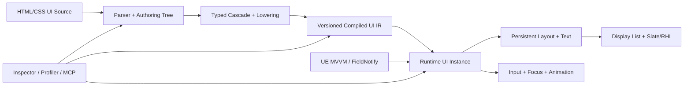

# WebToUE 工程技术总览与路线图

> 文档性质：长期维护的工程事实源（Living Engineering Document）
>
> 插件版本：`0.1.0-preview`
>
> 引擎基线：Unreal Engine 5.8
>
> 当前平台：Win64
>
> 当前里程碑：M2——增量原生运行时
>
> 最近核验：2026-08-11，基于 Git `26745212e962` 的 working tree
>
> 统一术语：[CONTEXT.md](../../../CONTEXT.md)

本文同时回答四个问题：项目现在是什么、已经做到什么、为什么这样设计、下一步如何验收。它是工程状态和路线的入口，不是完整 Web 标准兼容承诺，也不替代源码、自动化测试或独立 ADR。

---

## 1. 文档使用与维护规则

### 1.1 信息分层

本文按变化速度组织，维护时不要把不同生命周期的信息重新混在一起：

1. **工程宪法**：项目定位、非目标、不可轻易改变的架构约束。
2. **当前快照**：版本、能力、测试、性能事实和风险，必须能由代码或构建结果核验。
3. **路线图**：宏观里程碑、活跃里程碑的微观工作包及退出条件。
4. **附录**：精确的 HTML/CSS/绑定支持矩阵和变更记录。

### 1.2 状态标记

| 标记 | 含义 |
| --- | --- |
| ✅ 已验证 | 已实现，并有自动化测试、构建结果或可重复证据。 |
| 🟡 已实现未度量 | 功能存在，但缺少性能、压力或跨平台证据。 |
| 🚧 进行中 | 已开始，尚未满足退出条件。 |
| ⬜ 已规划 | 已进入路线，但尚未开始。 |
| ⛔ 非目标 | 明确不进入当前产品边界。 |

路线进度使用“已通过验收项 / 总验收项”，不是工时百分比。每个验收项等权，只表示完成颗粒度，不表示剩余工作量。除非验收项明确另有约定，只有同时满足以下条件才可勾选：

- 功能代码合入。
- 对应自动化测试通过。
- 本文的当前能力、风险和路线状态已同步。
- 性能敏感功能有基准或确认没有破坏既定预算。

### 1.3 必须更新本文的事件

- 支持或移除 HTML 标签、CSS 属性、选择器、绑定或输入能力。
- 修改 Compiled UI IR、资产自定义版本或 Cook 边界。
- 改变样式、布局、绘制、命中或绑定的失效策略。
- 新增 Runtime 或 Editor 模块、第三方依赖、平台或引擎版本。
- 完成里程碑验收项、发现高风险问题或改变性能预算。
- 作出难以逆转且存在真实权衡的架构决定；此时还应新增 ADR，并从本文链接。

---

## 2. 一页工程仪表盘

### 2.1 当前判断

| 维度 | 当前结论 | 证据状态 |
| --- | --- | --- |
| 产品方向 | 使用前端式源语言构建 UE 原生 UI，方向正确。 | ✅ |
| 浏览器依赖 | 无 CEF、Chromium、WebBrowser 或通用页面运行时。 | ✅ |
| 原生程度 | 编译资产 + C++ 节点 + Yoga + 单 Slate 控件绘制。 | ✅ |
| 功能成熟度 | 已能覆盖受控的菜单/HUD 原型；尚非完整生产 UI 框架。 | 🟡 |
| 性能成熟度 | 固定体积轻、无默认 Tick；增量样式和布局尚未建立。 | 🟡 |
| Gameface 对标 | 架构形态接近专用原生 UI Runtime，工程成熟度与性能证据仍有明显差距。 | 🟡 |
| 当前最大风险 | 小范围状态变化会放大全树样式、文本缓存、资源和布局工作。 | ✅ |
| 当前策略 | 暂缓横向扩张 Web 特性，优先完成 M2 增量运行时。 | 🚧 |

### 2.2 版本与验证快照

| 项目 | 当前值 |
| --- | --- |
| 插件版本 | `0.1.0-preview` |
| Engine | UE 5.8 |
| SupportedTargetPlatforms | Win64 |
| 自动化测试 | 12 / 12 通过（2026-08-11，working tree） |
| 当前编译验证 | UE 5.8 Win64 Editor Development 通过（2026-08-11，working tree） |
| 历史发布验证 | Win64 Game Development/Shipping、BuildCookRun、BuildPlugin 均曾通过；发布前必须在当前提交重新执行 |
| Git 基线 | `26745212e962` 基础上的 working tree；未提交，不生成伪哈希 |
| 当前发布级别 | Developer Preview / 技术可行性与基础能力阶段 |

### 2.3 宏观里程碑

| 里程碑 | 对应前端演进经验 | 状态 | 验收进度 | 结果 |
| --- | --- | --- | --- | --- |
| M0 技术闭环 | 文档结构与样式可被独立渲染 | ✅ | 8 / 8 | 从 HTML/CSS 到 Cooked 原生 UI 的端到端闭环 |
| M1 UI 基础语义 | 排版、交互、本地化与诊断 | ✅ | 10 / 10 | 常规菜单/HUD 原型所需的受控基础子集 |
| M2 增量原生运行时 | 浏览器的 retained/incremental rendering | 🚧 | 1 / 7 退出门 | 可度量、局部失效、可扩展的 Runtime |
| M3 响应式与组件 | React/Vue/Svelte 的数据和组件抽象 | ⬜ | 0 / 8 | UE MVVM 驱动的组件、列表与结构复用 |
| M4 动画与响应式视觉 | 合成层、时间线与多视口适配 | ⬜ | 0 / 6 | 游戏级动效而不引入浏览器合成器 |
| M5 工具链与 MCP | DevTools、自动化与生态接口 | ⬜ | 0 / 7 | 可检查、可分析、可由工具安全驱动 |
| M6 1.0 产品化 | 标准化、兼容策略与平台工程 | ⬜ | 0 / 7 | 可被外部项目稳定依赖的插件 |

M2 的 `1 / 7` 表示“原生、事件驱动的单控件运行时”这一前置门已经具备；其余退出门尚未完成。它不表示 M2 已完成约 14% 的工时。

---

## 3. 工程宪法

### 3.1 产品定位

WebToUE 将 HTML/CSS 视为 **UI Source**，而不是在游戏中运行的网页。编辑器负责解析、诊断并生成带版本的 **Compiled UI IR**；游戏运行时读取 WTUE Document，通过 UE 的对象、资源、输入和渲染能力生成 Runtime UI Instance。

直接价值：

- 前端开发者可以使用熟悉的结构与样式抽象。
- 游戏仍遵守 Unreal 的 UObject、资产、Cook、输入和平台构建流程。
- 避免通用浏览器内核的固定包体、内存、启动、安全和跨平台成本。
- UI 逻辑可继续存在于 C++、Blueprint、UE MVVM 和游戏系统中。

### 3.2 长期架构约束

1. Runtime 核心不依赖 CEF、Chromium、WebKit、Gecko 或通用 WebView。
2. Runtime 核心不以通用 JavaScript VM 作为状态和交互基础。
3. UI Source 必须先经过可诊断、可版本化的编译边界；Shipping 不读取磁盘前端源文件。
4. Compiled UI IR 与 Runtime State 必须分离；前者可共享，后者按视图实例存在。
5. 每个源节点不默认对应一个 UObject、UWidget 或独立 Slate Widget。
6. UE MVVM、FieldNotify、UObject 和类型化命令是响应式桥接方向。
7. 吸收前端历史中的结构、级联、组件、响应式和 DevTools 经验，但不追求浏览器标准完整度。
8. MCP 只作为可选 Editor Automation Surface，不得成为 Core、Runtime 或 Cooked 游戏依赖。

### 3.3 明确非目标

- 完整 DOM、浏览器导航、Cookie、Storage 和网页网络模型。
- 为兼容网页而复制浏览器历史遗留行为。
- 让任意 JavaScript 直接控制 UObject 或游戏世界。
- 仅为了 CSS 覆盖率而牺牲可预测性能、Cook 安全或跨平台能力。
- 在 1.0 前承诺任意网页可无修改运行。

---

## 4. 目标架构与当前差距



| 层 | 当前实现 | 目标状态 | 目标里程碑 |
| --- | --- | --- | --- |
| Authoring | 受控 HTML/CSS、自定义 `data-ue-*` | 明确版本的 WTUE Web Subset 与精确 Source Map | M2/M5 |
| Compiler | Parser、CSS 校验、级联、RichText lowering 集中于 Core | 分阶段编译管线、类型化属性、可缓存中间结果 | M2 |
| Asset/IR | 扁平 CompiledNodes/Rules、自定义版本 | 不可变、版本化、依赖完备、可迁移的 UI IR | M2/M6 |
| Runtime Instance | 运行节点混合源码、样式、布局和交互状态 | Compiled Node、Runtime State、Layout/Paint Cache 分离 | M2 |
| Reactivity | 根属性绑定、FieldNotify 刷新 | 依赖图、嵌套路径、转换器、命令、结构化更新 | M3 |
| Layout/Text | 每次脏布局重建 Yoga 树；节点级文本缓存 | 持久 Yoga、约束感知文本缓存、局部 Measure/Layout | M2 |
| Paint/Input | 递归 Slate Paint、全树 Hit Test | Display List、局部重绘、稳定排序、分层命中 | M2 |
| Tooling | 导入诊断、热重载、自动化测试 | Inspector、Profiler、Source Map、可选 MCP | M5 |

当前最重要的结构问题是 `FWebToUENode` 同时承载编译数据、计算样式、布局结果、滚动偏移和伪状态。M2 必须拆开这些生命周期，否则组件、动画和响应式能力会继续放大全量重算成本。

---

## 5. 当前实现架构

### 5.1 模块边界

| 模块 | 类型 | 当前职责 |
| --- | --- | --- |
| `WebToUEYoga` | Runtime | 内置 Yoga 3.2.1，并提供 Flex 布局能力。 |
| `WebToUECore` | Runtime | HTML/CSS 解析、节点、选择器、样式计算、诊断、RichText lowering 和 Yoga 适配。 |
| `WebToUERuntime` | Runtime | WTUE Document、UMG 外壳、Slate 渲染、输入、绑定、事件和字体配置。 |
| `WebToUEEditor` | Editor | `.html` 导入/重导入、依赖收集、资产编译、文件监听和本地化导入。 |

当前依赖方向为 Yoga → Core → Runtime → Editor。Editor 不进入游戏目标。

### 5.2 编译与运行链路

1. `UWebToUEFactory` 读取 HTML，并按源顺序收集 `<link>`、`<style>` 和元素内联样式。
2. `FWebToUECompiler` 解析结构、校验受支持 CSS、执行级联和富文本 lowering。
3. 工厂生成 `UWebToUEDocument`，保存扁平节点、规则、资源引用、诊断和自定义版本。
4. Editor 监听已加载文档依赖，文件变化后以 200ms 防抖重导入；失败时保留上次成功运行数据。
5. `UWebToUEView` 作为 UMG 控件宿主，底层创建单个 `SWebToUEView : SLeafWidget`。
6. Runtime hydration 后使用 Yoga 计算布局，通过 Slate 递归绘制、裁剪、文本、图片和交互状态。
7. Data Context 提供绑定值；语义化 UI Event 返回 Blueprint/C++ 游戏逻辑。

### 5.3 Cook 边界

Cooked 游戏保留 Compiled Nodes、Rules、Root、纹理/String Table 引用、诊断和 Runtime 模块。HTML/CSS 原文、源路径和依赖文件属于 Editor-only 数据。

现有 Development 和 Shipping IoStore 历史验证未发现 WebUI 源文件、Chromium、CEF 或 WebBrowser 运行文件。该结论在发布候选版本必须重新核验。

---

## 6. 当前能力矩阵

### 6.1 已实现并验证

- `.html` 导入、外链/内联 CSS、重导入、依赖监听与失败回退。
- 类型、Class、ID、复合、后代、直接子代、选择器组。
- `:hover`、`:active`、`:focus`、`:disabled`。
- Flex 主轴/交叉轴、Wrap、Gap、绝对定位、百分比尺寸和 Min/Max。
- Slate 约束文本测量、多行换行、`white-space: nowrap`。
- `FText` namespace/key、String Table、稳定自动 key 和基础富文本。
- `overflow: hidden/auto/scroll`、垂直滚轮、嵌套边界传递和裁剪感知 Hit Test。
- 鼠标点击、Tab/Shift+Tab、Enter/Space 焦点激活。
- 根 UObject 属性绑定、FieldNotify 自动刷新、可见性与启用状态。
- 语义化 `data-ue-on-click` → `OnUIEvent`。
- 自定义资产版本、旧资产重编译请求。
- Editor-only 的确定性 100/500/2,000 节点 Benchmark Corpus 与 50/200/500 规则集。
- Win64 Editor 编译以及 12 项自动化测试。

### 6.2 已实现但仍需工程化证据

- 中小型菜单与 HUD 的实际帧耗；固定 Benchmark Corpus 已建立，但尚无阶段计时和 P50/P95 基线。
- 高频伪状态与 FieldNotify 更新下的 Game Thread 峰值。
- 大型兄弟节点集合的 Paint 排序与全树 Hit Test 成本。
- 异常资源路径、超大文档和恶意输入的上限与恢复行为。
- 当前提交的 Game Development/Shipping、Cook 和独立插件打包矩阵。

### 6.3 尚未支持

- 输入框、文本编辑、IME、表单语义。
- 可见滚动条、拖拽/触摸滚动、惯性和虚拟列表。
- 手柄导航、CommonUI 深度集成、无障碍语义。
- 嵌套属性路径、Converter、双向绑定、类型化事件载荷。
- 组件、Props、Slots、条件节点、循环和 Keyed Diff。
- Transition、Keyframes、Transform、阴影、渐变、滤镜和 Mask。
- CSS Grid、Table、Float、CSS Variables、`calc()`、媒体查询。
- 独立样式/布局/事件检查器、性能时间线和跨平台矩阵。

精确的标签、属性和测试清单见附录 A～D。

---

## 7. 性能基线与预算

### 7.1 已知事实

2026-08-11 的 Win64 Editor DLL 文件体积：

| 模块 | 大小 |
| --- | ---: |
| `UnrealEditor-WebToUECore.dll` | 222,720 B |
| `UnrealEditor-WebToUEEditor.dll` | 185,856 B |
| `UnrealEditor-WebToUERuntime.dll` | 280,576 B |
| `UnrealEditor-WebToUEYoga.dll` | 340,480 B |
| 合计 | 1,029,632 B（约 0.98 MiB） |

这只能证明当前插件代码的固定文件成本很小，不代表 Shipping 包体、运行时内存、GPU 成本或 Gameface 性能对等。

M2 已建立三档确定性 Benchmark Corpus：100 节点/50 规则、500 节点/200 规则和 2,000 节点/500 规则。Automation Test 会验证源码生成确定性、编译无错误、运行节点/规则精确计数以及固定 Binding/Hover 目标。该证据只证明测试输入稳定可重复；尚未采集 Hydrate、Style、Measure、Layout、Paint Build、Hit Test、Binding 的计时、分配或 P50/P95 数据。

有利特征：

- 没有浏览器内核和通用脚本 VM。
- `SWebToUEView` 默认 `SetCanTick(false)`。
- 一个视图使用一个 Slate 叶控件，而不是每节点一个 UObject/UWidget。
- 滚动偏移变化目前只使 Paint 失效。

已知放大路径：

- Hover、Pressed、Focus 和绑定刷新调用全局 `RebuildStylesAndBrushes`。
- 样式解析对每个节点遍历规则并排序匹配项，近似 `O(N × R × selector-depth)`。
- 全局样式刷新会清空全部 Text Layout Cache。
- Layout Dirty 时重新创建并递归释放完整 Yoga Tree。
- Brush 重建可能同步 `LoadObject<UTexture2D>`。
- Paint 复制并排序每组子节点；Hit Test 递归遍历节点树。

因此当前性能结论是：**固定成本轻、静态和低频界面有良好基础；动态扩展性尚未被证明。**

### 7.2 M2 初始性能预算

预算以项目指定的固定测试机和 Development 构建为准；首次基准建立后允许校准数值，但改变预算必须记录原因。

| 场景 | 初始目标 |
| --- | --- |
| 未变化帧 | UI Runtime Tick 为 0；WTUE 自身临时分配为 0 |
| 500 节点 / 200 规则，单节点 Hover | Game Thread P95 < 0.5 ms |
| 500 节点 / 200 规则，单 FieldNotify 更新 | Game Thread P95 < 0.5 ms |
| 500 节点暖缓存完整布局 | P95 < 2.0 ms |
| 2,000 节点压力场景 | 状态局部变化不得触发全树资源加载或不可控的 16.6 ms 尖峰 |
| 性能回归 | CI/本地标准脚本输出样式、布局、文本、绘制、命中和内存分项 |

这些是路线目标，不是当前已达到的成绩。

---

## 8. 风险登记册

| ID | 风险 | 等级 | 当前证据 | 缓解路线 | 状态 |
| --- | --- | --- | --- | --- | --- |
| R-01 | 伪状态/绑定导致全树样式、Brush、文本和布局刷新 | Critical | Runtime 调用链已确认 | Dirty Graph、Selector Index、属性影响分类 | 🚧 M2 |
| R-02 | Yoga Tree 每次布局重建 | High | Core 布局代码已确认 | Persistent Yoga Nodes、局部 Dirty | ⬜ M2 |
| R-03 | 编译数据与 Runtime State 混合在节点结构 | High | `FWebToUENode` 字段已确认 | 拆分 IR/Instance/Cache 生命周期 | ⬜ M2 |
| R-04 | 状态变化路径可能同步加载纹理 | High | Brush 重建使用 `LoadObject` | 编译依赖 + Resource Cache + 异步策略 | ⬜ M2 |
| R-05 | Compiler/View 职责集中，修改回归面扩大 | High | 两个核心实现文件体量和职责已确认 | 按编译阶段和 Runtime 服务拆分 | ⬜ M2 |
| R-06 | 没有完整可重复性能基准，无法证明“原生且高效” | Critical | 固定 Corpus 已建立；阶段计时、统计和预算门禁仍缺失 | Benchmark、Stat、Trace、预算门禁 | 🚧 M2 |
| R-07 | CSS 声明使用 Map，重复声明顺序不完全等价 | Medium | 当前声明模型已确认 | Ordered Declaration IR | ⬜ M2 |
| R-08 | 仅 Win64，平台假设尚未暴露 | Medium | `.uplugin` 平台限制 | 平台抽象审计与构建矩阵 | ⬜ M6 |
| R-09 | MCP 为 Experimental 且本地服务无认证 | Medium | UE 5.8 官方边界 | Editor-only、默认关闭、最小权限工具 | ⬜ M5 |

风险关闭必须链接对应测试、基准或代码变更，不能只把状态改成“已解决”。

---

## 9. 宏观路线：按前端抽象演进，而非复制浏览器

### M0——技术闭环 ✅ 8 / 8

- [x] HTML/CSS 可导入。
- [x] 可生成 Unreal Asset。
- [x] Yoga 可计算布局。
- [x] Slate 可原生绘制。
- [x] UMG 可承载 WTUE View。
- [x] UObject 绑定和语义事件闭环。
- [x] 文件变化可重导入。
- [x] Cooked 运行不依赖 UI Source 或浏览器内核。

### M1——UI 基础语义 ✅ 10 / 10

- [x] 多来源 CSS 级联和精确诊断。
- [x] 约束文本测量和自动换行。
- [x] 稳定 FText/String Table 身份。
- [x] 基础富文本 run。
- [x] 垂直滚动、嵌套边界和裁剪命中。
- [x] 鼠标和基础键盘交互。
- [x] 资产自定义版本和旧资产识别。
- [x] Development/Shipping Cook 历史闭环。
- [x] Core/Runtime/Editor 自动化测试基础。
- [x] 工程技术总览和明确非目标。

### M2——增量原生运行时 🚧 1 / 7 退出门

- [ ] 有可重复基准、Trace/Stat 和预算门禁。
- [ ] Compiled UI IR、Runtime State、Layout/Paint Cache 完全分离。
- [ ] Typed Property、Selector Index 和 Ordered Declaration 建立。
- [ ] Style/Measure/Layout/Paint/HitTest Dirty Graph 生效。
- [ ] Yoga、Text 和 Resource Cache 持久化且局部失效。
- [ ] Paint 顺序、Display List 和 Hit Test 可扩展。
- [x] 单 Slate 控件、无默认 Tick、无浏览器内核的事件驱动基础。

退出结果：500 节点常规菜单的局部状态变化满足性能预算；全量更新路径可被 Profiler 明确解释。

### M3——响应式数据与组件 ⬜ 0 / 8

- [ ] UE MVVM/FieldNotify 依赖图。
- [ ] 嵌套属性路径与类型化 Converter。
- [ ] Command 与类型化事件载荷。
- [ ] 编译期 Component 与 Props。
- [ ] Slots 与模板复用。
- [ ] 条件节点与列表循环。
- [ ] Stable Key、Keyed Diff 和实例复用。
- [ ] 大列表虚拟化。

退出结果：单字段变化只触达依赖节点；列表更新复用稳定实例，不进行全树重建。

### M4——动画与响应式视觉 ⬜ 0 / 6

- [ ] Typed Transition 和 easing。
- [ ] Keyframes 时间线。
- [ ] Transform、Opacity、Color 的 Paint/Composite 路径。
- [ ] Layout Animation 与 Paint Animation 分层。
- [ ] DPI、Safe Zone、视口和输入设备条件。
- [ ] 阴影、渐变、九宫格等受控商业 UI 能力。

退出结果：常用动画不触发无关 Cascade/Yoga；标准压力场景达到目标帧率。

### M5——工具链与 MCP ⬜ 0 / 7

- [ ] Authoring Tree、IR 和 Runtime Tree Inspector。
- [ ] Cascade、Computed Style、Box Model 和焦点可视化。
- [ ] Source Map 与源码跳转。
- [ ] Incremental Compile、DDC 和依赖图。
- [ ] Screenshot/Golden 测试。
- [ ] 性能时间线、Paint Rect 和内存统计。
- [ ] 可选 `WebToUEMCP` Editor-only 适配器。

退出结果：问题能够从画面定位到源文件、规则、布局和耗时；AI 工具只能通过受控接口操作 Editor。

### M6——1.0 产品化 ⬜ 0 / 7

- [ ] Public API 与扩展点稳定。
- [ ] UI IR/资产迁移和兼容策略稳定。
- [ ] Win64 以外的平台矩阵。
- [ ] Game/Shipping/Cook/BuildPlugin 自动发布门禁。
- [ ] 安全、异常恢复和资源上限。
- [ ] 文档、样例、升级指南、错误码和支持矩阵。
- [ ] 分发、许可证和第三方声明完备。

退出结果：外部项目可以依据公开版本、兼容策略和性能预算长期升级。

---

## 10. M2 微观执行路线

M2 是当前唯一活跃里程碑。工作包按依赖顺序推进；原则上不在 M2.0～M2.4 完成前扩张大型 CSS、组件或动画能力。

### M2.0——性能可观测性 🚧 1 / 6

- [x] 固定 100/500/2,000 节点文档生成器与 50/200/500 规则集。
- [ ] 分别统计 Hydrate、Style、Measure、Layout、Paint Build、Hit Test、Binding。
- [ ] 记录节点、规则、匹配、Yoga、文本布局、Brush 和分配数量。
- [ ] Unreal Insights/CSV/Automation 可消费的输出。
- [ ] 固定测试机、构建配置、采样次数和 P50/P95 规则。
- [ ] 把第 7.2 节预算转成回归门禁。

### M2.1——拆分生命周期 ⬜ 0 / 6

- [ ] 定义只读 `CompiledDocument/CompiledNode` 边界。
- [ ] 定义每视图 `RuntimeInstance/NodeState`。
- [ ] Layout、Text、Paint 和 Resource Cache 不再写回 Compiled IR。
- [ ] Binding、Pseudo State、Focus、Scroll 只存在于 Runtime State。
- [ ] Runtime 可共享同一 Document 创建两个互不污染的实例。
- [ ] Compiler 和 View 按职责拆分，当前 WebToUE 回归测试无回归。

### M2.2——类型化样式与选择器索引 ⬜ 0 / 5

- [ ] CSS Property ID + Typed Value，停止在热路径解析字符串。
- [ ] 声明保持源顺序，正确处理同规则重复属性。
- [ ] 规则按 ID/Class/Tag/Pseudo 候选索引。
- [ ] 属性元数据声明 Inherited 及影响 Style/Measure/Layout/Paint 的范围。
- [ ] Cascade 结果和浏览器式无效声明语义有专项测试。

### M2.3——Dirty Graph ⬜ 0 / 6

- [ ] 明确 Structure/Style/Measure/Layout/Paint/HitTest Dirty Flags。
- [ ] Hover/Active/Focus 只处理受影响选择器候选。
- [ ] Paint-only 属性不触发 Measure/Layout。
- [ ] 继承属性只向必要后代传播。
- [ ] FieldNotify 只刷新依赖节点。
- [ ] 每次更新可报告“为什么这些节点失效”。

### M2.4——持久缓存 ⬜ 0 / 6

- [ ] Yoga Node 与 Runtime Node 同生命周期。
- [ ] 仅脏子树进入 Measure/Layout。
- [ ] Text Layout 以文本、字体、样式和约束作为 Cache Key。
- [ ] 伪状态变化不再无条件清空全部 Text Layout。
- [ ] 编译资产生成明确资源依赖，Runtime 使用 Resource Cache。
- [ ] 状态变化路径不执行同步纹理加载。

### M2.5——Paint 与命中扩展性 ⬜ 0 / 5

- [ ] 稳定 Paint Order，避免每帧复制排序不变子节点。
- [ ] 引入可复用 Display List/Paint Commands。
- [ ] 局部 Paint Invalidations 和重绘区域可视化。
- [ ] Hit Test 使用裁剪感知的层次包围或空间索引。
- [ ] 500/2,000 节点场景满足预算并无异常分配。

### M2.6——生产 UI 基础补齐 ⬜ 0 / 7

- [ ] 可见垂直/水平滚动条。
- [ ] 鼠标拖拽、触摸和惯性滚动。
- [ ] 手柄导航与 CommonUI 协作。
- [ ] DPI 与 Safe Zone。
- [ ] 输入框、文本编辑和 IME 的最小可用方案。
- [ ] 无障碍语义的节点模型。
- [ ] 输入、重导入、绑定和截图自动化覆盖。

### M2.7——退出检查 ⬜ 0 / 6

- [ ] 11 项现有测试及新增 M2 测试全部通过。
- [ ] Editor/Game Development/Shipping 编译通过。
- [ ] Cook、IoStore 和 BuildPlugin 通过。
- [ ] 第 7.2 节性能预算通过。
- [ ] R-01～R-06 关闭或降至可接受等级。
- [ ] 文档、示例和升级说明同步。

### 建议的前六个实现变更

1. Benchmark/Stats 基础与固定压力文档。
2. Compiler/View 拆分和 Compiled IR/Runtime State 类型设计。
3. Dirty Flags 与属性影响元数据。
4. Selector Index 与局部 Pseudo State 重算。
5. Persistent Yoga/Text/Resource Cache。
6. Display List、Paint/Hit Test 优化及 M2 性能门禁。

---

## 11. MCP 接入策略

UE 5.8 的 Unreal MCP 仍是 Experimental。WebToUE 可以利用它改善编辑器开发体验，但不得让实验协议污染 Runtime 架构。

建议未来新增独立、可选、默认关闭的 `WebToUEMCP` Editor 模块：

```text
WebToUECore
WebToUERuntime
WebToUEEditor
WebToUEMCP       # EditorOnly, optional
```

M2 期间先建立与传输协议无关的 Compiler、Diagnostics、Inspection、Benchmark Editor Services。M5 再让 MCP 作为这些服务的适配器，而不是唯一入口。

首批候选能力：

- Resources：文档列表、Compiled UI IR、诊断、支持矩阵、性能快照。
- Read-only Tools：检查文档、Computed Style、布局、依赖和测试结果。
- Mutating Tools：编译、重导入和生成样例；必须支持参数校验、UE Transaction/Undo 和明确权限。

禁止暴露任意文件系统、Shell、任意 UObject/Blueprint 调用或远程无认证访问。MCP 不参与 Cook，不进入玩家设备，也不用于 Runtime 消息传递。

---

## 12. 测试与发布门禁

### 12.1 当前自动化测试（12 / 12）

| 层 | 测试 |
| --- | --- |
| Core | `HtmlCss`、`FlexLayout`、`ConstrainedMeasure`、`RichTextCompile`、`ScrollLayout`、`CssDiagnostics` |
| Runtime | `AssetVersion`、`TextWrapping`、`LocalizedRichText`、`ScrollInteraction` |
| Editor | `BenchmarkScenarios`、`LocalizationImport` |

### 12.2 仍需建立

- Runtime Pseudo State 局部失效测试。
- FieldNotify 依赖节点增量更新测试。
- 两个 Runtime UI Instance 状态隔离测试。
- Reimport 成功、失败回退和依赖变化测试。
- 鼠标、键盘、手柄、触摸与 IME 自动化。
- Screenshot/Golden 跨 DPI 测试。
- 100/500/2,000 节点性能和内存回归。
- Win64 Editor/Game Development/Shipping/Cook/BuildPlugin 一键门禁。

功能测试通过不等于性能达标；发布门禁必须分别报告 Correctness、Performance、Packaging 和 Compatibility。

---

## 13. 变更记录

只记录会改变工程判断、架构、里程碑或支持边界的变化；普通提交不在此重复 Git 历史。

| 日期 | 基线 | 变化 | 路线影响 |
| --- | --- | --- | --- |
| 2026-08-11 | `2674521` + working tree | 建立 Editor-only 的确定性 100/500/2,000 节点 Benchmark Corpus、50/200/500 规则集及专项 Automation Test。 | M2.0 达到 1/6；R-06 仍为 Critical，等待阶段计时与预算门禁。 |
| 2026-08-11 | `2674521` + working tree | 将一次性技术总结重构为长期工程事实、风险、宏观/微观路线和验收进度文档；建立统一术语。 | M0/M1 固化为完成，M2 成为唯一活跃里程碑。 |
| 2026-08-11 | `2674521` | 稳定 FText/String Table 身份与基础富文本。 | 完成 M1 本地化与文本语义。 |
| 2026-08-11 | `325d17b` | 垂直滚动、嵌套边界和裁剪命中。 | 完成 M1 基础滚动语义。 |
| 2026-08-10 | `e23638a` | 约束文本测量与自动换行。 | 完成 M1 排版基础。 |
| 2026-08-10 | `d81ec1c` | 多来源 CSS 诊断。 | 完成 M1 样式诊断基础。 |
| 2026-08-10 | `f5be9a5` | Compiled Document 自定义版本。 | 建立 M6 资产兼容前置能力。 |
| 2026-08-10 | `84f2eee` | 原生 HTML/CSS UI Preview 首版。 | 完成 M0 技术闭环主体。 |

---

## 附录 A：当前 HTML 与 Authoring 支持

标签：

- 文档：`html`、`head`、`body`
- 样式：`style`、`link`
- UI：`div`、`span`、`p`、`img`、`button`
- 行内语义：`strong` / `b`、`em` / `i`、`u`、`br`

解析能力：

- 双引号、单引号、无引号和布尔属性。
- HTML 注释、doctype 跳过和常见/数值实体解码。
- `<style>`、外链 CSS 和元素 `style`。
- 未知标签保留为通用 Flex 容器并产生警告。
- 文本首尾空白裁剪；尚非完整浏览器空白折叠语义。

本地化声明：

- `data-ue-loc-key`
- `data-ue-loc-namespace`
- `data-ue-string-table` + `data-ue-string-key`
- `data-ue-rich-text="true"`

关键产品文案应使用显式 key；无 `id` 节点结构重排可能改变自动作者路径。

## 附录 B：当前 CSS 支持

选择器：类型、Class、ID、复合、后代、直接子代、逗号组，以及 `:hover`、`:active`、`:focus`、`:disabled`。

布局与可见性：

- `display`、`position`、`visibility`、`overflow`
- `width/height`、`min-*`、`max-*`
- `left/top/right/bottom`
- `margin`、`padding` 及四方向属性
- `gap`、`row-gap`、`column-gap`

Flex：

- `flex`、`flex-direction`、`flex-wrap`
- `flex-grow`、`flex-shrink`、`flex-basis`
- `justify-content`、`align-items`、`align-self`

绘制与文本：

- `color`、纯色 `background/background-color`
- `border`、`border-color/width/style/radius`
- `opacity`、`z-index`
- `font-family/size/weight`、`text-align`、`white-space`
- `object-fit: fill/contain/cover`

值：`px`、百分比、零、部分 `auto`；Hex 颜色和少量命名色。尚无 `rgb()`、变量、`calc()`、渐变和完整颜色集合。

显式继承：`color`、`font-family`、`font-size`、`font-weight`、`text-align`、`white-space`。

## 附录 C：绑定、事件、输入与资源

绑定：

| 声明 | 当前行为 |
| --- | --- |
| `data-ue-bind-text="Property"` | 根 UObject 属性转文本 |
| `data-ue-bind-visible="BoolProperty"` | 控制可见性 |
| `data-ue-bind-enabled="BoolProperty"` | 控制可用状态和 `:disabled` |
| FieldNotify | 订阅实际使用字段并触发刷新；尚未局部更新节点 |

事件：`data-ue-on-click="EventName"` 广播 `EventName` 和 `ElementId`。

输入：鼠标移动/点击/滚轮、Tab/Shift+Tab、Enter/Space。尚无触摸、手柄、IME 和可访问性导航。

图片：`src` 使用 Unreal 软对象路径，例如 `/Game/UI/T_Logo.T_Logo`；不支持磁盘图片和 HTTP 下载。

## 附录 D：诊断与资产行为

当前诊断覆盖：

- HTML/CSS 文件读取失败。
- 标签名缺失、未匹配闭合标签、未知标签。
- CSS 规则未闭合、声明格式错误。
- 不支持的 at-rule、选择器、属性和值。
- 外链、内联样式的实际文件、行和列。

第一次导入错误不会产生有效运行数据；已有资产重导入失败保留上次成功运行数据并更新诊断。

WTUE Document 使用自定义版本 GUID，当前包含初始 Compiled Document 和本地化富文本演进。旧资产可请求重编译；全局未加载资产扫描和完整字段级迁移仍属于 M6。

## 附录 E：事实锚点与外部参考

主要源码事实锚点：

- 节点、样式和文档模型：`Source/WebToUECore/Public/WebToUECoreTypes.h`
- 编译、级联和 Yoga 适配：`Source/WebToUECore/Private/WebToUECompiler.cpp`
- WTUE Document 资产：`Source/WebToUERuntime/Public/WebToUEDocument.h`
- Slate Runtime、绑定、绘制和输入：`Source/WebToUERuntime/Private/SWebToUEView.cpp`
- HTML 导入和 Compiled Asset 生成：`Source/WebToUEEditor/Private/WebToUEFactory.cpp`
- 固定 Benchmark Corpus：`Source/WebToUEEditor/Private/Benchmarks/WebToUEBenchmarkScenario.cpp`
- 插件模块与平台声明：`WebToUE.uplugin`

外部参考只用于说明对标产品和引擎能力，不构成 WTUE 的兼容承诺：

- [Epic：Unreal MCP in Unreal Editor（UE 5.8）](https://dev.epicgames.com/documentation/unreal-engine/unreal-mcp-in-unreal-editor)
- [Epic：ModelContextProtocol API（UE 5.8）](https://dev.epicgames.com/documentation/unreal-engine/API/Plugins/ModelContextProtocol)
- [Coherent Labs：Gameface Unreal Overview](https://docs.coherent-labs.com/unreal-gameface/overview/)
- [Coherent Labs：Gameface Performance Profiling](https://docs.coherent-labs.com/unreal-gameface/performance-optimization/profilingoverview/)
