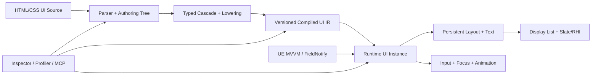

# WebToUE 工程技术总览与路线图

> 文档性质：当前工程事实、风险和路线的长期入口
>
> 插件版本：`0.1.0-preview`
>
> 引擎/平台：Unreal Engine 5.8 / Win64
>
> 当前里程碑：M2——增量原生运行时
>
> 当前交付 Profile：PersonalGame-ready 0.5——Win64 项目内生产使用；通用商业 1.0 延后
>
> 最近核验：2026-08-13，`fbbf74d`～`7f838de` 完成 M2.5 FieldNotify/Text 纵向切片；发布后 41 / 41 Automation、UE 5.8 Win64 Game + Editor Development、Cook/Stage/Pak/IoStore 和 Editor readiness/MCP/Python/World 通过
>
> 统一术语：[CONTEXT.md](../../../CONTEXT.md) · 历史证据：[WTUE_EvidenceLedger.md](WTUE_EvidenceLedger.md) · 精确支持边界：[WTUE_SupportMatrix.md](WTUE_SupportMatrix.md)

本文回答项目现在是什么、已经做到什么、当前风险是什么、下一步如何验收。它不保存逐次实验历史，也不是完整 Web 标准兼容承诺；历史性能、构建与里程碑证据进入 Evidence Ledger，逐项功能边界进入 Support Matrix，难以逆转的决定进入 ADR。

---

## 1. 维护规则

### 1.1 信息职责

| 文档 | 唯一职责 |
| --- | --- |
| 本文 | 当前架构、能力判断、性能结论、风险、路线和门禁 |
| `CONTEXT.md` | 稳定的统一领域语言，不记录实现和版本状态 |
| `WTUE_EvidenceLedger.md` | 带时间语境的验证、性能和工程变更历史 |
| `WTUE_SupportMatrix.md` | HTML/CSS/绑定/输入/资源/诊断的精确当前边界 |
| `ADRs/` | 存在真实替代方案且难以逆转的架构决定 |

路线进度使用“已满足验收项 / 总验收项”，不是工时百分比。只有实现、自动化测试、必要性能/发布证据和文档同步全部满足后才能勾选完成。

### 1.2 状态标记

| 标记 | 含义 |
| --- | --- |
| ✅ | 已实现且有可重复证据 |
| 🟡 | 已实现但证据仍不足 |
| 🚧 | 已开始，尚未满足退出条件 |
| ⬜ | 已规划，尚未开始 |
| ⛔ | 明确不进入产品边界 |

以下变化必须同步本文：架构或所有权边界、Compiled UI IR/资产版本/Cook、失效策略、模块/依赖/平台、预算、风险等级、路线进度和发布门禁。支持项变化同步 Support Matrix；新的验证记录追加到 Evidence Ledger，不在本文复制完整过程。

---

## 2. 当前仪表盘

### 2.1 工程判断

| 维度 | 当前结论 | 状态 |
| --- | --- | --- |
| 产品方向 | 使用前端式 UI Source 编译 UE 原生 UI，方向成立 | ✅ |
| 浏览器依赖 | 无 CEF、Chromium、WebBrowser、通用页面运行时或 JavaScript 状态 VM | ✅ |
| 原生形态 | 编译资产 + C++ Runtime Instance + Yoga + 单 Slate 控件 | ✅ |
| 生命周期 | Compiled IR、Runtime State、Style/Layout Data、Presentation Cache 已按视图分离 | ✅ |
| 功能成熟度 | 可覆盖受控菜单/HUD 原型，尚非完整生产 UI 框架 | 🟡 |
| 性能成熟度 | 无默认 Tick；Hover、FieldNotify、暖布局和未变化 Paint 有硬门；Yoga、Paint/Hit Test 与真实渲染证据仍待后续路线 | 🟡 |
| 当前最大风险 | 局部 Hover/FieldNotify 已无 O(N) Style/Binding/Resource 工作；持久 Yoga、Display List、资源热路径与 Packaged GT/RT/GPU 仍开放 | ✅ |
| 当前策略 | 先完成 M2 增量运行时，再只实现 PersonalGame-ready 0.5 的 M3/M4 必需切片；外部通用 1.0 能力延后 | 🚧 |

### 2.2 验证快照

| 项目 | 当前值 |
| --- | --- |
| 自动化测试 | 41 / 41 通过（2026-08-13，M2.5 closure candidate；`StartsWith:WebToUE`） |
| 当前编译 | M2.5 closure candidate 的 UE 5.8 Win64 Game + Editor Development 通过 |
| 当前发布 | M2.5 closure candidate 的 Win64 Development BuildCookRun 通过：Cook 0 errors、Stage/Pak/IoStore、569 packages、2,226 chunks、250.11 MiB、UAT ExitCode 0；该门不证明 Packaged Runtime 正确性或 GT/RT/GPU/输入到像素性能 |
| 历史发布 | Win64 Game Development/Shipping、BuildCookRun、BuildPlugin 曾通过；发布前须在当前提交重跑 |
| Git 基线 | M2.5 实现/资产基线为 `fbbf74d`、`b84b2b4`、`99a4405`、`c2635a3`、`09ef231`、`51e0563`、`3af152c`、`7f838de`；必要文档与发布证据随本路线收口 |
| 发布级别 | Developer Preview |

### 2.3 宏观里程碑

| 里程碑 | 状态 | 验收进度 | 结果 |
| --- | --- | --- | --- |
| M0 技术闭环 | ✅ | 8 / 8 | HTML/CSS 到 Cooked 原生 UI 的端到端闭环 |
| M1 UI 基础语义 | ✅ | 10 / 10 | 受控菜单/HUD 原型的排版、交互、本地化和诊断基础 |
| M2 增量原生运行时 | 🚧 | 7 / 9 退出门 | 可度量、共享样式模板、稳定身份、局部失效、真实渲染可扩展的 Runtime |
| M3 响应式与组件 | ⬜ | 0 / 8 | UE MVVM 驱动的组件、列表与结构复用 |
| M4 动画与响应式视觉 | ⬜ | 0 / 7 | 游戏级动效而不引入浏览器合成器 |
| M5 工具链与 MCP | ⬜ | 0 / 7 | 可检查、可分析、可由受控工具驱动 |
| M6 1.0 产品化 | ⬜ | 0 / 7 | 可被外部项目稳定依赖的插件 |

M2 已具备性能可观测性与代表性硬门、完整生命周期分离、类型化样式/选择器/Cascade、共享 Style Template 与稳定身份、Paint-only Pseudo 和根字段 FieldNotify/Text 局部失效，以及无默认 Tick 的单控件事件驱动基础。路线复核后保留“真实 Packaged 渲染证据”等退出门，避免把 Game Thread 微基准外推为完整产品性能。`7 / 9` 不是工时比例。

### 2.4 当前交付 Profile：PersonalGame-ready 0.5

当前优先目标不是立即成为可供未知外部项目稳定依赖的通用商业插件，而是在 PersonalGame 的真实菜单/HUD 中达到可生产使用、可测量、可打包和可恢复。Profile 分类不改变已经完成的事实，也不把 Deferred 项伪装为完成：

| 分类 | 含义 |
| --- | --- |
| `P0.5` | 阻塞 PersonalGame-ready 0.5，按依赖顺序实施和验收 |
| `P0.5-if-used` | 必须由目标游戏 Corpus 审计决定：实际使用则实现并验收，未使用则以明确 `N/A` 证据关闭 |
| `P1.0` | 延后到外部通用商业插件阶段，不阻塞 0.5 |

PersonalGame-ready 0.5 的固定边界：

- 平台与分发：Win64、项目内集成；Editor/Game Development、Shipping、Cook、IoStore 和真实 Packaged Smoke 必须通过。BuildPlugin、第二平台和独立插件分发属于 `P1.0`。
- 界面与输入：真实 Main Menu、HUD、Stress Corpus；鼠标、键盘、手柄/CommonUI、DPI 与 Safe Zone 属 `P0.5`。触摸/惯性、完整文本编辑/IME 和无障碍实现属于 `P1.0`，除非目标游戏明确使用。
- Runtime：M2.3～M2.7 的稳定身份、K=1 局部失效、持久 Layout/Text/Resource、Display List/Hit Test 和 Packaged GT/RT/GPU/内存证据不得裁掉。
- 响应式与复用：类型化 Command、Component/Props/Slots、条件节点和普通 Keyed List 属 `P0.5`；嵌套 Converter、通用 Keyed Diff 扩展和大列表虚拟化按实际 Corpus 决定。
- 动画：Transform/Opacity/Color Transition、easing 和仅活动时 Tick 属 `P0.5`；Keyframes、Layout Animation 与复杂商业视觉能力按需或延后。
- 工具与兼容：跨 DPI Screenshot/Golden、失败诊断、资源上限和内部使用文档属 `P0.5`。完整 Inspector、Source Map、Incremental Compile/DDC、WebToUEMCP、稳定外部扩展 API、多代资产兼容、分发与许可证收口属于 `P1.0`。
- 资产升级：0.5 期间 UI Source 是可恢复事实源，允许在清晰诊断下重新编译资产；发布 1.0 前再冻结长期资产迁移兼容承诺。
- 对标：同画面 UMG A/B 属 `P0.5`；只有能获得合法、可比较的 Gameface Release 环境时才运行其 A/B，否则明确记录 `Unknown`，不阻塞 0.5。

0.5 退出时必须同时满足：M2 Go/No-Go；上述 `P0.5` 的响应式、组件、动画和输入切片；三类真实 Corpus 的 Win64 Packaged Development/Shipping 证据；当前项目的错误恢复、Golden、资源上限和维护文档。每个 `P0.5-if-used` 项必须由冻结后的真实 Corpus 清单裁决为“已实现并通过”或“有证据的 `N/A`”；一旦被使用就自动成为阻断门，不能以“按需”为由跳过。

---

## 3. 工程宪法

### 3.1 产品定位

WebToUE 将 HTML/CSS 视为 **UI Source**，而不是在游戏中运行的网页。Editor 负责解析、诊断并生成带版本的 **Compiled UI IR**；Cooked Runtime 读取 WTUE Document，以 UE 对象、资源、输入和渲染能力创建 Runtime UI Instance。

直接价值：前端开发者使用熟悉的声明式结构与样式；游戏继续遵守 UObject、资产、Cook、输入和平台流程；Runtime 避免通用浏览器内核的固定包体、内存、启动、安全和跨平台成本。

### 3.2 长期约束

1. Runtime 不依赖 CEF、Chromium、WebKit、Gecko、通用 WebView 或 JavaScript 状态 VM。
2. UI Source 必须经过可诊断、可版本化的编译边界；Shipping 不读取磁盘前端源文件。
3. Compiled UI IR 可共享且不可变；Runtime State、Render Data 和 Cache 按视图存在。
4. 每个源节点不默认对应 UObject、UWidget 或独立 Slate Widget。
5. UE MVVM、FieldNotify、UObject 和类型化命令是响应式桥接方向。
6. 吸收前端的结构、级联、组件、响应式和 DevTools 经验，但不追求浏览器标准完整度。
7. MCP 只是可选 Editor Automation Surface，不进入 Core、Runtime、Cook 或产品协议。
8. “Gameface 级性能”不是单一营销数字或兼容承诺；性能结论只来自同硬件、同画面、同交互轨迹、同视觉结果和同构建配置的可复现 A/B。

### 3.3 非目标

- 完整 DOM、网页导航、Cookie、Storage 和网页网络模型。
- 为网页兼容复制浏览器历史遗留行为。
- 让任意 JavaScript 直接控制 UObject 或游戏世界。
- 仅为 CSS 覆盖率牺牲可预测性能、Cook 安全或跨平台能力。
- 在 1.0 前承诺任意网页可无修改运行。

---

## 4. 架构与当前差距

| 层 | 当前实现 | M2 目标 |
| --- | --- | --- |
| Compiler | Parser/CSS 前端、RichText lowering、Property ID/Typed Value、Property Metadata、固定槽位 Typed Cascade、Property 应用和 Yoga Adapter 已拆分 | old/new Property change set 与失效依赖 |
| Asset/IR | 私有扁平 CompiledNodes/Rules、类型化样式声明、自定义版本、原子提交 | 不可变、依赖完备、可迁移 |
| Runtime Instance | 每视图节点 Hydration、修订内 Template Node ID、Owner + Generation + Slot Handle、连续 NodeState、连续 Computed Style/Layout | Dirty Graph 和依赖图 |
| Presentation | 每视图 Layout Dirty、Handle-keyed Text/Paint Order/Brush/Resource Cache | 持久缓存与局部失效 |
| Layout/Text | 脏布局重建 Yoga Tree；节点级 Text Layout Cache | Persistent Yoga、约束感知 Text Cache、局部 Measure/Layout |
| Paint/Input | 递归 Paint/Hit Test；Paint Order 已缓存 | Display List、局部重绘、分层命中 |
| Tooling | 导入诊断、热重载、Automation、Stat/Trace/Telemetry | Inspector、Profiler、Source Map、可选 MCP |

`UWebToUEDocument` 保存共享 Compiled payload，并按当前文档修订缓存不可变的已水合 Style Rules 与 Selector Index；`FWebToUERuntimeInstance` 保留每 View 节点包装、Instance Handle 代次、NodeState 和 Render Data，因为 Binding 会插入动态子节点且 Parent/Children/Handle 属实例生命周期；`FWebToUERuntimePresentation` 独占 Handle-keyed Layout/Text/Paint/Resource Cache。双 View 专项已验证状态、Style/Layout 和 Presentation Cache 互不污染；`RuntimeIdentity` 证明同一模板节点跨 View 的 Template Node ID 一致、Style Template 共享，而 Instance Handle 不能跨 View、结构修订、重导入或 View 销毁解析。Runtime 数组以 Handle Slot 索引，Yoga Measure Context 通过 Handle 解析节点；未来 Dirty Graph、Display List 与 Stable Key 必须沿用同一合同，不另建 raw-pointer 身份。

### 4.1 模块边界

| 模块 | 类型 | 职责 |
| --- | --- | --- |
| `WebToUEYoga` | Runtime | 固定 Yoga 3.2.1 与 Flex 布局能力 |
| `WebToUECore` | Runtime | HTML/CSS、节点、选择器、样式、诊断、RichText lowering、Yoga Adapter |
| `WebToUERuntime` | Runtime | WTUE Document、Runtime Instance、UMG/Slate、绑定、输入、事件、字体 |
| `WebToUEEditor` | Editor | 导入/重导入、依赖收集、资产编译、监听、本地化、Benchmark |

依赖方向为 Yoga → Core → Runtime → Editor。Editor 和 Editor-only Benchmark 类型不进入游戏目标。

`WebToUEEditor` 的 Runtime 专项基准私有依赖 UE `ModelViewViewModel`，并在插件元数据中显式声明；产品 Runtime 的 FieldNotify 订阅仍只通过 `FieldNotification` 和 `INotifyFieldValueChanged`，不把 Editor 测试类型带入 Cooked 路径。

### 4.2 编译与运行链路

1. Factory 读取 HTML，按源顺序收集外链、内联和元素样式。
2. Compiler 解析结构、校验 CSS，并把受支持属性和值一次性降低为稳定 Property ID 与 Typed Value；独立服务承担 Cascade、Property 应用和 Yoga。
3. Factory 在局部构建 Nodes、Rules、资源依赖并原子提交；Runtime 只读 Compiled IR。
4. 已加载文档依赖变化后以 200ms 防抖重导入；失败保留 last-good 数据。
5. `UWebToUEView` 宿主创建一个 `SWebToUEView : SLeafWidget`。
6. 每视图 Runtime/Presentation 协调状态、布局、缓存、Slate Paint 和输入。
7. Data Context 提供绑定值；语义 UI Event 返回 Blueprint/C++ 游戏逻辑。

Cooked 游戏保留 Compiled Nodes/Rules、Root、纹理/String Table 引用、诊断和 Runtime 模块；HTML/CSS 原文、源路径和依赖文件属于 Editor-only 数据。

---

## 5. 当前能力边界

已验证能力包括 HTML/CSS 导入与失败回退、受控 Selector/Pseudo State、Flex/Wrap/Gap/绝对定位、约束文本与 RichText、本地化身份、滚动裁剪与命中、鼠标/基础键盘、根属性绑定/FieldNotify、语义点击事件、自定义资产版本和固定 Benchmark Corpus。

当前仍缺生产级输入/IME、触摸与手柄、无障碍、组件/列表、动画、复杂 CSS、Inspector、跨平台和当前提交的完整发布矩阵。逐项支持、限制和诊断行为以 [WTUE_SupportMatrix.md](WTUE_SupportMatrix.md) 为唯一精确来源。

仍需工程化证据：真实菜单/HUD 的 Game/Render/GPU 帧耗、高频 Pseudo/FieldNotify 峰值、大型兄弟节点 Paint/Hit Test、Draw Element/Slate Batch、冷/暖首帧、每 View 与第二 View 增量内存、异常资源与恶意输入，以及当前提交的 Shipping/Packaged Smoke。BuildPlugin 是后续外部分发门，不阻塞 PersonalGame-ready 0.5。

---

## 6. 当前性能结论与预算

### 6.1 测量政策

正式可比较环境指纹 `79E20297`：UE 5.8.1、WindowsEditor Development、i7-12700KF、32 GB、RTX 5050。Sampling policy schema `1` 为 1 次 warmup、20 样本、median P50、nearest-rank P95；Snapshot Telemetry schema `6` 记录七阶段时间、Selector/Pseudo/Dirty/Cache/Binding/Resource 工作量；budget policy schema `8` 区分 Observe/Enforce，并强制 Hover、FieldNotify、暖布局和未变化 Paint 门。

| 场景 | 当前 P95 | 目标 | 状态 |
| --- | ---: | ---: | --- |
| Compile Style 100/50 | 0.097000 ms | 比较基线 | Observe |
| Compile Style 500/200 | 0.901200 ms | 比较基线 | Observe |
| Compile Style 2,000/500 | 6.689500 ms | 比较基线 | Observe |
| Hydrate 500/200 | 2.266999 ms | 比较基线 | Observe |
| Hydrate 2,000/500 | 15.088700 ms | 比较基线 | Observe |
| Hydrate 10,000/500 | 76.560199 ms | 比较基线 | Observe |
| 500/200 单节点 Hover | 0.294100 ms | < 0.5 ms | Enforced / 通过 |
| 500/200 单 FieldNotify | 0.238400 ms | < 0.5 ms | Enforced / 通过 |
| 500 节点暖布局 | 0.696801 ms | < 2.0 ms | Enforced / 通过 |
| 未变化 Paint | 0.301301 ms；0 次/0 B | 0 Tick、0 WTUE 临时分配 | 分配 Enforced / 通过 |

500/200 的单节点 Hover 每样本改变 2 个旧/新状态路径节点，检查 160 个编译失效目标候选，只访问 1 个 Style 节点、求值 43 个右端 Selector 候选、产生 1 个 Dirty Target 和 1 个 Property change；Measure/Layout/Yoga、Text Cache 失效和 Paint Order 重建均为 0，仅重建受影响目标的 1 个背景 Brush。500/200 单 FieldNotify 每样本读取 1 个根字段、执行 1 个 Binding Op、更新 1 个节点，Style visit、Selector candidate/evaluation、Layout、Yoga、Text Cache eviction、Brush、Paint Order 与资源加载均为 0，只重算 1 个目标文本 Desired Size；等长值保持 Layout clean。完整 Paint 仍递归遍历节点并生成 Draw Elements，故两项结果都不代表 Display List 或真实渲染成本已局部化。

已知放大路径：Paint-only Pseudo 已由编译的 Reason→Target 依赖、实例 Target Index 和 old/new Typed Cascade change set 驱动，只更新旧/新状态路径及实际 Dirty Target；根字段 FieldNotify 由版本 5 Binding Ops 直接定位 Instance Handle，文本键命中复用 Desired Size，visible/enabled 只更新其精确 Style/Pseudo 目标。布局一旦真正变化仍重建完整 Yoga Tree；Resource 影响或完整刷新仍可能同步加载纹理；Paint/Hit Test 仍全树递归。

Property ID/Typed Value 已消除版本 4 正常 Runtime 路径的属性名和值字符串解析；52 项 Property Metadata 现在统一提供稳定名称、继承性和 Style/Measure/Layout/Paint/HitTest/Resource 影响分类，Style Resolver 的显式继承也从该表驱动。Selector ID/Class identity 与候选桶在每个文档修订的共享 Runtime Style Template 中一次性派生，热路径不组装或去重候选数组。Typed Cascade 将匹配声明直接竞争到固定 Property winner slots，并将受支持 shorthand 展开到规范 longhand slots，移除了每节点 `Matches.Sort + TMap`；三节点集成语料三轮 Style Resolve 的标记分配从 20 降为 17。固定 Corpus 的单轮时间有上下波动，因此本工作包不宣称耗时改善；Dirty 粒度和 payload 紧凑度也未改变。

单次显式 `SetDocument` 的 Hydration Corpus 覆盖 500/200、2,000/500、10,000/500。稳定身份→共享 Style Template 完整回归的 P50/P95 为 `2.187399/2.256501→2.157299/2.266999`、`15.556302/16.173001→14.695600/15.088700`、`76.497801/78.366399→75.147599/76.560199 ms`。每文档共享 Style Rules + Selector Index 为 `84,496/205,456/205,456 B`；每 View known-owned 从 `916,030/3,308,234/14,373,224 B` 降至 `691,958/2,761,322/13,826,312 B`，第二 View 不再重复该共享容量。节点包装仍按 View 线性增长，这是为动态子节点、Parent/Children 和实例 Handle 保留的可逆选择；Editor RSS 继续只作原始观测，不替代 Packaged RSS/LLM。本轮证明共享边界和容量下降，不把小样本耗时变化宣称为产品级性能改善。

`tracked_allocations` 和已知 payload 字节只覆盖 WebToUE 标注点，不代表进程 allocator、完整常驻内存或 Slate/Yoga 内部分配。完整采样历史、阶段数据和 schema 演进见 [WTUE_EvidenceLedger.md](WTUE_EvidenceLedger.md)。

### 6.2 M2 性能预算

| 场景 | 目标 |
| --- | --- |
| 未变化帧 | UI Runtime Tick 为 0；WTUE 自身临时分配为 0 |
| 500/200 单节点 Hover | Game Thread P95 < 0.5 ms |
| 500/200 单 FieldNotify | Game Thread P95 < 0.5 ms |
| 500 节点暖缓存完整布局 | P95 < 2.0 ms |
| 2,000 节点压力 | 局部变化不得触发全树资源加载或不可控 16.6 ms 尖峰 |
| 性能回归 | 标准脚本输出 Style、Layout、Text、Paint、Hit Test 和内存分项；真实 Packaged Corpus 另输出 GT/RT/GPU、Batch/Vertex、首帧与进程/显存趋势 |

改变预算必须记录原因。单项通过不能外推其他场景；Hover/FieldNotify 只有稳定达到目标后才能启用硬门。

### 6.3 产品性能合同与对标边界

M2 不以模糊的“达到 Gameface”作为验收。性能合同分为三类，并要求在 WTUE、UMG 以及可获得的 Gameface 环境中复刻相同视觉结果和输入轨迹：

| 合同 | 代表场景 | M2 核心证明 |
| --- | --- | --- |
| A 静态 HUD | 常驻状态、低频文本/数值更新 | 无活动时 0 Tick；缓存命中；GT/RT/GPU、常驻内存和第二 View 增量可解释 |
| B 响应式菜单 | Hover/Focus、FieldNotify、图片、滚动 | 单点变化成本与实际影响节点数成正比；500/200 两项 P95 `<0.5 ms` |
| C 扩展压力 | 2,000 节点、深层 Flex、长文本/CJK、裁剪与大兄弟集合 | 无同步资源加载、无不可控尖峰；Paint/Hit Test、批次和内存具备扩展证据 |

动画密集和虚拟大列表分别在 M4/M3 完成产品能力，但 M2 必须先建立对应语料、指标字段和可运行基线，防止后续能力建立在不可观测路径上。正式 A/B 使用 Packaged Development/Shipping 或对方等价 Release 配置；Editor Development 微基准只用于定位和回归，不能单独支撑产品对等结论。

---

## 7. 风险登记册

| ID | 风险 | 等级 | 当前证据 | 缓解路线 | 状态 |
| --- | --- | --- | --- | --- | --- |
| R-01 | Pseudo/Binding 导致全树刷新 | Medium | Hover 为 1 Style 节点、43 Selector 求值、0 Yoga；FieldNotify 为 1 字段/1 Op/1 节点、0 Style/Selector/Yoga；两项均 Enforce `<0.5 ms` | M2.4/M2.5 局部切片已完成；结构变化与 Resource 路径由 M2.6 继续约束 | ✅ Mitigated |
| R-02 | Yoga Tree 每次布局重建 | High | 暖布局重建 500 Yoga；P95 0.696801 ms | M2.6 Persistent Yoga、局部 Dirty | ⬜ M2 |
| R-03 | Compiled 数据与 Runtime 生命周期混合 | Medium | 四项边界/双实例专项通过 | 后续 IR/Dirty/Cache 保持边界 | ✅ Mitigated |
| R-04 | 状态变化可能同步加载纹理 | High | Paint-only Pseudo 只重建受影响 Brush，不加载纹理或重建无关图片；Resource/完整刷新仍可进入 `LoadObject` | M2.6 Resource Manifest、稳定 Handle、异步策略 | 🚧 M2 |
| R-05 | Compiler/View 职责集中 | Low | Core 服务和 Presentation 已拆分，41/41 通过 | 后续能力进入对应服务 | ✅ Mitigated |
| R-06 | 性能证据和硬门仍不完整 | Critical | Hover、FieldNotify、暖布局、未变化 Paint 四项硬门通过，Hydration 已建立 Observe 基线；Packaged GT/RT/GPU、RSS/LLM 仍缺失 | M2.7 真实渲染证据、M2.9 预算门禁 | 🚧 M2 |
| R-07 | Map 声明丢失重复属性顺序 | Medium | Core、Compiled IR 与 Hydration 已使用有序声明；当前 41/41、历史 Win64 Development BuildCookRun 通过 | 保持 Ordered Declaration 专项与资产版本门 | ✅ Mitigated |
| R-08 | 仅 Win64 | Medium | `.uplugin` 平台限制；PersonalGame-ready 0.5 明确采用 Win64-first | `P1.0` 第二平台可行性 Spike 与完整构建矩阵 | ⬜ M6 |
| R-09 | MCP Experimental 且通用 Python 权限高 | Medium | 本地 Editor 环境已验证 | 回环/受信任/Editor-only/最小权限 | ⬜ M5 |
| R-10 | Sandbox 或宿主超时可使 UE 子进程脱离观察 | High | 曾复现；Preflight、互斥、发布进程树 PID/日志和持久状态已有 Pester 5/5 | 生命周期 Skill 与 [ADR-0001](ADRs/ADR-0001-Editor-Lifecycle-Execution-Boundary.md) | ✅ Mitigated |
| R-11 | 每 View 深拷贝静态节点/规则 | Medium | Compiled payload、已水合 Style Rules 与 Selector Index 按修订共享；每 View known-owned 降至 `0.69/2.76/13.83 MB`，但实例节点包装仍随 N 线性增长 | ADR-0002 保留可逆节点包装；M2.7/M2.9 以真实 Packaged 每 View/第二 View 内存复核是否可接受 | 🟡 Observe |
| R-12 | Game Thread Paint 微基准无法代表 Slate Renderer/RT/GPU | Critical | 当前基准手动生成 Draw Elements；无 Batch、RT、GPU、首帧和 VRAM 门 | M2.7 指标扩展、真实 Packaged Corpus 与 A/B | 🚧 M2 |
| R-13 | 同步 Presentation Resource 不只包含纹理 | High | 图片路径可 `LoadObject`；字体解析可 `LoadSynchronous` | 编译 Resource Manifest、预载/异步解析、热路径稳定 Handle | 🚧 M2 |
| R-14 | 单 Slate Leaf 内部语义节点对焦点/IME/无障碍不可见 | High | 当前仅宿主控件获得 Slate 焦点 | M2.8 的 `P0.5` Semantic/Focus 接口与手柄焦点；完整 IME/无障碍适配属于 `P1.0`，除非目标界面提升优先级 | ⬜ M2 |

风险关闭必须有测试、Benchmark、构建或代码证据，不能只修改状态文字。

---

## 8. 宏观路线

M0/M1 已完成，详细验收项保存在 [Evidence Ledger](WTUE_EvidenceLedger.md#1-完成里程碑证据)。M2 是当前唯一活跃里程碑；原则上不在 M2.3～M2.7 完成并形成真实渲染证据前扩张大型 CSS、组件或动画能力。

### M2——增量原生运行时 🚧 7 / 9

- [x] 可重复 Benchmark、Trace/Stat 和预算门禁。
- [x] Compiled IR、Runtime State、Layout/Paint Cache 完全分离。
- [x] Typed Property、Selector Index、Ordered Declaration、Typed Cascade。（M2.2 已完成 5 / 5）
- [x] 共享 Compiled/Style Template、稳定 Node/Instance 身份和已量化的 Hydrate/每 View 内存；Packaged RSS/LLM 仍由 M2.7/M2.9 验证。
- [x] Paint-only 与 FieldNotify 纵向切片满足局部 Dirty/Cache/Paint 预算。
- [ ] Yoga、Text、Resource Cache 持久化；布局变化只传播必要依赖路径。
- [ ] Display List、局部重绘、裁剪/空间 Hit Test 和 Slate Batch 可扩展。
- [ ] 三类真实 Corpus 在 Packaged 构建中具备 GT/RT/GPU、首帧和内存证据。
- [x] 单 Slate 控件、无默认 Tick、无浏览器内核的事件驱动基础。

退出结果：500 节点常规菜单的局部状态变化满足预算，全量路径可由 Profiler 解释。

### M3——响应式与组件 ⬜ 0 / 8

- [ ] `P0.5-if-used` UE MVVM/FieldNotify 依赖图；M2.5 的根字段直接索引仍为无条件前置。
- [ ] `P0.5-if-used` 嵌套属性路径与类型化 Converter。
- [ ] `P0.5` Command 与类型化事件载荷。
- [ ] `P0.5` 编译期 Component 与 Props。
- [ ] `P0.5` Slots 与模板复用。
- [ ] `P0.5` 条件节点与普通列表循环。
- [ ] `P0.5` 基于 M2 稳定身份的 Stable Key、Keyed Diff 和实例复用，范围先覆盖真实普通列表 Corpus。
- [ ] `P1.0` 大列表虚拟化；若 PersonalGame 的真实列表规模触发预算，则提升为 `P0.5-if-used`。

### M4——动画与响应式视觉 ⬜ 0 / 7

- [ ] `P0.5` Typed Transition 和 easing。
- [ ] `P1.0` Keyframes 时间线。
- [ ] `P0.5` Transform、Opacity、Color 的 Paint/Composite 路径。
- [ ] `P0.5` 仅活动动画注册 Clock/Active Timer，停止后恢复 0 Tick。
- [ ] `P1.0` Layout Animation 与 Paint Animation 分层。
- [ ] `P0.5-if-used` 基于 DPI、Safe Zone、视口和输入设备的响应式视觉条件；M2.8 的基础 DPI/Safe Zone/手柄适配仍为 `P0.5`。
- [ ] `P0.5-if-used` 阴影、渐变、九宫格等受控商业 UI 能力。

### M5——工具链与 MCP ⬜ 0 / 7

- [ ] `P1.0` 将 M2 最小只读 Inspector 扩展为 Authoring/IR/Runtime Tree Inspector。
- [ ] `P1.0` 将 M2 失效原因可视化扩展为 Cascade、Computed Style、Box Model、焦点可视化。
- [ ] `P1.0` Source Map 与源码跳转。
- [ ] `P1.0` Incremental Compile、DDC、依赖图。
- [ ] `P1.0` 将 M2.8 已要求的目标 DPI/真实 Corpus Golden 扩展为通用 Screenshot/Golden 工具链。
- [ ] `P1.0` 性能时间线、Paint Rect、内存统计；M2 所需的最小诊断和 Telemetry 不因此延后。
- [ ] `P1.0` 可选 `WebToUEMCP` Editor-only 适配器。

### M6——1.0 产品化 ⬜ 0 / 7

- [ ] `P1.0` Public API 与扩展点稳定。
- [ ] `P1.0` IR/资产长期迁移与兼容策略稳定；0.5 使用保留 UI Source、诊断后重编译的明确合同。
- [ ] `P1.0` Win64 以外平台矩阵。
- [ ] `P1.0` 在 M2.9 当前项目门禁之上增加 BuildPlugin、外部安装和分发矩阵自动化。
- [ ] `P1.0` 在 0.5 已验证的异常恢复与资源上限之上完成外部不受控输入的安全加固。
- [ ] `P1.0` 在 0.5 内部文档之上冻结外部文档、升级指南、扩展 API、错误码和支持政策。
- [ ] `P1.0` 分发、许可证和第三方声明收口。

---

## 9. M2 微观执行路线

M2.0～M2.5 已形成可观测性、生命周期、类型化样式、共享 Style Template、统一身份，以及 Paint-only Pseudo 与根字段 FieldNotify/Text 局部失效事实。后续不再按“先统一造 Dirty Flags、再统一造 Cache、最后统一造 Display List”的横向方式推进，而以稳定身份和真实更新路径为纵向切片：每个切片必须贯穿依赖定位、属性差异、失效传播、缓存保留、布局/绘制工作量和端到端预算。宏观 `7 / 9` 统计工程退出门；M2.8 按 PersonalGame-ready 0.5 Profile 验收。全部 0.5 性能预算和 Win64 Packaged 证据最终在 M2.9 收口，BuildPlugin 与第二平台不再阻塞 M2。

### M2.0——性能可观测性 ✅ 6 / 6

- [x] 固定 100/500/2,000 节点与 50/200/500 规则语料。
- [x] 七阶段时间统计。
- [x] 节点、Selector、Yoga、Text、Brush、分配工作量。
- [x] Insights/Stat 与 schema `4` Telemetry CSV。
- [x] 固定环境和 P50/P95 规则。
- [x] Schema `7` Observe/Enforce；Hover、暖布局和未变化 Paint 分配硬门。

### M2.1——拆分生命周期 ✅ 6 / 6

- [x] 只读 Compiled Document/Node 边界。
- [x] 每视图 Runtime Instance/NodeState。
- [x] Layout/Text/Paint/Resource Cache 不写回 IR。
- [x] Binding/Pseudo/Focus/Scroll 只在 Runtime State。
- [x] 同一 Document 双实例互不污染。
- [x] Compiler/View 按职责拆分并通过回归。

### M2.2——类型化样式与选择器索引 ✅ 5 / 5

依赖顺序也是交付顺序；每项必须独立验收：

- [x] Ordered Declaration：保持源顺序，专项覆盖重复声明、有效/无效交错和最后有效声明获胜；资产版本 3、旧示例重编译、26/26 Automation 及 Win64 Development BuildCookRun 均通过。
- [x] CSS Property ID + Typed Value：52 个受支持属性在编译期解析为稳定 ID 与类型化联合值；规则和 inline style 的正常热路径不再解析属性名和值。资产版本 4、v3 一次性 Hydration 回退、两个示例重编译、27/27 Automation 及 Win64 Development BuildCookRun 均通过。
- [x] Property Metadata：52 项受支持属性统一声明稳定名称、Inherited 及 Style/Measure/Layout/Paint/HitTest/Resource 影响范围；显式继承由元数据驱动。`PaintOnlyPseudoResourceSafety` 以真实 Slate Paint 证明 opacity hover 生效，同时不增加纹理加载次数且保留无关图片 Brush；29/29 Automation、Game + Editor Development 及 Win64 Development BuildCookRun 通过。
- [x] Selector Index：最初在每 View Runtime Document 初始化时建立，M2.3 后改为每个文档修订的共享 Runtime Style Template 持有；按右端 ID/Class/Tag/Pseudo/Universal 将每条规则归入一个主桶，节点缓存规范化 ID/Class 并在初始化阶段去重 class token，热路径直接遍历匹配桶后执行完整组合选择器校验。100/50、500/200、2,000/500 的候选/求值分别为 `638/638`、`10,694/10,694`、`102,794/102,794`，均低于原全扫描 `5,000`、`100,000`、`1,000,000`；专项覆盖 ID/Class/Tag/Pseudo/child combinator/universal/miss/重复 class，聚焦 6/6、完整 30/30、Game + Editor Development 及 Win64 Development BuildCookRun 通过。资产 payload/schema 不变。
- [x] Typed Cascade：匹配声明直接竞争固定 Property winner slots，按 inline origin、specificity、source order 和 declaration order 决定胜者；`margin`、`padding`、`gap`、`flex`、`background`、`border` 的受支持分量与 longhand 竞争同一规范槽位。Core 专项覆盖重复/无效声明及 shorthand/longhand 优先级，Runtime 专项以最终 Yoga gap 和 Slate background draw elements 验证输出；聚焦 8/8、固定性能 Corpus 5/5、完整 32/32 及 Win64 Editor Development 通过。三轮 Style Resolve 的标记分配 `20→17`，资产 payload/schema 不变，未触发发布门。

中途门：先锁定正确性；资产 payload 改变时先完成迁移闭环；索引完成后立即验证工作量。Hover `<0.5 ms` 属 M2.4，因为没有失效依赖时仍可能访问全树节点。Property Metadata 已证明 Paint-only Pseudo 变化不会同步加载纹理或重建无关图片；完整 Resource Manifest/Cache 属 M2.6。

### M2.3——共享模板与稳定身份裁决 ✅ 6 / 6

`P0.5-if-used` 裁决：`N/A`。M2.3 只收口 Runtime 架构、身份和共享边界，不包含由目标游戏 Corpus 触发的可选产品能力；冻结 Corpus 的能力级裁决仍在 M2.8，本文不提前实施或关闭其中任何条目。

- [x] 测量 500/2,000/10,000 节点 Hydrate P50/P95、单 View 常驻内存和第二 View 增量内存：P95 `2.423998/14.574900/75.649202 ms`；首/第二 View known-owned 均为 `895,678/3,227,058/13,966,944 B`。Editor RSS 另行原样记录，不外推 Packaged 内存。
- [x] 为 Compiled Template 定义修订内稳定 `TemplateNodeId`，为静态/动态实例定义 Owner + Generation + Slot Handle；交互状态及 Text/Brush/Paint Order Cache 不再以无法校验生命周期的 raw pointer 作为长期身份合同。身份范围与替代方案见 [ADR-0002](ADRs/ADR-0002-Template-And-Instance-Identity.md)。
- [x] 裁决共享边界：Compiled payload、已水合 Style Rules 与 Selector Index 按文档修订共享；每 View 保留节点包装、NodeState、Render Data 和 Presentation Cache。Hydration Corpus 证明第二 View 不再重复 `84,496/205,456/205,456 B` 的样式模板容量。
- [x] Runtime State/Render Data 使用 Handle Slot，Yoga Measure Context、Text、Brush、Paint Order 使用 Instance Handle；未来 Dirty、Display List 和 Stable Key 的身份合同冻结为 Template Node ID + Instance Handle，不创建占位接口。
- [x] `RuntimeIdentity` 覆盖结构修订、`NotifyDocumentChanged` 重导入刷新、跨 View、旧 Generation、动态节点和 View 销毁；旧 Handle 均不能命中新实例。
- [x] [ADR-0002](ADRs/ADR-0002-Template-And-Instance-Identity.md) 记录最终共享边界、替代方案、迁移成本和多 View 数据；34/34 Automation 与 UE 5.8 Win64 Editor Development 通过，资产 payload/schema、模块依赖和发布边界不变。

### M2.4——Paint-only Pseudo 纵向切片 ✅ 7 / 7

`P0.5-if-used` 裁决：`N/A`。M2.4 的验收集合不含任何 `P0.5-if-used` 产品能力，因而没有可由目标游戏 Corpus 提升为阻断门的路线内条目；冻结 Corpus 的能力级裁决仍在 M2.8，本路线不提前实施或关闭其中任何能力。

- [x] 共享 Runtime Style Template 编译 Selector Reason→Target 依赖，覆盖目标自身、祖先 Pseudo 后代、child/descendant 组合和继承传播；实例 Target Index 以 Handle 定位目标，右端 Selector Index 继续只承担候选匹配。
- [x] Typed Cascade 产生 old/new Property change set 与 Impact 并省略未变化属性；`TypedCascadeChangeSet` 覆盖值变化、无变化和继承元数据。
- [x] Hover/Active/Focus 只更新旧/新状态路径和编译依赖候选；`PseudoInvalidationPath` 的 500/200 样本只访问 1 个 Style 节点，不再全树清状态或访问全部 Style 节点。
- [x] Paint-only change set 定向更新 Presentation；opacity 变化保留 Text Cache、Paint Order、全部无关 Brush 和已加载图片，背景变化只重建受影响目标 Brush；Measure/Layout/Yoga 为 0。
- [x] 最小只读文本视图按 `Source State → Selector → Property → Impact → Dirty Target` 报告因果链；Runtime 专项校验 Hover、`background-color`、`Style|Paint` 和目标身份。
- [x] 500/200 单节点 Hover P50/P95 为 `0.271350/0.294100 ms`，低于 `<0.5 ms`；每样本 1 Style visit、43 Selector candidate/evaluation、1 Dirty Target、1 Property change、0 Yoga，budget schema `7` 已转 Enforce。
- [x] `PseudoInvalidationDependencies` 与 `PseudoInvalidationPath` 覆盖深层祖先 Pseudo、宽泛目标、child/descendant 组合和继承文本传播；Compiler 对无右端 ID/Class 的宽泛祖先 Pseudo 发出诊断。完整 37/37 Automation、UE 5.8 Win64 Editor Development、Editor readiness/MCP/Python/World 均通过。

### M2.5——FieldNotify 与文本纵向切片 ✅ 6 / 6

`P0.5-if-used` 裁决：`N/A`。M2.5 的六项均为无条件 `P0.5` Runtime 前置，不包含由目标游戏 Corpus 选择性启用的产品能力；MainMenu/HUD 冻结样例实际使用 enabled/text/visible 根字段绑定并已重编译为版本 5，但嵌套路径与 Converter 仍明确留在 M3，不因本路线扩张。

- [x] 编译根字段→Binding Op→Runtime Node 直接索引；`FieldId` 不再退化为全树 Binding 扫描，嵌套路径留给 M3。
- [x] 单字段变化只读取该字段并更新直接依赖节点；一个字段绑定多节点和多个字段绑定一节点均有专项。
- [x] Text Cache Key 覆盖文本、RichText、字体、样式、区域设置和约束；只重建实际变化的文本。
- [x] 文本 Desired Size 未变化时跳过 Yoga；变化时只传播必要 Measure/Layout 依赖路径。
- [x] visible/enabled 走准确影响分类；enabled↔disabled 在同一刷新中使用新 Pseudo State 完成 `:disabled` 匹配。
- [x] 500/200 单 FieldNotify P50/P95 `0.217000/0.238400 ms`，低于 `<0.5 ms`；K=1 工作量门满足并在 budget schema `8` 转 Enforce。

### M2.6——持久 Layout、Text 与 Resource ⬜ 0 / 7

- [ ] Yoga Node 与 Runtime Instance 同生命周期；Style change set 只把变化写入对应 Yoga 属性。
- [ ] Layout Dirty 沿必要祖先、兄弟和后代传播；深层 Flex、Wrap、绝对定位和约束文本有工作量专项。
- [ ] 局部布局复用 Text Measure 结果；暖缓存完整布局 `<2 ms` 硬门继续保留。
- [ ] Compiled Asset 生成 Texture/Font/String Table Resource Manifest；相同资源跨节点、适用时跨 View 去重。
- [ ] View 创建阶段预载或异步解析资源，Presentation 热路径只消费稳定 Handle；状态变化中纹理/字体同步加载次数为 0。
- [ ] 冷/暖首帧、首次新字形、资源失败/取消和峰值内存进入 Telemetry 与异常恢复测试。
- [ ] 2,000 节点单点 Layout 变化无不可控 16.6 ms 尖峰，并能解释全部受影响工作量。

### M2.7——Display List、命中与真实渲染 🚧 1 / 7

- [x] 稳定 Paint Order，未变化 Paint 不复制排序子节点。
- [ ] 建立可 patch 的 Display List/Paint Commands，明确 Command Range、Clip、Bounds、Batch Key 和文本 Run 的所有权。
- [ ] 局部 Paint Invalidations、Dirty Rect/Command 可视化和不相交区域复用。
- [ ] 通过层次 Bounds、裁剪或空间索引让 Paint/Hit Test 成本与可见/候选节点成正比；为 M3 虚拟列表保留接口。
- [ ] 记录 Draw Elements、Slate Batches、Vertices、Render Thread、GPU、Overdraw 和纹理/RT VRAM；验证 LayerId/Clip 不破坏关键合批。
- [ ] 三类真实 Corpus 在 Packaged Development/Shipping 中记录 GT/RT/GPU P50/P95/P99、冷/暖首帧、RSS/LLM/VRAM 和输入到像素延迟。
- [ ] 同画面/同轨迹的 UMG 基线使用同一测量合同；可获得合法、可比较的 Gameface Release 环境时追加 A/B，否则明确标记 `Unknown` 且不阻塞 PersonalGame-ready 0.5，不用营销数字代替。

### M2.8——核心生产宿主基础 ⬜ 0 / 4

- [ ] 定义内部 Semantic/Focus Node 接口，使单 Slate Leaf 内部元素可被导航、IME 和未来无障碍适配器引用。
- [ ] 手柄导航与 CommonUI、DPI 与 Safe Zone 完成目标游戏所需的最小闭环。
- [ ] 输入、重导入、绑定、截图 Golden 跨 DPI 自动化。
- [ ] `P0.5-if-used` 垂直/水平滚动条和基本拖拽；触摸/惯性、完整文本编辑/IME、无障碍实现属于 `P1.0`，除非真实目标界面将其提升为 0.5 阻断项。

### M2.9——PersonalGame-ready 0.5 退出与 Go/No-Go ⬜ 0 / 7

- [ ] M2 Correctness/Performance 测试套件全部通过；精确当前数量从 Automation 产物生成，不在退出条件中手写易漂移的 N。
- [ ] 第 6.2 节预算全部满足，Hover/FieldNotify 转为 Enforce；K=1 局部变化不再做 O(N) Style/Binding/Resource 工作。
- [ ] 第 6.3 节三类 Corpus 具备 Packaged GT/RT/GPU、首帧、Batch 和完整内存证据。
- [ ] Win64 Editor/Game Development/Shipping 编译、Cook、IoStore 和真实 Packaged Smoke 通过；BuildPlugin 属 `P1.0` 分发门。
- [ ] R-01～R-06、R-11～R-14 关闭或降至产品可接受等级。
- [ ] 0.5 内部文档、示例、UI Source 重编译策略、性能合同和失败诊断同步。
- [ ] Go/No-Go：若 500/200 局部更新仍 `>1 ms` 或 K=1 仍触发 O(N)，停止大型功能扩张并重审 Runtime 数据/渲染模型；若 Slate 端到端关键维度持续落后目标基线 `>2×`，选择缩窄产品合同或正式立项混合/自定义渲染 ADR。

---

## 10. MCP 与 Editor Automation 边界

UE 原生 MCP 和 VibeUE 仅用于受信任开发机上的日志、截图、PIE、测试、性能采样和资产操作。当前 Editor-only VibeUE 5.0 固定于 `24ac69d750c1c558a1b78ed5b60644ce000198d3`，与原生工具共用 `http://127.0.0.1:8000/mcp`；版本与归档校验见项目根 `Plugins/VibeUE.version.json`。Editor 生命周期统一使用 `$operate-webtoue-editor`；非沙箱执行边界、Preflight、互斥、受跟踪 BuildCookRun 和持久状态见 [ADR-0001](ADRs/ADR-0001-Editor-Lifecycle-Execution-Boundary.md)。昂贵发布门只在候选源码、测试、资产和必要文档冻结后运行；任一修复会重新打开候选并要求先重跑受影响的廉价门。

M2 先建设与传输协议无关的 Compiler、Diagnostics、Inspection 和 Benchmark 服务；M5 才增加可选、默认关闭的 `WebToUEMCP` 适配器。首批候选面仅包含：文档/Compiled UI IR/诊断/支持矩阵/性能快照 Resources；文档、Computed Style、布局、依赖和测试结果的只读检查；以及具备参数校验、UE Transaction/Undo 和明确权限的编译/重导入/样例生成。它不得暴露任意文件系统、Shell、UObject/Blueprint 调用或远程无认证访问，不参与 Cook、Runtime 消息或产品协议。历史 VibeUE/MCP 验证见 [Evidence Ledger](WTUE_EvidenceLedger.md#5-工程变更记录)。

---

## 11. 测试与发布门禁

### 11.1 当前 Automation（41 / 41）

| 层 | 测试 |
| --- | --- |
| Core | `HtmlCss`、`OrderedDeclarations`、`TypedProperties`、`PropertyMetadata`、`SelectorIndex`、`PseudoInvalidationDependencies`、`TypedCascade`、`TypedCascadeChangeSet`、`FlexLayout`、`ConstrainedMeasure`、`RichTextCompile`、`ScrollLayout`、`CssDiagnostics` |
| Runtime | `AssetVersion`、`BindingIndex`、`CompiledDocumentBoundary`、`OrderedDeclarationHydration`、`RuntimeIdentity`、`RuntimeInstanceIsolation`、`RuntimeCacheSeparation`、`RuntimePresentationIsolation`、`PseudoInvalidationPath`、`PaintOnlyPseudoResourceSafety`、`TypedCascadeSlateOutput`、`TextCacheKeyAndDirtyPath`、`TextWrapping`、`LocalizedRichText`、`ScrollInteraction`、`PerformanceInstrumentation`、`PaintOrderCache` |
| Editor | `BenchmarkScenarios`、`BenchmarkStatistics`、`RuntimeHoverBenchmark`、`RuntimeFieldNotifyBenchmark`、`RuntimeHydrationBenchmark`、`RuntimeWarmLayoutBenchmark`、`RuntimeUnchangedPaintBenchmark`、`BindingImport`、`FieldNotifyInvalidation`、`LocalizationImport`、`OrderedDeclarationImport` |

Editor 生命周期另有 Pester 5 / 5，不计入 UE Automation；`SafeBuildCookAndLaunch` 已在 M2.5 closure candidate 上完成真实 UAT→Editor 重启集成，精确操作与日志路径见 Evidence Ledger。

### 11.2 仍需建立

- Reimport 成功、失败回退和依赖变化专项。
- `P0.5` 鼠标、键盘、手柄/CommonUI 自动化；触摸、IME 和无障碍属于 `P1.0`，除非真实目标界面提升优先级。
- Screenshot/Golden 跨 DPI，以及三类真实 HUD/Menu/Stress Corpus。
- 局部更新工作量回归，以及 Packaged 每 View/第二 View RSS/LLM。
- Packaged GT/RT/GPU、Draw Elements/Slate Batches/Vertices、冷/暖首帧、RSS/LLM/VRAM 回归。
- `P0.5` Win64 Editor/Game Development/Shipping/Cook/IoStore/Packaged Smoke 一键门禁；BuildPlugin 与第二平台可行性 Spike 属 `P1.0`。

交付必须分别报告 Correctness、Performance、Packaging 和 Compatibility；功能测试通过不能替代其余门禁。

---

## 12. 文档地图与事实锚点

- 历史性能、构建和工程变更：[WTUE_EvidenceLedger.md](WTUE_EvidenceLedger.md)
- HTML/CSS/绑定/输入/资源/诊断边界：[WTUE_SupportMatrix.md](WTUE_SupportMatrix.md)
- Editor 生命周期决定：[ADR-0001](ADRs/ADR-0001-Editor-Lifecycle-Execution-Boundary.md)
- 节点、样式和模型：`Source/WebToUECore/Public/WebToUECoreTypes.h`
- Compiler/Property/Cascade/Yoga：`Source/WebToUECore/Private/WebToUECompiler.cpp`、`WebToUEStyleProperties.cpp`、`WebToUEStyleResolver.cpp`、`WebToUELayoutEngine.cpp`
- WTUE Document：`Source/WebToUERuntime/Public/WebToUEDocument.h`
- Runtime/View/Presentation：`Source/WebToUERuntime/Private/WebToUERuntimeInstance.*`、`SWebToUEView.cpp`、`WebToUERuntimePresentation.cpp`
- Import/Compiled Asset：`Source/WebToUEEditor/Private/WebToUEFactory.cpp`
- Benchmark Corpus：`Source/WebToUEEditor/Private/Benchmarks/WebToUEBenchmarkScenario.cpp`
- 插件模块、引擎插件依赖与平台声明：`WebToUE.uplugin`

外部参考只用于对标，不构成兼容承诺：[Epic Unreal MCP](https://dev.epicgames.com/documentation/unreal-engine/unreal-mcp-in-unreal-editor)、[ModelContextProtocol API](https://dev.epicgames.com/documentation/unreal-engine/API/Plugins/ModelContextProtocol)、[UE UI Invalidation](https://dev.epicgames.com/documentation/unreal-engine/invalidation-in-slate-and-umg-for-unreal-engine)、[Gameface Overview](https://docs.coherent-labs.com/unreal-gameface/overview/)、[Gameface Technical Overview](https://docs.coherent-labs.com/cpp-gameface/integration/technicaloverview/)、[Gameface Rendering Architecture](https://docs.coherent-labs.com/cpp-gameface/integration/rendering/)、[Gameface Profiling](https://docs.coherent-labs.com/unreal-gameface/performance-optimization/profilingoverview/)。
